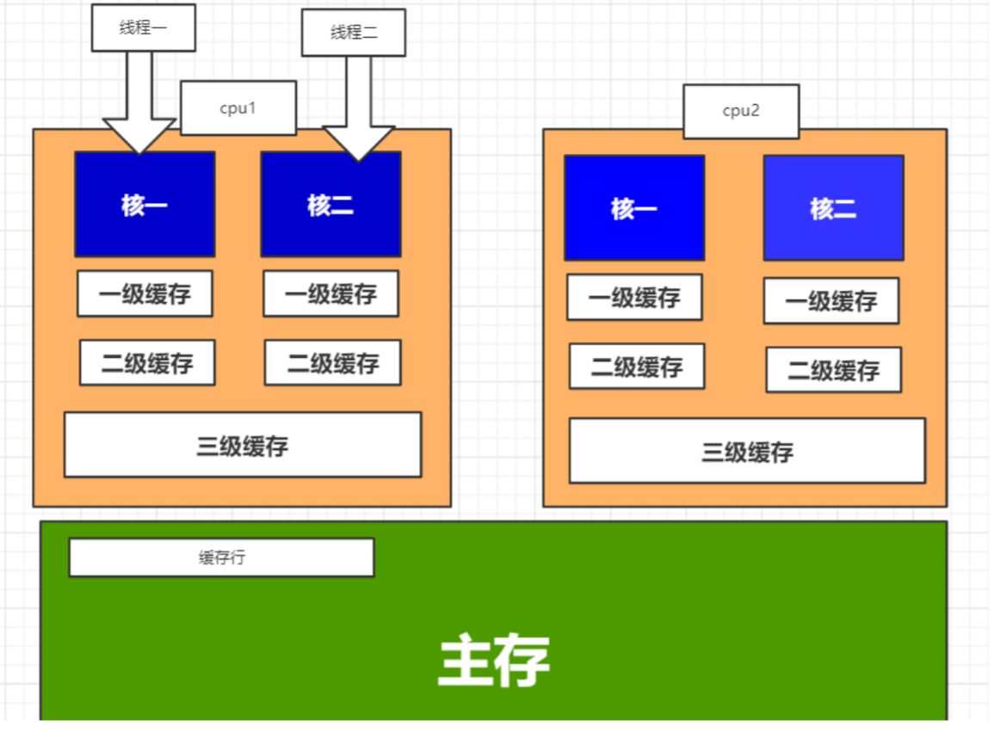
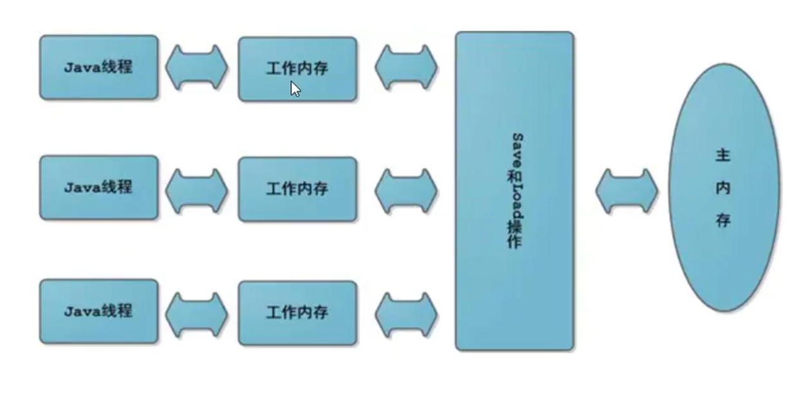
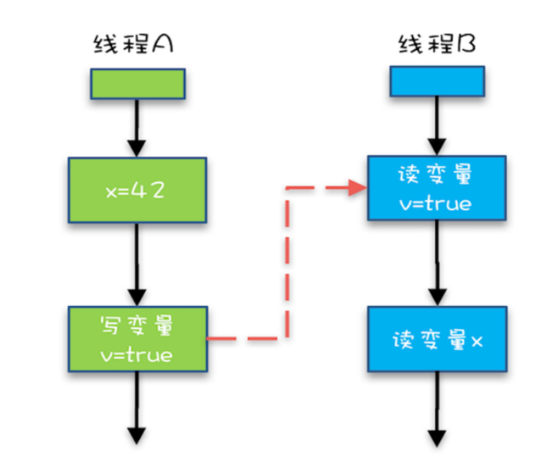
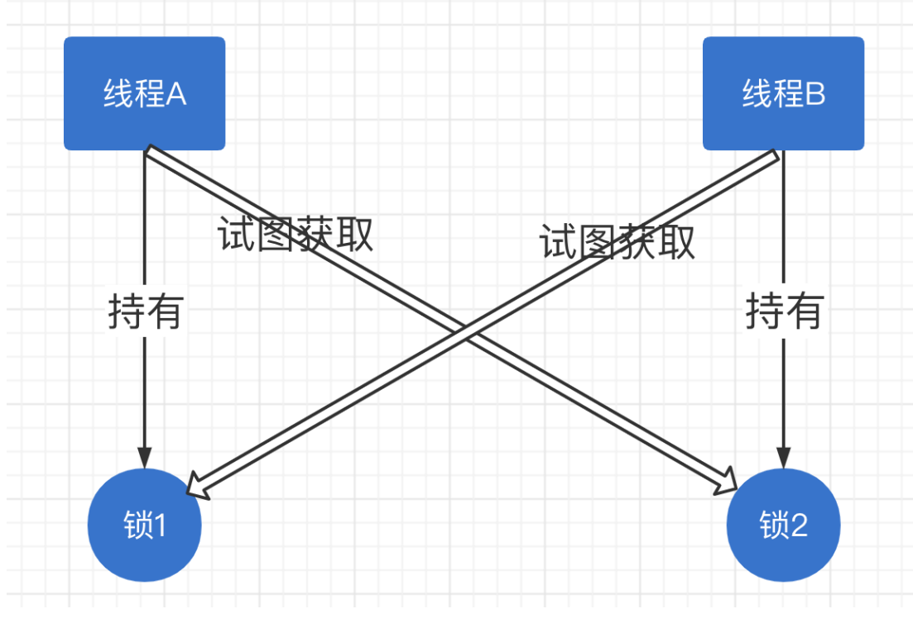
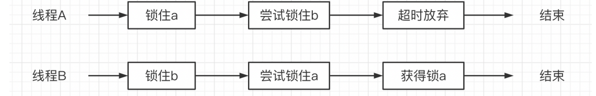
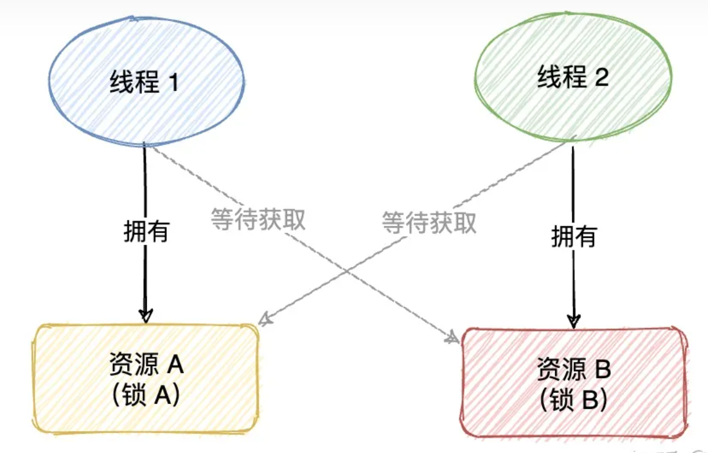
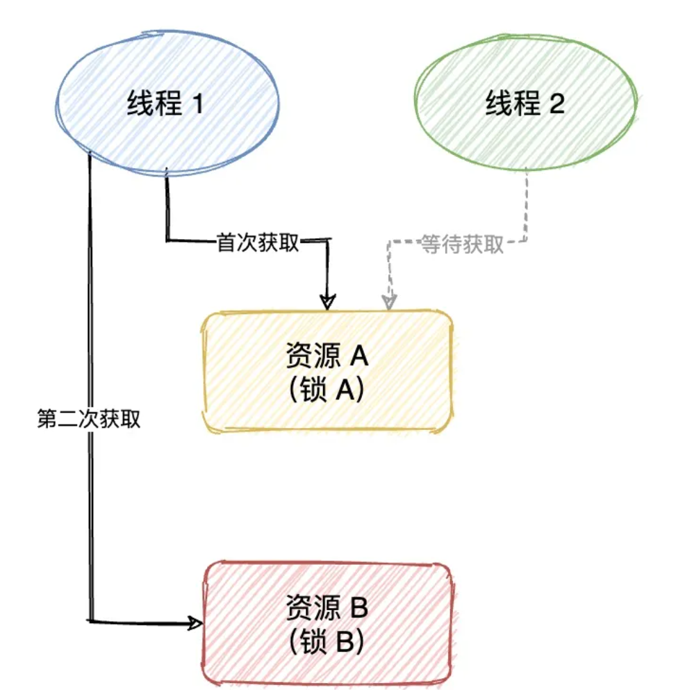
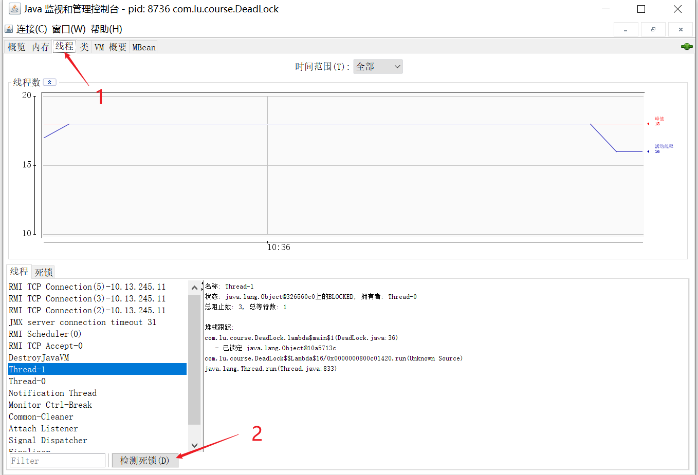
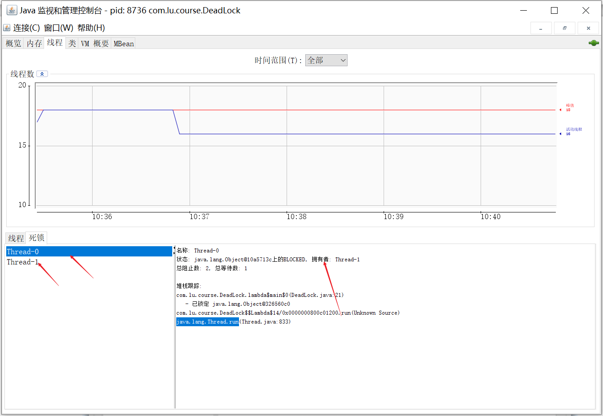

# JVM内存模型和死锁


JVM内存模型和死锁描述

<!--more-->

# JVM内存模型和死锁

### cpu多核缓存架构

目的：解决cpu与内存速度不匹配问题

> cpu分为三级缓存，每个cpu都有L1，L2缓存，但L3缓存是多核共用的。

> cpu查找数据的顺序：cpu->L1->L2->L3->内存->硬盘。



> cpu每次读数据会读取与其相邻的64个字节的数据，叫做【缓存行】-计算机局部性原理

多级缓存问题

1. 可见性问题（一个线程修改的值对其他线程不可见，导致数据不一致）
2. 资源的争夺问题（多个线程修改相同的资源时）

另外除增加高速缓存之外，为了使处理器内部的运算单元尽量被充分利用。处理器可能会对输入的代码进行【乱序执行】，优化处理器 会在计算之后将乱序执行的结果【进行重组】，保证该结果与顺序 执行的结果是一致的，但并不保证程序中各个语句的先后执行顺序 与输入输入代码中的顺序一致。因此如果存在一个计算任务，依赖 于另外一个依赖任务的中间，结果那么顺序性不能靠代码的先后顺 序来保证。 Java虚拟机的即时编译器中也有【指令重排】的优化。

### JMM-java内存模型

**内存结构与内存模型**

java内存结构：内存结构由Java虚拟机规范定义, 其描述的是Java程序执行过程中, 由JVM管理的不同的数据区域。包括程序计数器、虚拟机栈、本地方法栈、Java堆、方法区。


java内存模型：

Java虚拟规范中曾经试图定义一种Java内存模型，来屏蔽各种硬件和操作系统的内存访问之间的差异，以实现让Java程序在各种平台上都能达到一致的内存访问效果。sun（“一次编写，到处运行”（Write once, run anywhere、WORA，有时也作“write once, run everywhere”、WORE），在此之前，主流程序语言直接使用物理内存和操作系统的内存模型，会由于不同平台的内存模型的差异，可能导致程序在一套平台上发挥完全正常，而在另一套平台上并发觉经常发生错误，所以在某种常见的场景下，必须针对平台来进行代码的编写。

目的：屏蔽各种硬件和操作系统的内存访问之间的差异，以实现让Java程序在各种平台上都能达到一致的内存访问效果



这里的内存模型和我们的运行时数据区是从不同的角度去分析java对内存的使用的（）。两者表达的含义和目的不同。

在java内存模型当中一样会存在可见性和指令重排的问题。

存在的问题

1. 指令重排

   在指令重排中，有一个经典的as-if-serial语义，计算机会安装该语义对指令进行优化，其目的是不管怎么重排序（编译器和处理器为了提高并行度），（单线程）程序的执行结果不能被改变。为了遵守as-if-serial语义，**编译器和处理器不会对存在数据依赖关系的操作做重排序**，因为这种重排序会改变执行结果。但是，如果操作之间不存在数据依赖关系，这些操作依然可能被编译器和处理器重排序。
   
   ```
   {
   int a = 1;
   int b = 2;
   a+b;
   }
   ```

单线程情况是不会出现问题，但多线程可能出这个线程依赖另一个线程的数据，它们之间是无感知的所以会出现问题。

多线程下指令重排可能会导致一些问题，乱序执行导致结果不一致

解决指令重排的方法是使用内存屏障（就是一条指令）：在java语言中我们可以使用volatile关键字来保证一个变量在一次读写操作时的避免指令重排

【内存屏障】是在我们的读写操作之前加入一条指令当cpu碰到这条指令后必须等到前边的指令执行完成 才能继续执行下一条指令。

```java
1
↓  ---Lock（必须等1执行结束） 
2
↓   
3
```

2. 可见性

```java
public class visible {
    private static volatile boolean flag=false; //缓存中的flag
    public static void main(String[] args) throws InterruptedException {
        Thread t1=new Thread(()->{
           while (!flag){
           }
            System.out.println("看见我了吗！");
        });
        t1.start();
        Thread.sleep(2000);
        flag = true;       //主存中已修改的flag
    }
}
```

如不加voiatile关键字，thread线程一直在高速缓存中读取flag的值，不能感知主线程已经修改了flag的值而退出循环。 

volatile能强制对改变量的读写直接在主存中操作，从而解决了不可见的问题。 写操作是，立刻强制刷在主存，并且将其他缓存区域的值设置为不可用。

**happens-before**（先行发生）

JMM用【happens-before】的概念来阐述操作之间的内存可见性。在JMM中，如果一个操作执行的结果需要对另一个操作可见， 那么这两个操作之间必须要存在happens-before关系 。 

总结就是规定了哪些写操作对其他线程的读操作可见，它是可见性与有序性的一套规则总结：

- 程序顺序规则 ：

在一个线程内，按照控制流顺序，书写在前面的操作先行发生于书写在后面的操作。

若Ａ操作书写顺序在Ｂ操作之前，则线程中Ａ操作早于Ｂ操作执行

> 虽然程序顺序规则规定了若A操作的书写顺序在B操作之前，则线程中A操作早于B操作执行，但是这并不意味着单线程中不存在指令重排。
>
> 在单线程中，处理器仍然可能对指令的执行顺序进行优化，以提高程序的性能。这种指令重排不会影响程序的正确性，因为它仍然遵循HAPPENS-BEFORE原则。也就是说，即使处理器对指令的执行顺序进行了优化，它仍然会确保程序的执行结果与程序顺序规则的要求一致。
>
> 因此，单线程中仍然可能存在指令重排，但只要它遵循HAPPENS-BEFORE原则，就不会影响程序的正确性。

- volatile变量规则：

对一个volatile变量的写操作先行发生于后面对这个变量的读操作。

线程对volatile变量的写，对接下来其他线程对该变量的读可见

```java
 volatile static int x;

   new Thread(() ->{
            x = 10;
    },"t1").start();

    new Thread(() ->{
            System.out.println(x);
    },"t2").start();
```

- 线程启动规则：

Thread对象的start()方法先行发生于此线程的每个一个动作。 

线程 start 前对变量的写，对该线程开始后对该变量的读可见

```java
 static int x;

   x = 10;

   new Thread(() ->{
     System.out.println(x);
    },"t2").start();
```

- 线程终止规则：

线程中的所有操作都先行发生于对此线程的终止检测

线程结束前对变量的写，对其他线程得知它结束后的读可见（比如其他线程调用t1.isAlive() 或 t1.join()等待它结束）

```java
public class end {
    static int x;
    public static void main(String[] args) throws InterruptedException {

      Thread t1  =  new Thread(() ->{
            x = 10;
        },"t1");
        t1.start();
        System.out.println(x);
//       while (true){
//           if (!t1.isAlive()){
//               System.out.println("t1线程结束，获取x的值"+x);
//               break;
//           }
//       }

        //t1.join();
      //  System.out.println(x);
        
    }
}

```

- 线程中断规则：

对线程interrupt()方法一定早于检测到线程的中断信号。

> 线程t1打断t2(interrupt) 前对变量的写，对于其他线程得知t2 被打断后对变量的读可见（通过t2.interrupted 或t2.isInterrupted）

```java
  private static boolean stop = false;

    public static void main(String[] args) {
        Thread getter = new Thread(new Runnable() {
            @Override
            public void run() {
                while (true) {
                    if (Thread.currentThread().isInterrupted()) {
                        if (stop) {
                            System.out.println("getter stopped.");
                            break;
                        }
                    }
                }
            }
        }, "getter");
        Thread updater = new Thread(new Runnable() {
            @Override
            public void run() {
                try {
                    Thread.sleep(1000);
                } catch (InterruptedException e) {
                    throw new RuntimeException(e);
                }
                stop = true;
                getter.interrupt();
                System.out.println("updater set stop true.");
            }
        }, "updater");

        updater.start();
        getter.start();
    }
```

- 锁定规则 ：

一个unlock操作先行发生于后面对同一个锁的lock操作。

线程解锁m之前对变量的写，对于接下来对m加锁的其他线程对该变量的读可见

```java
 static int x;
static Object m = new Object();

        new Thread(() ->{
            synchronized (m){
                x = 10;
            }
        },"t1").start();

        new Thread(() ->{
            synchronized (m){
                System.out.println(x);
            }
        },"t2").start();
```

- 传递规则：

如果A早于B，B早于C，那么A一定早于C 



> “x=42” 先于读变量“v=true” 如果线程B读到了“v=true”，那么线程A设置的“x=42”对线程B是可见的。也就是说，线程B能看到 “x  == 42

- 对象终结规则：

一个对象的初始化完成先行发生于他的finalize()方法

> 对象的构造方法和静态块执行是先与finalize()的，也就是说一个对象的构造方法结束所产生的影响，对于它的finalize()方法开始执行是可见的。

```java
public class HappensBeforeTest {
    public HappensBeforeTest(){
        System.out.println("初始化");
   }
    
    //最好自己不要写finalize()
    @Override
    protected void finalize() throws Throwable{
        System.out.println("对象销毁");
   }
    public static void main(String[] args) {
        new HappensBeforeTest();
        System.gc();  //垃圾回收，垃圾收集器在确定这个对象没有被引用时会调用finalize
   }
}
//初始化
//对象销毁
```

总结：

**程序次序规则（Program Order Rule）**：在一个线程内，按照控制流顺序，书写在前面的操作先行发生于书写在后面的操作。

**锁定规则（Monitor Lock Rule）**：一个unlock操作先行发生于后面对同一个锁的lock操作。

**volatile变量规则（Volatile Variable Rule）**：对一个volatile变量的写操作先行发生于后面对这个变量的读操作。

**线程启动规则（Thread Start Rule）**：Thread对象start()方法先行发生于此线程的每一个动作。

**线程终止规则（Thread Termination Rule）**：线程中的所有操作都先行发生于对此线程的终止检测，我们可以通过Thread.join()方法和Thread.isAlive()的返回值等手段检测线程是否已经终止执行。

**线程中断规则（Thread Interruption Rule）**：对线程interrupt()方法的调用先行发生于被中断线程的代码检测到中断事件的发生，可以通过Thread.interrupted()方法检测到是否有中断发生。

**对象终结规则（Finalizer Rule）** ：一个对象的初始化完成（构造函数结束）先行发生于它的finalize()方法的开始。

**传递性（Transitivity）**：如果操作A先行发生于操作B，操作B先行发生于操作C，那就可以得出操作A先行发生于操作C的结论。

程序员对于这两个操作是否真的被重排序并不关心，程序员关心的是程序执行时的语义不能被改变（即执行结果不能被改变）。因此，happens-before关系本质上和as-if-serial语义是一回事。as-if-serial语义保证单线程内程序的执行结果不被改变， happens-before关系保证正确同步的多线程程序的执行结果不被改变。

## 死锁

### 1.概念

指两个或两个以上的线程在执行过程中，由于竞争资源或者彼此通信而造成的一种阻塞的现象，若无外力作用，它们都将无法推进下去。此时称系统处于死锁状态或系统产生了死锁，这些永远在互相等待的进程称为死锁进程。

如下图，线程A和线程B都尝试获取对方持有的锁，但是又不释放自己所持有的锁就会陷入死锁。



### 2.死锁产生原因

四个必要条件：

1、互斥使用，即当资源被一个线程使用(占有)时，别的线程不能使用 

2、不可抢占，资源请求者不能强制从资源占有者手中夺取资源，资源只能由资源占有者主动释放。 

3、请求和保持，即当资源请求者在请求其他的资源的同时保持对原有资源的占有。

4、循环等待，即存在一个等待队列：P1占有P2的资源，P2占有P3的资源，P3占有P1的资源。这样就形成了一个等待环路。

>  当上述四个条件都成立的时候，便形成死锁。当然，死锁的情况下如果打破上述任何一个条件，便可让死锁消失。

常见死锁

(1).交叉锁 

一个线程thread1访问lock1（获得锁lock1），然后又访问lock2；另一个线程thread2访问lock2（锁住了 lock2），然后企图访问lock1；这时线程thread1因为线程thread2已经锁住lock2，它必须等待线程thread2 释放lock2才能继续，同样线程thread2要等线程thread1释放lock2才能继续，这样死锁就产生了。

```java
public static void main(String[] args) {
        Object lock1 = new Object();
        Object lock2 = new Object();
        Thread thread1 = new Thread(() -> {
            synchronized (lock1) {
                System.out.println(Thread.currentThread().getName() + "获取了第一把锁");
                try {
                    Thread.sleep(1000);
               } catch (InterruptedException e) {
                    e.printStackTrace();
               }
                System.out.println(Thread.currentThread().getName() + "休息1s之后，尝试获取第二把锁");
                synchronized (lock2) {
                    System.out.println(Thread.currentThread().getName() + "获取第二把
锁");
               }
           }
       });
        thread1.start();
        Thread thread2 = new Thread(() -> {
            synchronized (lock2){
                System.out.println(Thread.currentThread().getName() + "获取了第二把锁");
                try {
                    Thread.sleep(1000);
               } catch (InterruptedException e) {
                    e.printStackTrace();
               }
                System.out.println(Thread.currentThread().getName() + "休息1s之后，尝试获取第一把锁");
                synchronized (lock1){

   System.out.println(Thread.currentThread().getName() + "获取第一把
锁");
               }
           }
       });
        thread2.start();
   }
```

(2).内存不足
线程A和线程B都需要内存40MB，现在线程A已有10MB，还需要30MB；线程B已有10MB，还需要30MB，
但是系统内存只剩余20MB，因此两个线程都在等对方释放内存来满足自己，死锁就产生了。
(3).一问一答的数据交换
服务器端（server）和客户端（client），server等待client的访问；client发送请求到server，等待接收数据；由于网络的原因，server错过了client的请求，因此server等待client的访问，client等待接收数据，产生死锁。

(4).死循环引起的死锁 

某个线程，由于编码问题，在对资源加锁后，陷入死循环，导致线程无法释放锁。

```java
public static void main(String[] args) {
    HashMap<String, String> map = new HashMap<>();
    for(int i=0; i<2; i++){
        new Thread(() -> { 
           synchronized (lock1) {
                System.out.println(Thread.currentThread().getName() + "获取了第一把锁");
                for(int i = 0; i < Integer.MAX_VALUE; i++ ){
                   map.put(String.valueOf(i1), String.valueOf(i1));
               }
                try {
                    Thread.sleep(1000);
               } catch (InterruptedException e) {
                    e.printStackTrace();
               }
                System.out.println(Thread.currentThread().getName() + "休息1s之后，尝试获取第二把锁");
           }
       }).start();
   }
}public static void main(String[] args) {
    HashMap<String, String> map = new HashMap<>();
    for(int i=0; i<2; i++){
        new Thread(() -> { 
           synchronized (lock1) {
                System.out.println(Thread.currentThread().getName() + "获取了第一把锁");
                for(int i1 = 0; i1 <Integer.MAX_VALUE; i1++ ){
                   map.put(String.valueOf(i1), String.valueOf(i1));
               }
                try {
                    Thread.sleep(1000);
               } catch (InterruptedException e) {
                    e.printStackTrace();
               }
                System.out.println(Thread.currentThread().getName() + "休息1s之后，尝试获取第二把锁");
           }
       }).start();
   }
}
```

### 3.避免死锁

3.1 预防死锁
核心思想是破坏死锁的四个必要条件之一
破坏互斥条件：破坏互斥条件而预防死锁不大可行，而且有的场合应该保持这种互斥性。
破坏不可剥夺条件：当某进程获得了部分资源，但得不到其他资源，则释放已占有的资源。
破坏请求保持条件：进程在运行前一次申请完它所需要的全部资源；在未满足全部资源时不运行。
破坏循环等待条件：给系统中的每类资源赋予一个编号，每一个进程按编号递增的顺序请求资源，
释放则相反。

3.2 避免死锁
不需要事先采取各种限制措施去破坏产生死锁的四个必要条件，而是在资源的动态分配过程中，用某种
方法去防止系统进入不安全状态，从而避免死锁的产生。即：分配资源之前判断是否会出现死锁
若一个进程的请求会导致死锁，则不启动。
若一个进程的增加资源会导致死锁，则不启动。

常实现方法：银行家算法 

银行家算法是操作系统中最有代表性的避免死锁的算法。在避免死锁方法中允许进程动态地申请资源，但系统在进行资源分配之前，应先计算此次分配资源的安全性，若分配不会导致系统进入不安全状态，则分配，否则等待。

> 所谓安全状态，是指系统能按某种进程推进顺序( P1, P2, ..., Pn)，为每个进程Pi分配其所需资源， 直至满足每个进程对资源的最大需求，使每个进程都可顺序地完成。此时称 P1, P2, ..., Pn 为安全序列。如果系统无法找到一个安全序列，则称系统处于不安全状态。（安全是指系统能找到一个序列 使得所有资源得到分配。） 如果系统处于安全状态，就一定不会发生死锁；如果系统处于不安全状态，就"可能"会发生死锁。

3.3 解除死锁

(1).终止进程
①.终止所有死锁进程
这是最简单的方法，终止所有死锁进程后，死锁自然就解除了。
缺点： 代价可能会很大：有些快要结束的进程一旦被终止，可谓是“功亏一篑”。
②.逐个终止进程，直至死锁解除
比上面的方法更温和一些，按照某种约定好的顺序，一个一个地终止进程，当有足够的资源时，就打破
了循环等待，死锁解除。
选择被终止的进程的策略：为死锁解除所付出的“代价最小”。“代价最小”应该考虑的一些因素：
1). 进程的优先级大小

2). 进程已经执行了多少时间？以后还需要多少时间才能完成？

3). 进程已经使用了多少资源？以后还需要多少资源？

缺点： 付出的代价也可能会很大，因为每终止一个进程，都要用死锁检测算法确定系统死锁是否已经被解除。

(2).超时放弃 

当使用synchronized关键词提供的内置锁时，只要线程没有获得锁，那么就会永远等待下去，然而Lock接口提供了boolean tryLock(long time, TimeUnit unit) throws InterruptedException方法，该方法可以按照固定时长等待锁，因此线程可以在获取锁超时以后，主动释放之前已经获得的所有的锁。通过这种方式， 也可以很有效地避免死锁。 时序图如下：



```java
 public static void main(String[] args) {
        /*
         * ReentrantLock（可重入锁）:提供了无条件的，可轮询的，定时的以及可中断的锁获取操作和解锁都是显式的
         * */
        Lock lock1 = new ReentrantLock();
        Lock lock2 = new ReentrantLock();
        Thread thread1 = new Thread(() -> {
            lock1.lock();  //获取第一把锁
            System.out.println(Thread.currentThread().getName() + "获取了第一把锁");
            try {
                Thread.sleep(1000);
            } catch (InterruptedException e) {
                throw new RuntimeException(e);
            }

            System.out.println(Thread.currentThread().getName() + "休息1s之后，尝试获取第二把锁");

            try {
                if(lock2.tryLock(3000, TimeUnit.MILLISECONDS)){
                    System.out.println(Thread.currentThread().getName() + "获取第二把锁");
                }else{
                    System.out.println("超过3s未获得第二把锁，线程1释放第一把锁");
                    lock1.unlock();
                }
            } catch (InterruptedException e) {
                e.printStackTrace();
            }
        });
        thread1.start();

        Thread thread2 = new Thread(() -> {
            lock2.lock();  //获取第二把锁
            System.out.println(Thread.currentThread().getName() + "获取了第二把锁");

            try {
                Thread.sleep(1000);
            } catch (InterruptedException e) {
                e.printStackTrace();
            }

            System.out.println(Thread.currentThread().getName() + "休息1s之后，尝试获取第一把锁");
            lock1.lock();
            try {
                if(lock1.tryLock()){//获取第一把锁
                    System.out.println(Thread.currentThread().getName() + "获取第一把锁");
                }
            } catch (Exception e) {
                e.printStackTrace();
            }finally{
                //使用lock时,一定记住在finally块中释放锁防止死锁的发生。
                lock1.unlock(); //释放第一把锁
                lock2.unlock(); //释放第二把锁
            }
        });
        thread2.start();
    }
```

> synchronized与lock区别： 
>
> 1）Lock是一个接口，而synchronized是Java中的关键字; 
>
> 2）synchronized当一个线程获取了对应的锁，并执行该代码块时，其他线程便只能一直等待，等待获取锁的线程释放锁，不能够响应中断,（释放条件：1.执行完线程自动释放；2.发生异常jvm让线程释放）。
>
>  3）Lock锁，可以不让等待的线程一直无期限地等待下去，比如只等待一定的时间或者响应中断。 但Lock在发生异常时，如果没有主动通过unLock()去释放锁，则很可能造成死锁现象，因此使用 Lock时必须在try{}catch{}块中进行，需要在finally块中释放锁；
>
>  4）通过Lock可以知道有没有成功获取锁，而synchronized却无法办到。
>
>  5）在性能上来说，如果竞争资源不激烈，两者的性能是差不多的，而当竞争资源非常激烈时（即 有大量线程同时竞争），此时Lock的性能要远远优于synchronized。所以说，在具体使用时要根据 适当情况选择。

(3).资源抢占的方法

通过打破循环等待条件与请求并持有条件来解决死锁问题。

①.顺序锁

所谓顺序锁就是有顺序的获取锁，从而避免环路等待条件，解决死锁问题。



线程 1 先获取了锁 A，再获取锁 B，线程 2 与 线程 1 同时执行，线程 2 先获取锁 B，再获取锁 A，这样双方都先占用了各自的资源（锁 A 和锁 B）之后，再尝试获取对方的锁，从而造成了环路等待问题，最后造成了死锁的问题。

此时我们只需要将线程 1 和线程 2 获取锁的顺序进行统一，也就是线程 1 和线程 2 同时执行之后，都先获取锁 A，再获取锁 B，执行流程如下图所示：



因为只有一个线程能成功获取到锁 A，没有获取到锁 A 的线程就会等待先获取锁 A，此时得到锁 A 的线程继续获取锁 B，因为没有线程争抢和拥有锁 B，那么得到锁 A 的线程就会顺利的拥有锁 B，之后执行相应的代码再将锁资源全部释放，然后另一个等待获取锁 A 的线程就可以成功获取到锁资源，执行后续的代码，这样就不会出现死锁的问题了。

```java
public class SolveDeadLockExample {
    public static void main(String[] args) {
        Object lockA = new Object(); // 创建锁 A
        Object lockB = new Object(); // 创建锁 B
        // 创建线程 1
        Thread t1 = new Thread(new Runnable() {
            @Override
            public void run() {
                synchronized (lockA) {
                    System.out.println("线程 1:获取到锁 A!");
                    try {
                        Thread.sleep(1000);
                    } catch (InterruptedException e) {
                        e.printStackTrace();
                    }
                    System.out.println("线程 1:等待获取 B...");
                    synchronized (lockB) {
                        System.out.println("线程 1:获取到锁 B!");
                    }
                }
            }
        });
        t1.start(); // 运行线程
        // 创建线程 2
        Thread t2 = new Thread(new Runnable() {
            @Override
            public void run() {
                synchronized (lockA) {
                    System.out.println("线程 2:获取到锁 A!");
                    try {
                        Thread.sleep(1000);
                    } catch (InterruptedException e) {
                        e.printStackTrace();
                    }
                    System.out.println("线程 2:等待获取B...");
                    synchronized (lockB) {
                        System.out.println("线程 2:获取到锁 B!");
                    }
                }
            }
        });
        t2.start(); // 运行线程
    }
}
```

②.轮询锁

轮询锁是通过打破请求并持有条件来解决死锁问题的，实现思路就是通过轮询来尝试获取锁，如果有一个锁获取失败，则释放当前线程拥有的所有锁，等待下一轮再尝试获取锁。

```java
public class pollingLock {
    public static void main(String[] args) {
        Lock lockA = new ReentrantLock(); // 创建锁 A
        Lock lockB = new ReentrantLock(); // 创建锁 B

        // 创建线程 1(使用轮询锁)
        Thread t1 = new Thread(new Runnable() {
            @Override
            public void run() {
                // 调用轮询锁
                pollingLock(lockA, lockB);
            }
        });
        t1.start(); // 运行线程

        // 创建线程 2
        Thread t2 = new Thread(new Runnable() {
            @Override
            public void run() {
                lockB.lock(); // 加锁
                System.out.println("线程 2:获取到锁 B!");
                try {
                    Thread.sleep(1000);
                    System.out.println("线程 2:等待获取 A...");
                    lockA.lock(); // 加锁
                    try {
                        System.out.println("线程 2:获取到锁 A!");
                    } finally {
                        lockA.unlock(); // 释放锁
                    }
                } catch (InterruptedException e) {
                    e.printStackTrace();
                } finally {
                    lockB.unlock(); // 释放锁
                }
            }
        });
        t2.start(); // 运行线程
    }

    /**
     * 轮询锁
     */
    public static void pollingLock(Lock lockA, Lock lockB) {
        while (true) {
            if (lockA.tryLock()) { // 尝试获取锁
                System.out.println("线程 1:获取到锁 A!");
                try {
                    Thread.sleep(1000);
                    System.out.println("线程 1:等待获取 B...");
                    if (lockB.tryLock()) { // 尝试获取锁
                        try {
                            System.out.println("线程 1:获取到锁 B!");
                        } finally {
                            lockB.unlock(); // 释放锁
                            System.out.println("线程 1:释放锁 B.");
                            break;
                        }
                    }
                } catch (InterruptedException e) {
                    e.printStackTrace();
                } finally {
                    lockA.unlock(); // 释放锁
                    System.out.println("线程 1:释放锁 A.");
                }
            }
            // 等待一秒再继续执行
            try {
                Thread.sleep(1000);
            } catch (InterruptedException e) {
                e.printStackTrace();
            }
        }
    }

}
```

### 4.Jconsole查看死锁

进入java安装的位置，输入Jconsole，然后弹出界面（或者进入安装目录/java/jdk1.70_80/bin/，点击 Jconsole.exe）：


选中进程点击连接



点击线程选中检测死锁



Thread-0需要Thread-1持有的对象，Thread-1需要Thread-0持有的对象，然后陷入等待。

