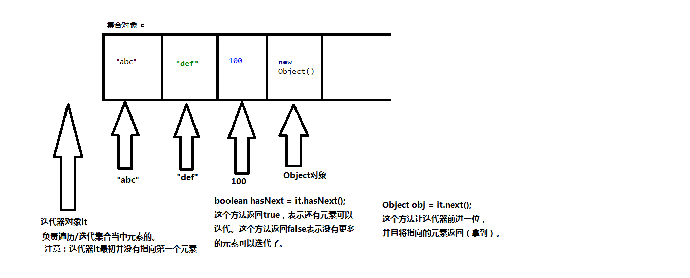
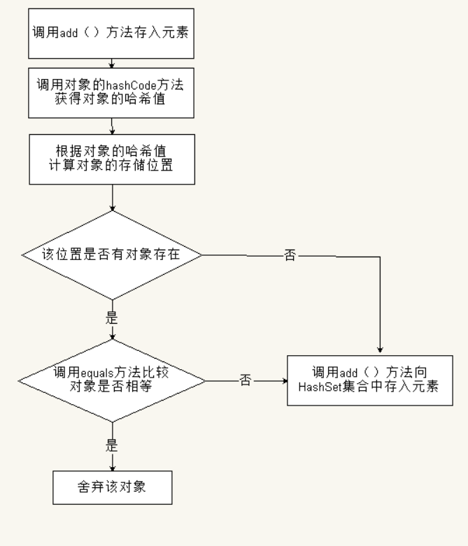
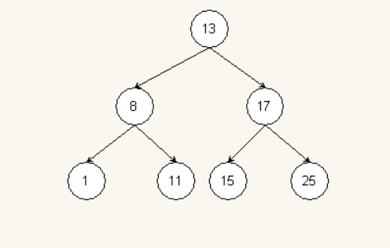
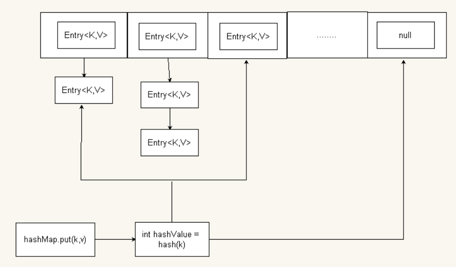

# Java集合


集合不能直接存储基本数据类型，也不能直接存储Java对象。集合当中存储的都是Java对象的内存地址...

<!--more-->

# Java 集合

### 一.集合概述

##### 1.1什么是集合？

数组是一组保存相同数据类型的集合。在某些情况下无法确定到底需要保存多少对象，由于数组的长度不可变，所以这时就不能使用数组来保存这些对象。

为了保存数目不确定的对象，Java中提供了一系列特殊的类，称为集合。集合是一个容器，可以存储任意类型的对象，并且长度可变。（所有的集合类和集合接口都在java.util包下）


##### 1.2集合详解

集合不能直接存储基本数据类型，也不能直接存储Java对象。集合当中存储的都是Java对象的内存地址。（或者说集合中存储的是引用。）

```java
list.add(100); //自动装箱Integer
```

在Java中每一个不同的集合，底层会对应不同的数据结构。往不同的集合中存储元素，等于将数据放到了不同的数据结构当中。

		new ArrayList(); 创建一个集合，底层是数组。
		new LinkedList(); 创建一个集合对象，底层是链表。
		new TreeSet(); 创建一个集合对象，底层是二叉树。
		.....

什么是数据结构？数据存储的结构就是数据结构。不同的数据结构，数据存储方式不同。例如集合中使用到的：数组、二叉树、链表、哈希表。使用不同的集合可能就是使用了不同的数据结构。

##### 1.3集合体系核心架构图

集合框架图：

<div align=center>
	
</div> 


从上面的框架图可以看到，Java 集合框架主要包括两种类型的容器，一种是集合（Collection），存储一个元素集合，称为单列集合；另一种是图（Map），存储键值对，称为双列集合。Collection 接口主要有2种子类型，List和Set ，而List和Set下面又有一些实现类。常用的集合有 ArrayList、LinkedList、HashSet、TreeSet、HashMap、TreeMap 等。

集合框架是一个用来代表和操纵集合的统一架构。所有的集合框架都包含如下内容：

**接口：**是代表集合的抽象数据类型。例如 Collection、List、Set、Map 等。之所以定义多个接口，是为了以不同的方式操作集合对象。

**实现（类）：**是集合接口的具体实现。从本质上讲，它们是可重复使用的数据结构，例如：ArrayList、LinkedList、HashSet、HashMap等。

**算法：**是实现集合接口的对象里的方法执行的一些有用的计算。例如：搜索和排序。


### 二.List集合

##### 2.1 Collection接口简介

Collection 接口是最基本的集合接口，一个 Collection 代表一组 Object， Java不提供直接继承自Collection的类，只提供继承于Collection的子接口(如List和set)。

由于 Collection 是所有单列集合的根接口，所以Collection中定义的一些方法，可以用于操作所有的单列集合。

Collection接口的常用方法：

```
 boolean add(E e)：添加一个元素
 void clear()：清空集合中所有的元素
 boolean remove(E e)：移除集合中指定的元素
 boolean contains(E e)：检查集合中是否包含指定的对象
 boolean isEmpty()：判断集合是否为空
 int size()：获取数组的大小
 Object[] toArray()：把集合元素存储到数组中
 Iterator iterator():返回在该集合上进行迭代的迭代器，用于遍历该集合所有元素
```

```java
public class CollectionTest01 {
    public static void main(String[] args) {
        Collection c = new ArrayList();
        
        //向集合种添加元素
        c.add("4123");
        c.add("1456");
        c.add("3789");

        //获取集合中元素的个数
        System.out.println("元素个数是："+c.size());//元素个数是：3

        //判断集合中是否包含某个元素
        c.add("jack");
        c.add(235);//这里有一个自动装箱的问题
        boolean flag1 = c.contains("4123");
        System.out.println(flag1);//true

        boolean flag2 = c.contains(123);
        System.out.println(flag2);//false

        //删除集合中的某个元素
        c.remove("1456");
        System.out.println("元素个数是："+c.size());//元素个数是：4

        //判断集合是否为空
        System.out.println(c.isEmpty());//false

        //清空集合所有元素
        c.clear();
        System.out.println(c.isEmpty());//true
        System.out.println("元素个数是："+c.size());//元素个数是：0

        //添加元素
        c.add("s1");
        c.add("s2");
        c.add("s3");
        c.add("s4");
        c.add("s5");
        c.add(new Student());

        //把集合转化成数组
        Object[] objs = c.toArray();
        for (int i = 0;i<objs.length;i++){
            //遍历数组
            Object o = objs[i];
            System.out.println(o);
        }
    }
}
class Student{
    
}
```

contains()和remove()方法深入：在上面例子中，调用contains方法，输出结果是对的，那么如果调用的是自定义类呢？

```java
public class CollectionTest05 {
    public static void main(String[] args) {
        //创建集合对象
        Collection c = new ArrayList();

        User u1 = new User("jack");
        c.add(u1);

        User u2 = new User("jack");

        //判断集合中是否包含u2
        //没重写equals方法之前
        // System.out.println(c.contains(u2));//结果为：false
        
           System.out.println(c.contains(u2));//结果为：true

        //重写equals方法后删除u2
        c.remove(u2);
       
        System.out.println("元素个数是："+c.size());//元素个数是：0
        //由此可见，remove和contains调用equals方法是相同的
    }
}
class User{
    private String name;

    public User() {
    }

    public User(String name) {
        this.name = name;
    }
    //重写equals方法
    public boolean equals(Object o){
        //传入对象为null或者对象类型不是User
        if (o == null || !(o instanceof User)) return false;
        if (o == this) return true;
        User u = (User)o;
        //如果名字一样表示同一个人。不再比较对象的内存地址，这里比较的是内容
        return u.name.equals(this.name);
    }
}
```

在集合中，对于contains()方法，底层调用了euqals()方法比较内容，不需要重写equals()方法。但是对于自定义类，类中没有重写equals()方法，默认继承的是Object的equals()方法，所以没重写时输出结果为“false”。

因此，对于自定义类，调用contains()方法和remove()方法之前必须重写equals()方法。

##### 2.2 List接口简介

List 接口是一个有序的 Collection，使用此接口能够精确的控制每个元素插入的位置，通过索引(元素在 List 中的位置，类似于数组的下标)可以访问 List 中的元素，第一个元素的索引为 0，而且允许有相同的元素。List 接口存储一组不唯一，有序（插入顺序）的对象。

List接口的特点：**有序可重复**，存储的元素有下标。有序是因为List集合都有下标，以1递增，可以通过索引来访问集合中的元素。

List接口继承自Collection接口，所有Collection接口的方法，List都可以使用，并且List中还新增了一些操作集合的特有方法。

List集合常用方法（在Collection基础上）：

```
void add(int index,E element) 在列表的指定位置插入指定元素。
Object get(int index) 返回列表中指定索引位置的元素。
int hashCode() 返回列表的哈希码值。
Object remove(int index) 移除列表中指定位置的元素
Object set(int index,Object element) 用指定元素替换列表中指定位置的元素。
int indexOf(Object o) 返回列表中首次出现指定元素的索引，如果列表不包含此元素，则返回-1。
int lastIndexOf(Object o) 返回列表中最后出现指定元素的索引，如果列表不包含此元素，则返回-1。
Object[] toArray() 返回以正确顺序包含列表中的所有元素的数组。
```

```java
public class ListTest01 {
    public static void main(String[] args) {
        //创建List类型的集合
        List list = new ArrayList();
        
        //添加元素
        list.add("A");
        list.add("B");
        list.add("C");
        list.add("D");
        
        //在索引位置为1的位置上添加“king“，索引从0开始，第一个参数是下标
        list.add(1,"King");

        //通过下标获取元素
        System.out.println("下标为3处的元素是："+list.get(3));

        //获取指定对象第一次出现的索引
        System.out.println("B第一次出现的索引是："+list.indexOf("B"));

        //获取指定对象最后一次出现的索引
        list.add(4,"B");
        System.out.println("B最后一次出现的索引是："+list.lastIndexOf("B"));

        //删除指定位置处的元素
        System.out.println("元素个数是："+list.size());
        list.remove(0);
        System.out.println("元素个数是："+list.size());

        //修改指定位置处的元素,list.set(indexOf,element);
        list.set(3,100);
        
        System.out.println("========================");
        
        //通过下标遍历元素：因为list集合有自己的特点：有索引。
        for (int i = 0;i<list.size();i++){
            Object o = list.get(i);
            System.out.println(o);
        }
    }
}
```

##### 2.3 ArrayList集合

ArrayList是List接口中的一个实现类，是程序中最常见的一种接口，底层是数组。

数组的优点：检索效率高。

数组的缺点：随机增删元素的效率低，并且不适合大数据存储

ArrayList集合的优点：把检索发挥到极致，并且给末尾添加元素的效率很高。

ArrayList集合有一个初始容量，大小为10，当容量不够时会自动进行扩容，每次扩容都是原容量的1.5倍。

ArrayList集合底层是数组，数组扩容效率比较低，怎么优化？

尽可能少的扩容，使用ArrayList集合的时候预估计元素的个数，给定一个初始化容量。

```java
List list = new ArrayList(20);//数组初始容量为20
```


##### 2.4 LinkedList集合

为了克服ArrayList集合随机增删元素效率较低的问题，可以使用List接口的另一个实现类LinkedList。

LinkedList集合底层是双向链表，没有初始容量,也没有扩容的机制，链表中的每一个元素都是以引用的方式来记住它的前一个元素和后一个元素。当插入一个新的元素时，只需要改变元素之间的引用关系即可，删除一个节点也是如此。因此，LinkedList集合对于元素的增删效率很高。但是，它的检索效率比较低，查找元素的时候只能从头节点一个个遍历查找。(链表中的元素在空间存储上，内存地址不连续)

```
增加：
addFirst(E e)：在链表头部插入一个元素；
addLast(E e)：在链表尾部添加一个元素；
push(E e)：与addFirst方法一致  
offer(E e)：在链表尾部插入一个元素                                    
add(int index, E element)：在指定位置插入一个元素。      
offerFirst(E e)：JDK1.6版本之后，在头部添加；                           
offerLast(E e)：JDK1.6版本之后，在尾部添加；

删除：
remove() ：移除链表中第一个元素;     
remove(E e)：移除指定元素；  
removeFirst(E e)：删除头，获取元素并删除； 
removeLast(E e)：删除尾；  
pollFirst()：删除头； 
pollLast()：删除尾；  
pop()：和removeFirst方法一致，删除头。 
poll()：查询并移除第一个元素      

查：
getFirst()：获取第一个元素； 
getLast()：获取最后一个元素；
peek()：获取第一个元素，但是不移除； 
peekFirst()：获取第一个元素，但是不移除； 
peekLast()：获取最后一个元素，但是不移除；
pollFirst()：查询并删除头； 
pollLast()：删除尾；
poll()：查询并移除第一个元素；   
```


```java
public class LinkedListTest02 {
    public static void main(String[] args) {
        LinkedList linkedList = new LinkedList();
        //添加元素
        linkedList.add(100);
        linkedList.add(140);

        //将元素插入指定位置
        linkedList.add(2,160);

        //将元素插入集合开头和结尾
        linkedList.push(10);
        linkedList.offer(300);
        System.out.println(linkedList);
        //[10, 100, 140, 160, 300]

        //获取元素
        Object obj = linkedList.peek();
        System.out.println(obj);
        //10

        //删除元素
        linkedList.remove(2);
        System.out.println(linkedList);
        //[10, 100, 160, 300]

    }
}
```


##### 2.5 Collection中的遍历

在程序开发中，Collection中的集合除了基本的增、删、改、查等操作之外，通常还需要对元素进行遍历操作。下面将介绍几种遍历方法。

**方法一：Iterator遍历集合**

什么是迭代器（Iterator对象）？Iterator接口是Java集合框架中的一员，但它与Collection、Map接口不一样，Collection接口与Map接口主要用于存储元素，而**Iterator主要用于迭代访问Collection中的元素。**

Iterator中的主要方法：

```
boolean hasNext() 如果还有元素可以迭代，则返回true，反之false
Object next() 返回迭代的下一个元素
```

迭代原理：

当遍历元素时，首先通过调用Collection的Iterator方法获得迭代器对象，然后使用hashNext()方法判断集合中是否存在下一个元素，如果存在，则调用next（）方法将元素取出，否则说明已到达了集合末尾，停止遍历。这里需要注意：在通过next（）方法获取元素时，必须保证要获取的元素存在，否则会抛出NoSuchElementException异常。

<div align=center>
	
</div> 

迭代器遍历集合时，内部采用指针的方式来跟踪集合中的元素。在调用Iterator的next()方法之前，迭代器的索引位于第一个元素之前，不指向任何元素，当第一次调用迭代器的next()方法后，迭代器的索引会向后移动一位，指向第一个元素并将该元素返回。以此类推，直到hasNext()方法返回false，表示达到了集合末尾，终止对集合的遍历。

```java
public class CollectionTest02 {
    public static void main(String[] args) {
        Collection c = new ArrayList();

        //添加元素
        c.add("abc");
        c.add("def");
        c.add(100);
        c.add(new Object());

        //第一步：获取集合对象的迭代器对象Iterator
        Iterator it = c.iterator();
        
        //第二步：通过以上获取的迭代器对象开始迭代/遍历集合
        while (it.hasNext()) {
            Object obj = it.next();
            System.out.println(obj);
        }
    }
}
```

由于迭代器记录的是当前集合的元素，如果记录之后集合元素又发生了改变，那么此时的集合和记录的集合是不一样的，如果没有更新迭代器，会抛出异常：java.util.ConcurrentModificationException（并发异常）。

有两种方式解决这种异常：

集合状态改变时，更新迭代器。

在迭代过程之中，如果是删除元素，使用迭代器的remove()方法删除元素。 

```java
public class CollectionTest06 {
    public static void main(String[] args) {
        Collection c1 = new ArrayList();
        
        c1.add(1);
        c1.add(2);
        c1.add(3);

        Iterator it = c1.iterator();
        //c1.add(4);
        while (it.hasNext()){
            //编写代码时next（）的返回值类型必须是object
            Object obj = it.next();

            //下面这种方法直接通过集合去删元素，没有通知迭代器，报错
            //出异常的原因：集合元素删除了，没有更新迭代器
            //c1.remove(1);

            //通过迭代器的删除方法才可以实现，删除迭代器的当前元素，迭代器自动更新迭代器
            it.remove();
            System.out.println(obj);
        }
        System.out.println("当前元素个数："+c1.size());
    }
}
```

**方法二：常用for循环**

利用下标，通过get()方法获取集合中的值。

**方法三：foreach增强循环**

虽然Iterator可以用来遍历集合中的元素，但是写法比较繁琐。从JDK5开始，提供了foreach循环。foreach循环是一种更见简洁的for循环，称为增强for循环。foreach语法格式如下：

```
for(容器中元素类型 临时变量 ： 容器变量){
	//语句
}
```

与for循环相比，foreach循环不需要获得容器的长度，也不需要根据索引访问容器中的元素，但它会自动遍历容器中的元素。

```java
public class ForEachTest02 {
    public static void main(String[] args) {
        List<String> list = new ArrayList<>();
        list.add("hello");
        list.add("world");
        list.add("kitty");

        //遍历：迭代器
        Iterator<String> it = list.iterator();
        while (it.hasNext()){
            String s = it.next();
            System.out.println(s);
        }
        System.out.println("----------------------------");
        //普通for循环，利用下标遍历
        for (int i = 0;i<list.size();i++){
            System.out.println(list.get(i));
        }
        System.out.println("-----------------------------");
         
        //foreach增强
        for (String s:list){
            System.out.println(s);
        }
        System.out.println("-----------------------------");
    }
}
```

**List小结:**

（1）ArrayList：底层数据结构是数组，查询快，增删慢，线程不安全，效率高，可以存储重复元素

（2）LinkedList 底层数据结构是链表，查询慢，增删快，线程不安全，效率高，可以存储重复元素

（3）Vector:底层数据结构是数组，查询快，增删慢，线程安全，效率低，可以存储重复元素

### 三.Set集合

##### 3.1 Set集合简介

Set 集合具有与 Collection 完全一样的接口，只是行为上不同，Set接口中的元素无序，并且存入Set的每个元素都必须是唯一的。

Set集合主要有两个实现类：HashSet和TreeSet。

##### **3.2 HashSet集合**

HashSet底层数据结构采用哈希表，元素无序不可重复，非线程安全，效率高。

 HashSet底层通过包装HashMap来实现，HashSet在添加一个值的时候，实际上是将此值作为HashMap中的key来进行保存。

可以存储null元素，元素的唯一性是靠所存储元素类型是否重写hashCode()和equals()方法来保证的，如果没有重写这两个方法，则无法保证元素的唯一性。
具体实现唯一性的比较过程：

当调用HashSet集合的add()方法时，首先会使用hashCode()方法获取对象的哈希值，然后根据对象的哈希值计算出一个存储位置；如果该存储位置上没有元素，则直接将元素存入，如果该位置上有元素存在，则会调用euqals()方法让当前存入的元素一一和该元素进行比较。如果返回结果为false就将该元素存入集合；返回结果为true则说明有重复元素，就将该元素舍弃。

<div align=center>
	
</div> 

Set实现类的集合对象中不能有重复元素，HashSet也一样，它是用了hash算法来保证其中的元素不重复。初始化容量16，默认加载因子0.75。

当向集合中存入元素时，为了保证HashSet正常工作，要求存入对象时，需要重写equals()方法和hashCode()方法。如果是String或者Integer这类Java已经写好了的常用类，就不用重写这两个方法，因为它们已经默认重写了。所以当存储的元素为自定义类对象时，必须重写hashCode()方法和equals()方法。

例子：

```java
public class HashSetTest02 {
    public static void main(String[] args) {
        HashSet hs = new HashSet();
        Postgraduate p1 = new Postgraduate(1,"jack");
        Postgraduate p2 = new Postgraduate(2,"lisa");
        Postgraduate p3 = new Postgraduate(2,"lisa");
        hs.add(p1);
        hs.add(p2);
        hs.add(p3);
        System.out.println(hs);
    }
}
//研究生类
class Postgraduate{
    int id;
    String name;

    public Postgraduate(int id, String name) {
        this.id = id;
        this.name = name;
    }
    @Override
    public String toString() {
        return id +":"+name;
    }
}
```

存入三个对象，由于没有重写equals()方法和hashCode()方法，所以即使在id和name相同的情况下，集合也会认为p2和p3是两个不同的对象，因为p2和p3的引用地址不同。下面对equals()方法和hashCode()方法进行重写:

```java
    //重写equals方法和hashcode方法
    @Override
    public boolean equals(Object o) {
        //地址相同返回true
        if (this == o) return true;
        //判断对象是不是Postgraduate类
        if (o == null ||!(o instanceof Postgraduate)) return false;
        Postgraduate that = (Postgraduate) o;
        //id相同并且name相同返回true
        return this.id == that.id && this.name.equals(that.name);
    }

    @Override
    public int hashCode() {
        return Objects.hash(id, name);
    }
```

Postgraduate类重写了Object类中的equals()方法和hashCode()方法。在hashCode()中返回id属性的hash值，在equals()方法中比较对象的id是否相等，并返回结果。当调用返回HashSet集合中的add()方法添加p3元素时，发现它的哈希值与p2的哈希值相同，而且调用equals()方法返回true，HashSet集合认为两个对象相同，重复的对象p3就会被舍弃。


##### **3.3 TreeSet集合**

TreeSet集合底层实际上是一个TreeMap，而TreeMap集合底层是一个二叉树，放到TreeSet集合中的元素，等同于放到TreeMap集合key部分了。元素唯一且已经排好序；二叉树结构保证了元素的有序性。

TreeSet集合中的元素特点：无序不可重复。但是可以按照元素的大小顺序自动排序。称为：可排序集合。

二叉树就是每个节点最多只有两个节点的有序树，每个节点及其子节点组成的树成为子树，左侧子节点称为左子树，右侧子节点称为右子树，左子树节点小于根结点，右侧子节点大于根结点。

例如：13，8，17，17，1，11，15，25的存储过程：

<div align=center>
	
</div> 

同一层元素，左边的元素总是小于右边的元素。当二叉树中存入新元素时，新元素首先会与第一个元素（最顶层元素）进行比较，如果小于第一个元素就执行左边的分支，继续和该分支的子元素进行比较，如果大于第一个元素就执行右边的分支，继续和该分支的子元素进行比较，直到最后。取出的时候TreeSet集合和TreeMap集合都是按照“左根右“的方式来取的。

TreeSet集合中的特有方法：

```
Object first（） 返回TreeSet集合的首个元素
Object last（） 返回TreeSet集合的最后一个元素
Object lower（Object o）返回TreeSet集合中小于给定元素的最大元素，如果没有就返回null
Object floor（Object o）返回TreeSet集合中小于或等于给定元素的最大元素，如果没有就返回null
Object higher（Object o）返回TreeSet集合中大于给定元素的最小元素，如果没有就返回null
Object ceiling（Object o）返回TreeSet集合中大于或等于给定元素的最小元素，如果没有就返回null
Object pollFirst（）移除并返回集合的第一个元素
Object pollLast（）移除并返回集合的最后一个元素
```

```java
public class TreeSetTest01 {
    public static void main(String[] args) {
        TreeSet ts = new TreeSet();
        ts.add(8);
        ts.add(4);
        ts.add(9);
        ts.add(14);
        ts.add(1);

        //获取首尾元素
        System.out.println("首元素："+ts.first());
        System.out.println("尾元素："+ts.last());

        //比较并获取元素
        System.out.println("<=7的元素："+ts.floor(7));
        System.out.println(">8的元素："+ts.higher(8));

        //删除元素
        Object obj = ts.pollFirst();
        System.out.println("删除的第一个元素是："+obj);
    }
}
```


```java
 public class TreeSetTest02 {
    //这个时候可以使用TreeSet集合，因为TreeSet集合放进去，拿出来是有顺序的
    public static void main(String[] args) {
        TreeSet<String> ts = new TreeSet<>();
        //添加元素
        ts.add("zhangsan");
        ts.add("lisi");
        ts.add("wangwu");
        ts.add("zhaoliu");

        //遍历
        for (String s:ts) {
            System.out.println(s);
        }
        //输出结果：
        //  lisi
        //  wangwu
        //  zhangsan
        //  zhaoliu
        System.out.println("-----------------------------");
        TreeSet<Integer> ts2 = new TreeSet<>();

        ts2.add(10);
        ts2.add(3);
        ts2.add(7);
        ts2.add(1);

        for (Integer s1:ts2){
            System.out.println(s1);
        }
        //输出结果：
        //1
        //3
        //7
        //10
    }
}
```

在实际开发中，除了会向TreeSet集中存储一些Java中默认的类型数据外，还会存储一些用户自定义的类型数据。由于这些自定义类型的数据没有实现Comparable接口，因此无法直接在TreeSet集合中进行排序操作。

TreeSet的两种排序规则：**自然排序**、**定制排序**。默认情况下，TreeSet是自然排序。自然排序要求元素必须实现Compareable接口，并重写里面的compareTo()方法，元素通过比较返回的int值来判断排序序列；定制排序要在TreeSet初始化的时候传入一个实现Comparator接口的比较器对象。（TreeSet集合存储数据时，TreeSet集合会对存入的数据进行比较排序，所以为了保证程序的正常运行，一定要保证存入TreeSet集合中的元素是同一种数据类型）

**自然排序：**

自然排序要求向TreeSet集合中存储的元素所在类必须实现Comparable接口，并重写compareTo()方法，然后TreeSet集合就会对该类型元素使用compareTo()方法进行比较，并默认升序排序。

例子：

```java
public class TreeSetTest04 {
    public static void main(String[] args) {
        Customer c1 = new Customer(32);
        Customer c2 = new Customer(20);
        Customer c3 = new Customer(30);
        Customer c4 = new Customer(25);

        // 创建TreeSet集合
        TreeSet<Customer> customers = new TreeSet<>();
        // 添加元素
        customers.add(c1);
        customers.add(c2);
        customers.add(c3);
        customers.add(c4);

        // 遍历
        for (Customer c : customers){
            System.out.println(c);
        }
    }
}
class Customer implements Comparable<Customer>{
    int age;
    public Customer(int age) {
        this.age = age;
    }
   
    //比较规则最终由程序员指定：例如按照年龄升序，或者按照年龄降序
    @Override
    public int compareTo(Customer c) {
        //写排序规则，按照说明比较
        //c1.compareTo(c2)
        //升序排法
        //return this.age-c.age;

        //降序排法
        return c.age - this.age;    
    }
    @Override
    public String toString() {
        return "Customer{" +
                "age=" + age +
                '}';
    }
}
```

 在compareTo()方法中编写比较逻辑/规则，按照什么比较

k.compareTo(t.key)，拿着参数k和集合中的每一个key作比较，返回值可能是>0,<0,=0。
                返回0表示两个值相同，value会覆盖
                返回>0，会继续在右子树上找【10-9=1,1>0说明左边数字比较大，所以在右子树上找】
                返回<0，会继续在左子树上找


先比较年龄，再比较名字：

```java
public class TreeSetTest05 {
    public static void main(String[] args) {
        TreeSet<VIP> vips = new TreeSet<>();
       VIP v1 = new VIP(18,"zhangsan");
       VIP v2 = new VIP(16,"lisi");
       VIP v3 = new VIP(18,"wangwu");
       VIP v4 = new VIP(21,"zhaoliu");
       VIP v5 = new VIP(20,"goudan");

       vips.add(v1);
       vips.add(v2);
       vips.add(v3);
       vips.add(v4);
       vips.add(v5);

       for (VIP vip :vips){
           System.out.println(vip);
       }
    }
}

class VIP implements Comparable<VIP>{
    int age;
    String name;

    public VIP(int age, String name) {
        this.age = age;
        this.name = name;
    }

    @Override
    public String toString() {
        return "VIP{" +
                "age=" + age +
                ", name='" + name + '\'' +
                '}';
    }

    @Override
    public int compareTo(VIP v) {
        if (this.age == v.age){
            //按照名字排序,姓名是String类型，可以直接比较
            return this.name.compareTo(v.name);
        }else {
            return this.age - v.age;
        }
    }
}
```

定制排序：

```java
public class TreeSetTest06 {
    public static void main(String[] args) {
        //TreeSet<WuGui> wuGuis = new TreeSet<>();//这样不行，没有通过构造方法传进比较器
        //给构造器传递一个比较器，实现定制排序规则
        TreeSet<WuGui> wuGuis = new TreeSet<>(new WuGuiComparator());
        wuGuis.add(new WuGui(120));
        wuGuis.add(new WuGui(300));
        wuGuis.add(new WuGui(80));
        wuGuis.add(new WuGui(170));
        wuGuis.add (new WuGui(141));

        for(WuGui w :wuGuis){
            System.out.println(w);
        }
    }
}
//乌龟类
class WuGui{
    int age;
    public WuGui(int age) {
        this.age = age;
    }
    @Override
    public String toString() {
        return "乌龟[" +
                "age=" + age +
                ']';
    }
}
//实现Comparator对象的比较器
class WuGuiComparator implements Comparator<WuGui>{
    @Override
    public int compare(WuGui o1, WuGui o2) {
        //指定比较规则，按照年龄排序
        return o1.age -o2.age;  
    }
}
```

传入Comparable接口实现类定制排序规则，使存入的TreeSet集合中的值按照大小进行排序。

**Set小结：**

（1）TreeSet 是二叉树实现的，数据是自动排好序的，不允许放入null值。

（2）HashSet 是哈希表实现的，数据是无序的，可以放入null，但只能放入一个null，两者中的值都不能重复。

（3）HashSet要求放入的对象必须实现HashCode()和euqals()方法，放入的对象，是以hashcode码作为标识的，而具有相同内容的对象，hashcode是一样，所以放入的内容不能重复。但是同一个类的对象可以放入不同的实例。

**Set和List比较：**

Set 接口实例存储的是无序的，不重复的元素。List 接口实例存储的是有序的，可重复的元素。

Set 插入删除效率高 查询效率低 因为插入和删除不会引起元素位置的改变

List 查询效率高 插入删除效率低 因为插入和删除会引起元素位置的改变

### 四.Map集合

##### 4.1Map集合简介

如果想存储具有对应关系的数据，需要使用Map接口。Map用于保存具有映射关系的数据，是一种双列接口，Map里保存着两组数据：key和value，它们可以是任何引用类型的数据，但key不能重复。通过指定的key就可以取出对应的value。（value可以重复）

*注意：* Map 没有继承 Collection 接口， Map 提供 key 到 value 的映射，可以通过“键”查找“值”。一个 Map 中不能包含相同的 key ，每个 key 只能映射一个 value 。 

Map常用方法：

```
V put(K key, V value) 向Map集合中添加键值对
V get(Object key) 通过key获取value
void clear()    清空Map集合
boolean containsKey(Object key) 判断Map中是否包含某个key
boolean containsValue(Object value) 判断Map中是否包含某个value
boolean isEmpty()   判断Map集合中元素个数是否为0
V remove(Object key) 通过key删除键值对
int size() 获取Map集合中键值对的个数。
Collection<V> values() 获取Map集合中所有的value，返回一个Collection
Set<K> keySet() 获取Map集合所有的key（所有的键是一个set集合）
Set<Map.Entry<K,V>> entrySet() 将Map集合转换成Set集合
```

```java
public class MapTest01 {
    public static void main(String[] args) {
        //创建Map集合对象
        Map<Integer,String> map = new HashMap<>();

        //向Map集合中添加键值对
        map.put(1,"zhangsan");
        map.put(2,"lisi");
        map.put(3,"wangwu");
        map.put(4,"zhaozixu");

        //通过key值获取value
        String value = map.get(2);
        System.out.println(value);

        //获取键值对的数量
        System.out.println("键值对的数量："+map.size());

        //通过key删除键值对
        map.remove(4);
        System.out.println("键值对的数量："+map.size());

        //判断是否包含某个key、value
        //contains方法底层调用的都是equals进行对比的，所以自定义类型的需要重写equals方法
        System.out.println(map.containsKey(4));

        System.out.println(map.containsValue("lisi"));

        //获取所有的value
        Collection<String> values =  map.values();
        for (String s:values) {
            System.out.println(s);
        }

        //清空map集合
        map.clear();
        System.out.println("键值对数量："+map.size());

        System.out.println(map.isEmpty());
    }
}
```

```
lisi
键值对的数量：4
键值对的数量：3
false
true
zhangsan
lisi
wangwu
键值对数量：0
true
```


##### 4.2 HashMap集合

- HashMap 是一个最常用的Map,它根据键的HashCode值存储数据，根据键可以直接获取它的值，具有很快的访问速度
- HashMap最多只允许有一条记录的键为Null，但是允许多条记录的值为 Null
- HashMap非线程安全

HashMap底层是由哈希表结构组成的，是”数组+链表“的组合体，通过初始化一个Entry数组来实现key、value的保存。数组是HashMap的主体结构。HashMap将两种数据结构的优点融合起来，对于元素的增、删、改、查操作表现出的效率都比较高。HahMap的key值无序不可重复。初始容量为16，默认加载因子是0.75。

<div align=center>
	
</div> 

水平方向以数组结构为主体并在竖直方向以链表结构进行结合的就是HashMap中的哈希表结构。水平方向数组的长度称为HashMap集合的容量，竖直方向上每个元素对应的链表结构称为一个桶，每个桶的位置在集合中都有对应的桶值，用于快速定位集合添加、查找。

**HashMap的put()方法实现原理**

当向HashMap集合添加元素时，首先会调用键对象k的hash(k)方法，快速定位并寻址到该元素在集合中要存储的位置。在定位到存储元素键对象k的哈希值所对应桶位置后，会出现两种情况:第一 种情况，键对象k的hash值所在桶位置为空，则可以直接向该桶位置插入元素对象；第二种情况，键对象k的hash值所在桶位置不为空，则还需要继续通过键对象k的equals(k)方法比较新插人的元素键对象k和已存在的所有元素键对象k是否相同，如果键对象k相同，就会**对原有元素的值对象v进行替换并返回原来的旧值**，否则会在该桶的链表结构头部新增一个节点来插人新的元素对象。

HashMap集合的key会先后调用两个方法，一个方法是hashCode()，一个方法是equals()，所以在自定义类中这两个方法都要重写。

**HashMap的get()方法实现原理**

调用k的hashCode()方法得出哈希值，通过哈希算法转换成数组下标，通过数组下标定位到某个位置，如果这个位置上什么也没有，返回null；如果有单向链表，那么会拿着参数k和单向链表上的每个节点中的k进行equals()比较，如果所有的equals()方法都返回false，那么get方法返回null，只要其中有一个节点的k和参数 k 进行equals()比较的时候返回true，那么此时这个节点的value就是要找的value，get()方法最终返回这个值。

```java
public class HashMapTest01 {
    public static void main(String[] args) {
        //测试HashMap集合key集合部分的元素特点
        //Integer是key，它的hashcode和equals都重写了
        Map<Integer,String> map = new HashMap<>();
        map.put(1,"zhangsan");
        map.put(2,"lisi");
        map.put(3,"wangwu");
        map.put(4,"zhaoliu");
        map.put(2,"liuqi");//后面一个2的value会覆盖前面2中的值
        System.out.println(map.size());
        //遍历map集合
        Set<Map.Entry<Integer,String>> set = map.entrySet();
        for (Map.Entry<Integer,String > node:set){
            System.out.println(node.getKey()+"="+node.getValue());
        }
    }
}
```

自定义类：

```java
public class HashMapTest02 {
    public static void main(String[] args) {
        Student s1 = new Student("zhangsan");
        Student s2 = new Student("zhangsan");

        //重写equals方法之前是false
        //System.out.println(s1.equals(s2));
        //重写equals方法之后是true
        System.out.println(s1.equals(s2));
        //调用Object中的hashcode方法，未重写
        System.out.println("s1的hashcode："+s1.hashCode());
        System.out.println("s2的hashcode："+s2.hashCode());

        //s1.equals(s2)的结果是true，表示s1和s2是一样的，王Hash Set集合中放，应该只能放进去yi
        Set<Student> students = new HashSet<>();
        students.add(s1);
        students.add(s2);
        //System.out.println(students.size());//结果应该是1，而不是现在输出的2
        System.out.println(students.size());//重写之后，输出为1
    }
}
```

```java
public class Student {
    private String name;

    public Student() {
    }

    public Student(String name) {
        this.name = name;
    }

    //重写equals方法
    @Override
        public boolean equals(Object obj) {
            if (obj == null ||!(obj instanceof Student)) return false;
            if (obj == this) return true;
            Student s = (Student) obj;
            if (this.name.equals(s.name)) return true;
            return false;
        }

    @Override
    public int hashCode() {
        return Objects.hash(name);
    }
}
```

自定义类必须重写equals()方法和hashcode()方法，重写了equals必须重写hashcode()方法。

Java8对HashMAp的改进，为了提高检索效率：
     如果hash表中元素超过8个，hash结构会变成红黑树结构，
     当红黑树节点小于6时，会重新把红黑树结构编程链表结构。

##### 4.3 Map遍历

（1）获取所有的key，通过遍历key，获取values

（2）Set<Map.Entry<K,V>> entrySet()方法

```java
public class MapTest02 {
    public static void main(String[] args) {
        //创建Map集合对象
        Map<Integer,String> map = new HashMap<>();

        //向Map集合中添加键值对
        map.put(1,"zhangsan");
        map.put(2,"lisi");
        map.put(3,"wangwu");
        map.put(4,"zhaozixu");

        //（1）获取所有的key，通过遍历key，获取values
        //获取所有的key，所有的key是一个集合
        Set<Integer> keys = map.keySet();
        //遍历key，通过key获取values

        //迭代器方法
        Iterator<Integer> it = keys.iterator();
        while(it.hasNext()){
            //取出其中一个key
            Integer key = it.next();
            //通过key获取value
            String value = map.get(key);
            System.out.println(key +"="+value);
        }
        System.out.println("---------------------------------");
        //foreach方法
        for (Integer key:keys) {
            System.out.println(key+"="+map.get(key));
        }
        System.out.println("-----------------------------------");
        
        //（2）Set<Map.Entry<K,V>> entrySet()，这个方法是把map集合直接全部转换成Set集合。
        //这种方式效率比较高，因为key和value都是直接从node对象获取的属性值
        //Set集合中元素的类型是：Map.Entry<Integer,String>类型的对象
        // 每一个对象里面都有Integer key属性和String value属性
        Set<Map.Entry<Integer,String>> set = map.entrySet();
        //遍历Set集合，每一次取出一个node，一个node就是一个Map.Entry<Integer,String>
        //迭代器
        Iterator<Map.Entry<Integer,String>> it2 = set.iterator();
        while(it2.hasNext()){
            Map.Entry<Integer,String> node = it2.next();
            Integer key = node.getKey();
            String value = node.getValue();
            System.out.println(key+"="+value);
        }
        System.out.println("----------------------------------");
        //foreach
        for (Map.Entry<Integer,String> node: set) {
            System.out.println(node.getKey()+"----->"+node.getValue());
        }
    }
}
```

##### 4.4  TreeMap集合

TreeMap存储键值对，不允许出现重复的键。在TreeMap内部是通过二叉树的原理来保证键的唯一性，与TreeSet集合存储原理一样，所以TreeMap中的键也是按某种顺序存储的。

```java
public class TreeMapTest01 {
    public static void main(String[] args) {
        Map map = new TreeMap();
        //添加元素
        map.put("2","rose");
        map.put("1","jack");
        map.put("3","lucy");

        System.out.println(map);
    }
}
```

这里键对象是String类型，String类实现了Comparable接口，因此默认以自然顺序对元素进行排序。原理与TreeSet部分讲解的一样。

##### 4.5 Properties集合

Properties是Hashtable的一个子类，Hashtable与HashMap相似，不过Hashtable是线程安全的，因此Hashtable的效率较低。Properties主要用来存储字符串类型的键和值，在实际开发中，经常用来存储应用的配置项。

```java
public class propertiesTest01 {
    public static void main(String[] args) {
        Properties ps = new Properties();
        //需要掌握properties的两个方法，一个存，一个取
        ps.setProperty("url","jdbc:mysql://localhost:3306/user");
        ps.setProperty("driver","com.mysql.jdbc.Driver");
        ps.setProperty("username","root");
        ps.setProperty("password","123");

        //通过key获取value
        String url = ps.getProperty("url");
        String driver = ps.getProperty("driver");
        String username = ps.getProperty("username");
        String password = ps.getProperty("password");

        System.out.println(url);
        System.out.println(driver);
        System.out.println(username);
        System.out.println(password);
    }
}
```

注意：TreeMap中是根据键（Key）进行排序的。而如果要使用TreeMap来进行正常的排序的话，Key 中存放的对象必须实现Comparable 接口。

**HashMap与TreeMap联系与区别：**

1. HashMap通过hashcode对其内容进行快速查找，而TreeMap中所有的元素都保持着某种固定的顺序，如果你需要得到一个有序的结果你就应该使用TreeMap（HashMap中元素的排列顺序是不固定的）。

2. 在 Map 中插入、删除和定位元素，HashMap 是最好的选择。但如果您要按自然顺序或自定义顺序遍历键，那么TreeMap会更好。使用HashMap要求添加的键类明确定义了hashCode()和 equals()的实现。

   

### 五. Collections 工具类

专门用来操作集合的类称为Collections，Collections类中提供了大量的静态方法用于对集合中元素进行排序、查找和修改等操作。

常用方法：

```
reverse(List list) 反转指定List集合中元素的顺序
shuffle(List list) 对List中的元素进行随机排序（洗牌）
sort(List list) 对List里的元素根据自然升序排序
sort(List list, Comparator c) 自定义比较器进行排序
swap(List list, int i, int j) 将指定List集合中i处元素和j出元素进行交换
rotate(List list, int distance) 将所有元素向右移位指定长度，如果distance等于size那么结果不变
binarySearch(List list, Object key) 使用二分搜索法，以获得指定对象在List中的索引，前提是集合已经排序
max(Collection coll) 返回最大元素
max(Collection coll, Comparator comp) 根据自定义比较器，返回最大元素
min(Collection coll)：返回最小元素
min(Collection coll, Comparator comp) 根据自定义比较器，返回最小元素
fill(List list, Object obj) 使用指定对象填充
frequency(Collection Object o) 返回指定集合中指定对象出现的次数
replaceAll(List list, Object old, Object new) 替换
复制代码
```


```java
public class CollectionsTest02 {
    public static void main(String[] args) {
        ArrayList<String> list = new ArrayList<>();
        //将所有指定元素添加到指定集合中
        Collections.addAll(list,"h","f","l","a","y");
        System.out.println("排序前："+list);

        //反转集合
        Collections.reverse(list);
        System.out.println("反转后："+list);

        //按自然顺序排列
        Collections.sort(list);
        System.out.println("按自然顺序排列后："+list);

        //随机排序
        Collections.shuffle(list);
        System.out.println("随机排序："+list);

        //将角标i处元素和角标j处元素交换
        Collections.swap(list,0,list.size()-1);
        System.out.println("交换后："+list);
    }
}
```

### 总结

Java集合框架为程序员提供了预先包装的数据结构和算法来操纵他们。

集合是一个对象，可容纳其他对象的引用。集合接口声明对每一种类型的集合可以执行的操作。

集合框架的类和接口均在java.util包中。

任何对象加入集合类后，自动转变为Object类型，所以在取出的时候，需要进行强制类型转换。

总结：

（1）常用方法

（2）自定义类的方法重写

（3）集合遍历
