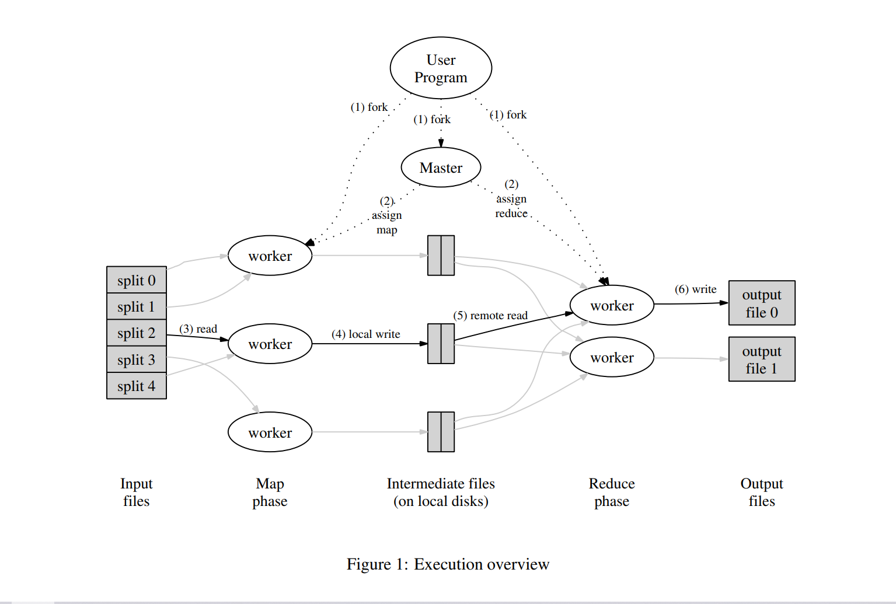
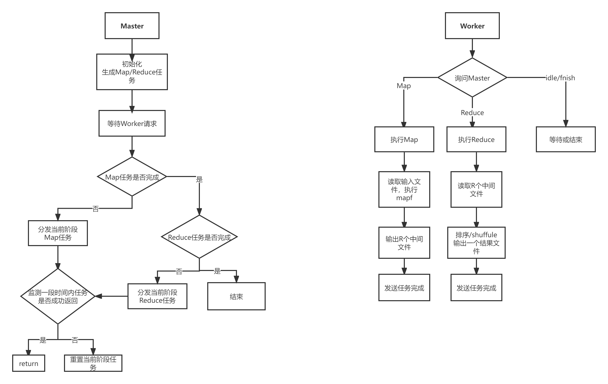

# MapReduce_Lab1


MapReduce_Lab1

<!--more-->

# MapReduce

MapReduce是一种编程模型，用于大规模数据集（大于1TB）的并行运算。方便了编程人员在不会分布式并行编程的情况下，将自己的程序运行在分布式系统上。 

具体实现是指定一个Map（映射）函数，用来把一组键值对映射成一组新的键值对，指定并发的Reduce（归约）函数，用来保证所有映射的键值对中的每一个共享相同的键组。

论文第三节中主要描述的流程图如下：



1. 启动MapReduce, 将输入文件切分成大小在16-64MB之间的文件。然后在一组多个机器上启动用户程序。
2. 其中一个副本将成为master, 剩下的成为worker. master给worker指定任务（M个map任务，R个reduce任务）。master选择空闲的worker给予map或reduce任务
3. 得到Map任务的worker接收切分后的input，执行Map函数，将结果缓存到内存
4. 缓存后的中间结果会周期性的写到本地磁盘，并切分成R份（reducer数量）。R个文件的位置会发送给master, master转发给reducer
5. Reduce worker 收到中间文件的位置信息，通过RPC读取。读取完先根据中间排序，然后按照key分组、合并。
6. Reduce worker 在排序后的数据上迭代，将中间文件交给reduce 函数处理。最终结果写给对应的output文件（分片）
7. 所有map和reduce任务结束后，master唤醒用户程序

## Lab 1: 

### 实验目的：

实现一个调用应用程序 Map 和 Reduce 函数并处理读取和写入文件的工作进程，以及一个将任务分发给Worker并处理失败的Worker的协调进程。在本例中完成一个分布式的词频统计功能。

### 实验要求：

- map 阶段应该将中间键划分为 `nReduce` reduce 任务的桶，其中`nReduce`是 reduce 任务的数量—— `main/mrcoordinator.go`传递给`MakeCoordinator()`的参数。因此，每个映射器都需要创建`nReduce`个中间文件以供 reduce 任务使用。
- worker 实现应该将第 X 个 reduce 任务的输出放在文件`mr-out-X`中。
- 主要完成`mr/worker.go`、`mr/coordinator.go`和`mr/rpc.go`里的任务代码。
- 当作业完全完成时，工作进程应该退出。

### 大致流程：

.png)

### 任务分配：

根据已提供的代码，我们需要完成coordinator.go也就是Master和Worker，以及负责他们之间通信的RPC的实现。其中Master及Worker的工作流程如下图：



### 关键代码：

Mater关键定义:

Master所维护的这些变量为关键参数

```go
c := Coordinator{
	files:             files,           //输入文件数组
	nReduce:           nReduce,          //reduce数量
	mapTasks:          make([]WorkerState, len(files)),     //Map任务数组
	reduceTasks:       make([]WorkerState, nReduce),        //Reduce任务数组
	mapCommitCount:    0,                                   //Map完成数
	reduceCommitCount: 0,                                   //Reduce完成数
	allCommited:       false,                               //程序结束标志
	timeout:           10 * time.Second,                    //检查间隔
}
```

Woker请求任务：

通过RPC循环请求Master分配任务的方法，携带之前产生的WorkID

```go
for {
		args := ApplyTaskArgs{WorkerId: workerId}
		reply := ApplyTaskReply{}
		working := call("Coordinator.ApplyTask", &args, &reply)
    .
    .
}
```

Master接收请求并分配任务ApplyTask：

Map任务数根据文件数产生，任务分为三种状态-未分配0；已分配未提交1；已提交2；遍历Map任务数组，查看当前阶段未分配的任务，并返回相关信息，将索引下任务的状态设为1

```go
const (  //未分配0；已分配未提交1；已提交2
	TaskFree WorkerState = iota
	TaskWoring
	TaskCommit
)
// map 阶段Map任务数根据文件数产生
func (c *Coordinator) ApplyTask(args *ApplyTaskArgs, reply *ApplyTaskReply) error {
for fileId, fileName := range c.files {
	if c.mapTasks[fileId] != TaskFree {
		continue
	}
	reply.TaskId = fileId
	reply.Filename = fileName
	reply.Type = MapTask
	reply.BucketNumber = c.nReduce
	c.mapTasks[fileId] = TaskWoring
    
	// 后台协程，处理超时的 task
	// 分发完 task 就可以返回了
	return nil
}

// reduce 阶段
for fileId, taskState := range c.reduceTasks {
	// task already dispatched
	if taskState != TaskFree {
		continue
	}

	reply.TaskId = fileId
	reply.Filename = ""
	reply.Type = ReduceTask
	reply.BucketNumber = len(c.files)
	c.reduceTasks[fileId] = TaskWoring
	return nil
}
// 全部提交，正常退出
if c.allCommited {
	reply.Type = FinishedTask
	return nil
}
// reduce 任务已经全部下发，但有的 worker 正在处理中，让 worker 闲置以防万一
reply.Type = IdleTask
    return nil
```
Woker收到任务，判断任务类型执行相应操作，最后进行提交当前已完成任务，使Map任务计数器加一。

```go
switch reply.Type {
		case MapTask:
			{
				MapWork(reply, mapf, workerId)
			}
		case ReduceTask:
			{
				ReduceWork(reply, reducef, workerId)
			}
		case IdleTask:
			{
				// idle 状态，此时 master 无任务可下发，并且有的 worker 正在处理中。所以啥也不干空耗时间
				log.Printf("[client %v] idle...", workerId)
				time.Sleep(500 * time.Millisecond)
				// idle 任务不需要 commit，直接申请下一个任务
				continue
			}
		case FinishedTask:
			{
				return
			}
		}
	working = call("Coordinator.CommitTask", &commitArgs, &commitReply)//提交当前任务
```

Worker每完成一个任务，都向`Master`汇报，让`master`进行对应处理。同样使用`rpc`机制实现这个通信，主要由`worker`向`master`传递信息。所以同一个worker在退出之前都会循环向Master请求任务。再一次去请求,当Map任务未全部提交时返回任务类型等待，如果全部提交，执行分配Reduce

```go
// map 任务已经全部下发，但有的 worker 正在处理中，让其他 worker 闲置等待
if c.mapCommitCount != len(c.files) {
	reply.Type = IdleTask
	return nil
}
Reduce...
```

检查所有任务提交：

```go
if c.mapCommitCount != len(c.mapTasks) || c.reduceCommitCount != len(c.reduceTasks) {
		return nil
	}
	c.allCommited = true
	log.Println("[server] all task commited")
	return nil
}
```

所以具体的Worker请求分为：

- 通过RPC在worker定义的call方法去访问Master中的公共方法
- 生成WorkerID
- 请求任务
- 根据返回任务类型做相应操作
- 操作完成提交已完成任务，更新mapCommitCount

多个Worker：

不管是测试脚本，还是我们自己跑`go run`，都是在模拟**集群**。真实运行情况下，各个`worker`跑在不同的机器上。我们自己跑`go run`或测试脚本，启动的是相互独立的**进程**，而不是在同一进程下启动多个**线程**，从而更好地模拟真实情况。创建更多`worker`不是在`Golang`代码内部实现的，而是外部启动时多次执行`go run`实现的。

### 代码调试：

在运行测试代码时发现程序一直未结束，通过打印woker去请求日志可以发现，有worker一直在去请求任务但master的任务列表已经清空了

```bash
2022/04/03 16:38:22 coordinator.go:147: [server] worker 1 apply but no tasks to dispatch, let idle
2022/04/03 16:38:22 worker.go:84: [client 1] idle...
2022/04/03 16:38:23 coordinator.go:147: [server] worker 10 apply but no tasks to dispatch, let idle
2022/04/03 16:38:23 worker.go:84: [client 10] idle...
2022/04/03 16:38:23 coordinator.go:147: [server] worker 0 apply but no tasks to dispatch, let idle
2022/04/03 16:38:23 worker.go:84: [client 0] idle...
2022/04/03 16:38:23 coordinator.go:147: [server] worker 8 apply but no tasks to dispatch, let idle
2022/04/03 16:38:23 worker.go:84: [client 8] idle...
2022/04/03 16:38:23 coordinator.go:147: [server] worker 1 apply but no tasks to dispatch, let idle
2022/04/03 16:38:23 worker.go:84: [client 1] idle...
2022/04/03 16:38:23 coordinator.go:147: [server] worker 10 apply but no tasks to dispatch, let idle
2022/04/03 16:38:23 worker.go:84: [client 10] idle...
2022/04/03 16:38:23 coordinator.go:147: [server] worker 0 apply but no tasks to dispatch, let idle
2022/04/03 16:38:23 worker.go:84: [client 0] idle...
```

但此时打印任务提交完成的标志allCommited发现依然是false

```go
log.Printf("所有任务已提交: %v \n",c.allCommited)
  // 全部提交，正常退出
  if c.allCommited {
    reply.Type = FinishedTask
    return nil
  }
```

查看crash.go中发现测试脚本会使你某个worker挂掉，但此时它已经申请了任务，但并未去提交任务，修改已完成的任务数。

解决办法：

每个worker进来都开启一个后台协程，处理超时的 task，如果超时就将它的任务分配标志设为未分配

```go
    ctx, _ := context.WithTimeout(context.Background(), c.timeout)
		go func() {
			select {
			case <-ctx.Done():
				{
					c.mutex.Lock()
					defer c.mutex.Unlock()
					// 超时后重新将 task 分配给其他 worker
					if c.mapTasks[fileId] != TaskCommit {
						c.mapTasks[fileId] = TaskFree
						log.Println("[server] timeout", "worker:", args.WorkerId, "map task:", fileId)
					}
				}
			}
		}()
```

2.从日志观察多Worker任务执行过程

```go
//为不同worker分配ID
2022/04/03 19:42:44 worker.go:61: [client 0] get a workerId
2022/04/03 19:42:44 worker.go:61: [client 1] get a workerId
2022/04/03 19:42:44 worker.go:61: [client 2] get a workerId
2022/04/03 19:42:44 worker.go:61: [client 3] get a workerId
//分发任务
2022/04/03 19:42:44 coordinator.go:96: [server] dispatch map task, wokerid: 2 task file: ../pg-being_ernest.txt
2022/04/03 19:42:44 coordinator.go:96: [server] dispatch map task, wokerid: 0 task file: ../pg-dorian_gray.txt
2022/04/03 19:42:44 worker.go:73: [client 2] get a map task, filename ../pg-being_ernest.txt taskid 0
2022/04/03 19:42:44 coordinator.go:96: [server] dispatch map task, wokerid: 1 task file: ../pg-frankenstein.txt
2022/04/03 19:42:44 worker.go:73: [client 0] get a map task, filename ../pg-dorian_gray.txt taskid 1
2022/04/03 19:42:44 coordinator.go:96: [server] dispatch map task, wokerid: 3 task file: ../pg-grimm.txt
2022/04/03 19:42:44 worker.go:73: [client 1] get a map task, filename ../pg-frankenstein.txt taskid 2
2022/04/03 19:42:44 worker.go:73: [client 3] get a map task, filename ../pg-grimm.txt taskid 3
//任务提交
2022/04/03 19:42:44 coordinator.go:152: [server] worker  1 commit TaskType 0 task: 2
2022/04/03 19:42:44 coordinator.go:162: [server] map commit, workerid: 1, taskid: 2
//提交后的Master维护的任务队列
2022/04/03 19:42:44 coordinator.go:178: [server] current task stat: map [1 1 2 1 0 0 0 0] reduce [0 0 0 0 0 0 0 0 0 0]
2022/04/03 19:42:47 coordinator.go:103: [server] waiting some woking map tasks, let worker 3 idle
2022/04/03 19:42:47 worker.go:84: [client 3] idle...
//4号worker执行0号Map任务超时
2022/04/03 19:43:04 coordinator.go:89: [server] timeout worker: 4 map task: 0
//将0号Map任务给再次来请求任务的3号Worker
2022/04/03 19:43:04 coordinator.go:96: [server] dispatch map task, wokerid: 3 task file: ../pg-being_ernest.txt
2022/04/03 19:43:04 coordinator.go:103: [server] waiting some woking map tasks, let worker 5 idle
2022/04/03 19:43:04 worker.go:73: [client 3] get a map task, filename ../pg-being_ernest.txt taskid 0
```

### 完整代码：

***coordinator.go***

```go
package mr

import (
	"context"
	"log"
	"net"
	"net/http"
	"net/rpc"
	"os"
	"sync"
	"time"
)

type WorkerState int

const (
	TaskFree WorkerState = iota
	TaskWoring
	TaskCommit
)

type Coordinator struct {
	// Your definitions here.
	files   []string
	nReduce int

	mapTasks    []WorkerState
	reduceTasks []WorkerState
	
	mapCommitCount    int
	reduceCommitCount int
	
	allCommited bool
	
	timeout time.Duration
	
	mutex sync.Mutex
	
	globalWorkerId int

}

// Your code here -- RPC handlers for the worker to call.

//
// an example RPC handler.
//
// the RPC argument and reply types are defined in rpc.go.
//
func (c *Coordinator) Example(args *ExampleArgs, reply *ExampleReply) error {
	reply.Y = args.X + 1
	return nil
}

func (c *Coordinator) GenWorkerId(args *GenWorkerIdArgs, reply *GenWorkerIdReply) error {
	c.mutex.Lock()
	defer c.mutex.Unlock()
	reply.WorkerId = c.globalWorkerId
	c.globalWorkerId++
	log.Printf("[server] dispatch workerid %v\n", reply.WorkerId)
	return nil
}

func (c *Coordinator) ApplyTask(args *ApplyTaskArgs, reply *ApplyTaskReply) error {
	c.mutex.Lock()
	defer c.mutex.Unlock() // 延迟到 return 时执行，相当于 lock_guard

	// map 阶段
	for fileId, fileName := range c.files {
		if c.mapTasks[fileId] != TaskFree {
			continue
		}
		reply.TaskId = fileId
		reply.Filename = fileName
		reply.Type = MapTask
		reply.BucketNumber = c.nReduce
		c.mapTasks[fileId] = TaskWoring
	
		// 后台协程，处理超时的 task
		ctx, _ := context.WithTimeout(context.Background(), c.timeout)
		go func() {
			select {
			case <-ctx.Done():
				{
					c.mutex.Lock()
					defer c.mutex.Unlock()
					// 超时后重新将 task 分配给其他 worker
					if c.mapTasks[fileId] != TaskCommit {
						c.mapTasks[fileId] = TaskFree
						log.Println("[server] timeout", "worker:", args.WorkerId, "map task:", fileId)
					}
				}
			}
		}()
	
		// 分发完 task 就可以返回了
		log.Printf("[server] dispatch map task, wokerid: %v task file: %v\n", args.WorkerId, reply.Filename)
		return nil
	}
	
	// map 任务已经全部下发，但有的 worker 正在处理中，让其他 worker 闲置等待
	if c.mapCommitCount != len(c.files) {
		reply.Type = IdleTask
		log.Printf("[server] waiting some woking map tasks, let worker %v idle\n", args.WorkerId)
		return nil
	}
	
	// reduce 阶段
	for fileId, taskState := range c.reduceTasks {
		// task already dispatched
		if taskState != TaskFree {
			continue
		}
	
		reply.TaskId = fileId
		reply.Filename = ""
		reply.Type = ReduceTask
		reply.BucketNumber = len(c.files)
		c.reduceTasks[fileId] = TaskWoring
	
		ctx, _ := context.WithTimeout(context.Background(), c.timeout)
		go func() {
			select {
			case <-ctx.Done():
				{
					c.mutex.Lock()
					defer c.mutex.Unlock()
					if c.reduceTasks[fileId] != TaskCommit {
						c.reduceTasks[fileId] = TaskFree
						log.Println("[server]:", "worker:", args.WorkerId, "reduce task:", fileId, "timeout")
					}
				}
			}
		}()
	
		log.Printf("[server] dispatch reduce task, wokerid: %v task file: %v\n", args.WorkerId, reply.Filename)
		return nil
	}
	log.Printf("所有任务已提交: %v \n",c.allCommited)
	// 全部提交，正常退出
	if c.allCommited {
		reply.Type = FinishedTask
		return nil
	}
	// reduce 任务已经全部下发，但有的 worker 正在处理中，让 worker 闲置以防万一
	reply.Type = IdleTask
	log.Printf("[server] worker %v apply but no tasks to dispatch, let idle", args.WorkerId)
	return nil
}

func (c *Coordinator) CommitTask(args *CommitTaskArgs, reply *CommitTaskReply) error {
	log.Println("[server] worker ", args.WorkerId, "commit TaskType", args.Type, "task:", args.TaskId)
	c.mutex.Lock()
	defer c.mutex.Unlock()

	switch args.Type {
	case MapTask:
		//避免重复提交
		if c.mapTasks[args.TaskId] != TaskCommit {
			c.mapTasks[args.TaskId] = TaskCommit
			c.mapCommitCount++
			log.Printf("[server] map commit, workerid: %v, taskid: %v\n", args.WorkerId, args.TaskId)
		} else {
			log.Printf("[server] map task %v commit again\n", args.TaskId)
		}
	case ReduceTask:
		if c.reduceTasks[args.TaskId] != TaskCommit {
			c.reduceTasks[args.TaskId] = TaskCommit
			c.reduceCommitCount++
			log.Printf("[server] reduce commit, workerid: %v, taskid: %v\n", args.WorkerId, args.TaskId)
		} else {
			log.Printf("[server] reduce task %v commit again\n", args.TaskId)
		}
	}
	// c.mutex.Unlock()
	
	// 检查 all commit
	log.Println("[server] current task stat: map", c.mapTasks, "reduce", c.reduceTasks)
	if c.mapCommitCount != len(c.mapTasks) || c.reduceCommitCount != len(c.reduceTasks) {
		return nil
	}
	c.allCommited = true
	log.Println("[server] all task commited")
	return nil

}

//
// start a thread that listens for RPCs from worker.go
//
func (c *Coordinator) server() {
	rpc.Register(c)
	rpc.HandleHTTP()
	//l, e := net.Listen("tcp", ":1234")
	sockname := coordinatorSock()
	os.Remove(sockname)
	l, e := net.Listen("unix", sockname)
	if e != nil {
		log.Fatal("[FATAL][server] listen error:", e)
	}
	go http.Serve(l, nil)
}

//
// main/mrcoordinator.go calls Done() periodically to find out
// if the entire job has finished.
//
func (c *Coordinator) Done() bool {
	// Your code here.
	c.mutex.Lock()
	defer c.mutex.Unlock()
	return c.allCommited
}

//
// create a Coordinator.
// main/mrcoordinator.go calls this function.
// nReduce is the number of reduce tasks to use.
//
func MakeCoordinator(files []string, nReduce int) *Coordinator {

	// Your code here.
	c := Coordinator{
		files:             files,
		nReduce:           nReduce,
		mapTasks:          make([]WorkerState, len(files)),
		reduceTasks:       make([]WorkerState, nReduce),
		mapCommitCount:    0,
		reduceCommitCount: 0,
		allCommited:       false,
		timeout:           10 * time.Second,
	}
	
	log.SetFlags(log.Lshortfile | log.Flags())
	log.Println("[server] Master node init:", files, nReduce)
	
	c.server()
	return &c

}
```

***worker.go***

```go
package mr

import (
	"encoding/json"
	"fmt"
	"hash/fnv"
	"io/ioutil"
	"log"
	"net/rpc"
	"os"
	"sort"
	"strconv"
	"time"
)

//
// Map functions return a slice of KeyValue.
//
type KeyValue struct {
	Key   string
	Value string
}

//
// use ihash(key) % NReduce to choose the reduce
// task number for each KeyValue emitted by Map.
//
func ihash(key string) int {
	h := fnv.New32a()
	h.Write([]byte(key))
	return int(h.Sum32() & 0x7fffffff)
}

// 自定义排序用的接口
// 按 key 从小到大排
type ByKey []KeyValue

func (a ByKey) Len() int           { return len(a) }
func (a ByKey) Swap(i, j int)      { a[i], a[j] = a[j], a[i] }
func (a ByKey) Less(i, j int) bool { return a[i].Key < a[j].Key }

//
// main/mrworker.go calls this function.
//
func Worker(mapf func(string, string) []KeyValue,
	reducef func(string, []string) string) {
	log.SetFlags(log.Lshortfile | log.Flags())

	// Your worker implementation here.
	//TODO: genWorkerID
	workerId := 0
	{
		args := GenWorkerIdArgs{} //rpc产生
		reply := GenWorkerIdReply{}
		working := call("Coordinator.GenWorkerId", &args, &reply)
		if !working {
			log.Println("master node crash when ask workerid, exit\ntask info:", reply)
			return
		}
		workerId = reply.WorkerId
		log.Printf("[client %v] get a workerId\n", workerId);
	}
	for {
		args := ApplyTaskArgs{WorkerId: workerId}
		reply := ApplyTaskReply{}
		working := call("Coordinator.ApplyTask", &args, &reply)
		if !working {
			log.Fatalf("[FATAL][client %v] master node crash, exit\n", workerId)
		}
		switch reply.Type {
		case MapTask:
			{
				log.Printf("[client %v] get a map task, filename %v taskid %v\n", workerId, reply.Filename, reply.TaskId)
				MapWork(reply, mapf, workerId)
			}
		case ReduceTask:
			{
				log.Printf("[client %v] get a reduce task, filename %v taskid %v\n", workerId, reply.Filename, reply.TaskId)
				ReduceWork(reply, reducef, workerId)
			}
		case IdleTask:
			{
				// idle 状态，此时 master 无任务可下发，并且有的 worker 正在处理中。所以啥也不干空耗时间
				log.Printf("[client %v] idle...", workerId)
				time.Sleep(500 * time.Millisecond)
				// idle 任务不需要 commit，直接申请下一个任务
				continue
			}
		case FinishedTask:
			{
				log.Printf("[client %v] all task done, exit", workerId)
				return
			}
		default:
			{
				log.Printf("[client %v] error reply.Type: %v\n", workerId, reply.Type)
				return
			}
		}
	
		commitArgs := CommitTaskArgs{WorkerId: workerId, TaskId: reply.TaskId, Type: reply.Type}
		commitReply := CommitTaskReply{}
		working = call("Coordinator.CommitTask", &commitArgs, &commitReply)
		if !working {
			log.Fatalf("[FATAL][client %v] master node crash, exit\n", workerId)
		}
	}

}

func MapWork(task ApplyTaskReply, mapf func(string, string) []KeyValue, workerId int) {

	file, err := os.Open(task.Filename)
	if err != nil {
		log.Fatalf("[FATAL][client %v] %v\n", workerId, err.Error())
	}
	content, err := ioutil.ReadAll(file)
	if err != nil {
		log.Fatalf("[FATAL][client %v] %v\n", workerId, err.Error())
	}
	kva := mapf(task.Filename, string(content))
	
	sort.Sort(ByKey(kva))
	
	// 追加写到 mr-tmp-X-Y 中
	tmpFileName := "mr-tmp-" + strconv.Itoa(task.TaskId) //int -> string
	fileBucket := make(map[int]*json.Encoder)
	for i := 0; i < task.BucketNumber; i++ {
		ofile, err := os.OpenFile(tmpFileName + "-" + strconv.Itoa(i), os.O_CREATE | os.O_RDWR | os.O_APPEND, os.ModeAppend | 0666)
		if err != nil {
			log.Fatal(err.Error())
		}
		defer ofile.Close()
		fileBucket[i] = json.NewEncoder(ofile)
	}
	
	for _, kv := range kva {
		key := kv.Key
		reduceId := ihash(key) % task.BucketNumber
		err := fileBucket[reduceId].Encode(kv)
		if err != nil {
			log.Fatalf("[FATAL][client %v] Unable to write file %v-%v, err: %v", workerId, tmpFileName, reduceId, err.Error())
		}
	}

}

func ReduceWork(task ApplyTaskReply, reducef func(string, []string) string, workerId int) {
	intermediate := []KeyValue{}

	// 读取 mr-tmp
	// map: BucketNum = nReduce
	// reduce: BucketNum = len(files)
	for mapTaskId := 0; mapTaskId < task.BucketNumber; mapTaskId++ {
		filename := "mr-tmp-" + strconv.Itoa(mapTaskId) + "-" + strconv.Itoa(task.TaskId)
		f, err := os.Open(filename)
		if err != nil {
			log.Fatalf("[FATAL][client %v] %v\n", workerId, err.Error())
		}
		defer f.Close()
	
		decoder := json.NewDecoder(f)
		var kv KeyValue
		for decoder.More() {
			err := decoder.Decode(&kv)
			if err != nil {
				log.Fatalf("[FATAL][client %v] Json decode failed, %v\n", workerId, err.Error())
			}
			intermediate = append(intermediate, kv)
		}
	}
	
	sort.Sort(ByKey(intermediate))
	
	// 写入到 mr-out-<reduce taskid>
	ofile, err := os.Create("mr-out-" + strconv.Itoa(task.TaskId+1))
	if err != nil {
		log.Fatalf("[FATAL][client %v] %v", workerId, err.Error())
	}
	defer ofile.Close()
	
	log.Printf("[client %v] complete to reduceTask %v start to write in to %v\n", workerId, task.TaskId, ofile.Name())
	
	i := 0
	for i < len(intermediate) {
		j := i + 1
		for j < len(intermediate) && intermediate[j].Key == intermediate[i].Key {
			j++
		}
		values := []string{}
		for k := i; k < j; k++ {
			values = append(values, intermediate[k].Value)
		}
		output := reducef(intermediate[i].Key, values)
	
		// this is the correct format for each line of Reduce output.
		fmt.Fprintf(ofile, "%v %v\n", intermediate[i].Key, output)
	
		i = j
	}
	
	ofile.Close()

}

//
// example function to show how to make an RPC call to the coordinator.
//
// the RPC argument and reply types are defined in rpc.go.
//
func CallExample() {

	// declare an argument structure.
	args := ExampleArgs{}
	
	// fill in the argument(s).
	args.X = 99
	
	// declare a reply structure.
	reply := ExampleReply{}
	
	// send the RPC request, wait for the reply.
	call("Coordinator.Example", &args, &reply)
	
	// reply.Y should be 100.
	fmt.Printf("reply.Y %v\n", reply.Y)

}

//system
// send an RPC request to the coordinator, wait for the response.
// usually returns true.
// returns false if something goes wrong.
//
func call(rpcname string, args interface{}, reply interface{}) bool {
	// c, err := rpc.DialHTTP("tcp", "127.0.0.1"+":1234")
	sockname := coordinatorSock()
	c, err := rpc.DialHTTP("unix", sockname)
	if err != nil {
		log.Fatal("dialing:", err)
	}
	defer c.Close()

	err = c.Call(rpcname, args, reply)
	if err == nil {
		return true
	}
	fmt.Println(err)
	return false
}
```

***rpc.go***

```go
package mr

//
// RPC definitions.
//
// remember to capitalize all names.
//

import (
	"os"
	"strconv"
)

//
// example to show how to declare the arguments
// and reply for an RPC.
//

type ExampleArgs struct {
	X int
}

type ExampleReply struct {
	Y int
}

type TaskType int32 // map task or reduce task
const (
	MapTask TaskType = iota
	ReduceTask
	IdleTask	// 无空闲任务，但有任务正在处理中，让 worker 闲置以防万一
	FinishedTask	// 所有任务都完成，让 worker 退出
)

type GenWorkerIdArgs struct {
}

type GenWorkerIdReply struct {
	WorkerId int
}

type ApplyTaskArgs struct {
	WorkerId int
}

type ApplyTaskReply struct {
	TaskId int
	Filename string
	BucketNumber int
	Type TaskType
}

type CommitTaskArgs struct {
	WorkerId int
	TaskId int
	Type TaskType
}

type CommitTaskReply struct {
	IsOK bool
}

// Add your RPC definitions here.

// Cook up a unique-ish UNIX-domain socket name
// in /var/tmp, for the coordinator.
// Can't use the current directory since
// Athena AFS doesn't support UNIX-domain sockets.
func coordinatorSock() string {
	s := "/var/tmp/824-mr-"
	s += strconv.Itoa(os.Getuid())
	return s
}
```

附：关于RPC

RPC是指远程过程调用，也就是说两台服务器A，B，一个应用部署在A服务器上，想要调用B服务器上应用提供的函数/方法，由于不在一个内存空间，不能直接调用，需要通过网络来表达调用的语义和传达调用的数据。而本例中使用到的net.Listen("unix", sockname)相当于**进程间通信，同一台主机**

与tcp方式不同在于，这里的地址不再是一个类似127.0.0.1:xxx这样的端口号,而是一个.sock文件的地址，文件地址可以自己选定。

设定地址和sock文件名后，服务端启动成功后会在对应目录生成该sock文件。每次启动前都应该先移除该文件。


