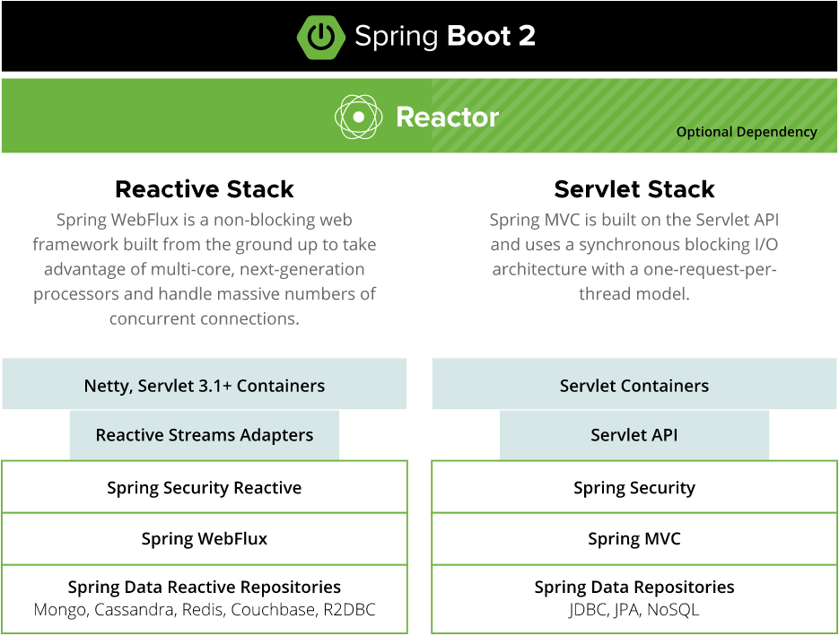
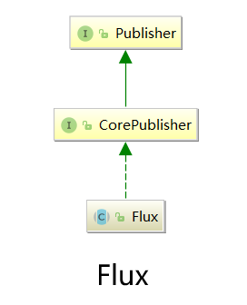
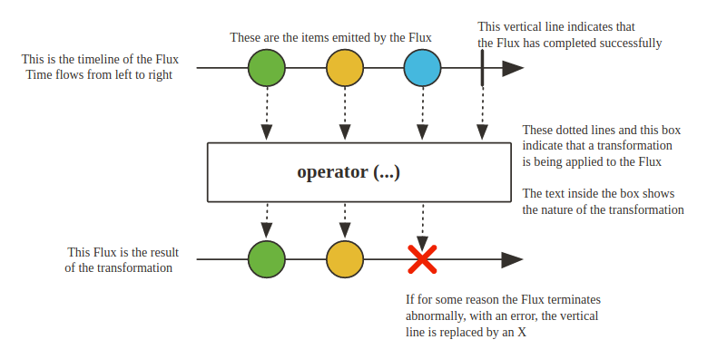

# Webflux


Spring WebFlux 是一个异步非阻塞式 IO 模型.

<!--more-->

# WebFlux

## 前置知识

1. **Lambda（`() -> {}`）、函数式接口（`@FunctionalInterface`，Function，Supplier，Consumer，Predicate）、方法引用（`::`）**
2. **JDK8 Stream**
3. **JDK9 Reactive Stream**(Backpressure、Publisher、Subscriber、Processor、Subscription)


## 一、什么是 WebFlux？

Spring WebFlux 是一个**异步非阻塞式 IO 模型**，通过少量的容器线程就可以支撑大量的并发访问，Spring WebFlux 可以**有效提升系统的吞吐量和伸缩性**。




## 二、什么是 Reactor？

Spring Reactor 是 Pivotal 团队基于反应式编程实现的一种方案，这是一种**非阻塞、由事件驱动的编程方案**，它使用**函数式编程**实现。

换句话说，大家可以**把 Reactor 理解为 Java8 中的 Stream + Java9 中的 Reactive Stream**。

Reactor是一个响应式流，它也有对应的发布者(`Publisher` )，Reactor的发布者用两个类来表示：

- **Mono**（返回 0 | 1 个元素）
- **Flux**（返回 0 | n 个元素）



## 三、Mono

​		Mono 作为发布者，发出一个或零个消息完成或发生错误后终止。若因为某个原因突然终止，它会抛出一个错误并立即终止。

```java
public Person findCurrentUser() {
    if (true) return new Person("Jane", "Doe");
    else return null;
}

//Java 8
public Optional<Person> findCurrentUser() {
    if (true) return Optional.of(new Person("Jane", "Doe"));
    else return Optional.empty();
}

//Reactive Stream
public Mono<Person> findCurrentUser() {
    if (true) return Mono.just(new Person("Jane", "Doe"));
    else return Mono.empty();
}
```


```java
public class MonoTest1 {
    @GetMapping("/hello")
    public String hello() {
        return "hello";
    }
    @GetMapping("/hello2")
    public Mono<String> hello2() {
        return Mono.just("hello Mono");
    }
}
```

上面的例子看不出来区别，改进一下如下：

```java
@RestController
public class MonoTest2 {
    @GetMapping("/helloDefault")
    public String hello() {
        long start = System.currentTimeMillis();
        String msg = getReturn("");
        System.out.println("普通接口耗时：" + (System.currentTimeMillis() - start));
        return msg;
    }
    @GetMapping("/helloMono")
    public Mono<String> hello2() {
        long start = System.currentTimeMillis();
        Mono<String> msg = Mono.fromSupplier(() -> getReturn("Mono"));
        System.out.println("WebFlux 接口耗时：" + (System.currentTimeMillis() - start));
        return msg;
    }

    private String getReturn(String type){
        try {
            Thread.sleep(2000);
        } catch (InterruptedException e) {
            e.printStackTrace();
        }

        return "Hello " + type;
    }
}
```

​		从调用者（浏览器）的角度而言，是感知不到有什么变化的，因为都是得等待2s才返回数据。但是，从服务端的日志我们可以看出，WebFlux是**直接返回Mono对象的**，而SpringMVC一直同步阻塞2s，线程才返回。

​		WebFlux提供了两种使用模式：①SpringMVC 注解；②Functional Endpoints（Lambda + 流式编程）。上面是 WebFlux 的注解（Spring MVC）使用方式，下面是 WebFlux 函数式使用方式：

```java
//handler 相当于 controller，官方定义是处理，就是写逻辑代码的地方。
//ServerResponse 是对响应的封装，可以设置响应状态，响应头，响应正文。Ok-200响应码
//MediaType 枚举是代表这文本内容类型、返回的是 String 的对象。
//这里用 Mono 作为返回对象，是因为返回包含了一个 ServerResponse 对象，而不是多个元素
@Component
public class MonoTest3 {
    public Mono<ServerResponse> monoTest3(ServerRequest request){
        return ServerResponse.ok()
                .contentType(MediaType.APPLICATION_JSON)
                .bodyValue("hello Mono by Handler");
    }
}

//router 相当于RequestMapping() ，配置映射，官方定义是路由。
//在使用 WebFlux 的 Spring Boot 应用中，只需要创建 RouterFunction 类型的 bean，就会被自动注册来处理请求并调用相应的 HandlerFunction。
@Configuration
public class MonoTestRouter {
    @Bean
    public RouterFunction<ServerResponse> CareerInfo(MonoTest3 handler) {
        return RouterFunctions.route().path("/monoTest",
                b1 -> b1.nest(RequestPredicates.accept(MediaType.APPLICATION_JSON),
                        b2 -> b2.GET("/byHandler", handler::monoTest3)
                ))
                .build();
    }
}
```


## 四、Flux

​		Flux 作为发布者，发出多个或零个消息完成或发生错误后终止。




```java
public List<Person> findAll() {
    return Arrays.asList(
        new Person("Jane", "Doe"),
        new Person("John", "Doe")
    );
}

//Java 8
public Stream<Person> findAll() {
    return Stream.of(
        new Person("Jane", "Doe"),
        new Person("John", "Doe")
    );
}

//Reactive Stream
public Flux<Person> findAll() {
    return Flux.just(
        new Person("Jane", "Doe"),
        new Person("John", "Doe")
    );
}
```


```java
@RestController
public class FluxTest1 {
    @GetMapping(value = "/helloFlux",produces = MediaType.TEXT_EVENT_STREAM_VALUE)
    public Flux<String> flux() {
        Flux<String> flux = Flux.fromArray(new String[]{"java","lambda","stream","back pressure"})
                .map(s -> {
                    try {
                        Thread.sleep(2000);
                    } catch (InterruptedException e) {
                        e.printStackTrace();
                    }
                    return "my->data->" + s;
        });
        return flux;
    }
}
```


## 五、WebFlux 实现增删改查

​		**WebFlux + R2DBC + MySQL**

```java
@Component
public class WebFluxCURD {
    private DatabaseClient dbClient;
    public WebFluxCURD(@Qualifier("DBClient") DatabaseClient client){
        this.dbClient = client;
    }

    public Mono<ServerResponse> createTest(ServerRequest request){
        String sql = "INSERT INTO sysservice (sname,sorder,snote) VALUES ('测试',1,'备注备注备注')";
        return ZZSR2DBCService.insertUpdateDelete(dbClient,sql)
                .flatMap(d -> {
                    String result = d > 0 ? "成功" : "失败";
                    return ServerResponse.ok()
                            .contentType(MediaType.APPLICATION_JSON)
                            .bodyValue("数据添加" + result);
                });
    }

    public Mono<ServerResponse> updateTest(ServerRequest request){
        String sql = "UPDATE sysservice SET snote = '修改备注备注备注' WHERE sname = '测试'";
        return ZZSR2DBCService.insertUpdateDelete(dbClient,sql)
                .flatMap(d -> {
                    String result = d > 0 ? "成功" : "失败";
                    return ServerResponse.ok()
                            .contentType(MediaType.APPLICATION_JSON)
                            .bodyValue("数据修改" + result);
                });
    }

    public Mono<ServerResponse> retrieveTest(ServerRequest request){
        String sql = "SELECT sname FROM sysservice";
        return ZZSR2DBCService.getJsonArray(dbClient,sql)
                .flatMap(d -> ServerResponse.ok()
                        .contentType(MediaType.APPLICATION_JSON)
                        .bodyValue(d.toString())
                );
    }

    public Mono<ServerResponse> deleteTest(ServerRequest request){
        String sql = "DELETE FROM sysservice WHERE sname = '测试'";
        return ZZSR2DBCService.insertUpdateDelete(dbClient,sql)
                .flatMap(d -> {
                    String result = d > 0 ? "成功" : "失败";
                    return ServerResponse.ok()
                            .contentType(MediaType.APPLICATION_JSON)
                            .bodyValue("数据删除" + result);
                });
    }
}
```


​		其中，WebFlux 获取 GET 请求参数的方式为：

```java
//获取所有的 GET 请求参数
Map<String,String> queryDatas = request.queryParams().toSingleValueMap();
//获取某个 GET 请求参数
String queryData = request.queryParam("Data1").toString();
```

​		获取 POST 请求参数的方式为：

```Java
Mono<Map<String,String>> formDatas = request.formData().map(MultiValueMap::toSingleValueMap);
```


## 六、WebFlux 复杂使用

### 1 Mono.zipWith()

​		把当前流中的元素与另外一个流中的元素按照一对一的方式进行合并。


```Java
public Mono<ServerResponse> monoZipWith(ServerRequest request){
    return Mono.just("This is Mono.zipWith(),")
        .flatMap(f1 -> {
            //Do something ...
            return Mono.just("mono1.zipWith(mono2)")
                .flatMap(f2 -> ServerResponse.ok()
                         .contentType(MediaType.APPLICATION_JSON)
                         .bodyValue(f1 + f2));
        });
}

public Mono<ServerResponse> monoZipWith(ServerRequest request){
    Mono<String> mono1 = Mono.just("This is Mono.zipWith(),");
    Mono<String> mono2 = Mono.just("mono1.zipWith(mono2)");

    return mono1.zipWith(mono2)
        .flatMap(d -> ServerResponse.ok()
                 .contentType(MediaType.APPLICATION_JSON)
                 .bodyValue(d.getT1() + d.getT2())
                );
}
```


### 2 Mono.zip()

​		合并多个数据源，最多允许同时合并 8 个数据源。注意：其中任意一个 Mono 为空最终都将得到空 Mono。


```java
//Tuple 元组
public static <T1, T2> Mono<Tuple2<T1, T2>> zip(Mono<? extends T1> p1, Mono<? extends T2> p2) {
    return zip(p1, p2, Flux.tuple2Function());
}
```


```java
public Mono<ServerResponse> monoZip(ServerRequest request){
        return Mono.just("This is Mono.zip()")
                .flatMap(f1 -> {
                    //Do something ...
                    return Mono.just("Victory or Defeat")
                            .flatMap(f2 -> {
                                //Do something ...
                                return Mono.just("Data source 3")
                                        .flatMap(f3 -> {
                                            //Do something ...
                                            return ServerResponse.ok()
                                                    .contentType(MediaType.APPLICATION_JSON)
                                                    .bodyValue(f1 + "," + f2 + "?" + f3);
                                        });
                            });
                });
    }
public Mono<ServerResponse> monoZip(ServerRequest request){
    Mono<String> mono1 = Mono.just("This is Mono.zip()");
    Mono<String> mono2 = Mono.just("Victory or Defeat");
    Mono<String> mono3 = Mono.empty();

    return Mono.zip(mono1,mono2,mono3)
        .flatMap(d -> ServerResponse
                 .ok()
                 .contentType(MediaType.APPLICATION_JSON)
                 .bodyValue(d.getT1() + "   " + d.getT2() + d.getT3())
                );
}
```

​		上述代码中，**产生 mono1、mono2、mono3 的过程是 并行 的**，因此可以加快程序的执行。

### 3 Mono.map() 与 Mono.flatMap()

​		Mono.flatMap()，入参 Function 的返回值要求是一个 Mono。


​		Mono.map()，入参 Function 只要求返回一个普通对象。


​		**因此，要将这些调用串联为一个整体链式调用，就必须使用 flatMap，而不是 map。**


​		实例：考生考卷压缩导出

```Java
//试卷信息——试卷名称、试卷总分、考试时间
Mono<Map<String,Object>> paperInfo = Mono.just(new HashMap<String,Object>());
//试卷明细——题型、大题序号、大题总分、包含小题数量
Mono<JSONArray> paperDetail = Mono.just(new JSONArray());
//考生信息——考生主键、考生姓名、考生考号
Mono<List<Map<String, Object>>> candidate = Mono.just(new ArrayList<Map<String,Object>>());
//session
Mono<WebSession> sessionMono = request.session();

return Mono.zip(paperInfo,paperDetail,candidate,sessionMono)
    .flatMap(d -> {
        if (d.getT2().length() == 0 || d.getT3().size() == 0)
            return ServerResponse.status(500).bodyValue("数据库繁忙，请稍后再试！");
        return createCandidatePaper(sFullParams,d);
    });
```

```java
Mono<JSONArray> arrayD = Mono.just(new JSONArray());//单选题
Mono<JSONArray> arrayM = Mono.just(new JSONArray());//多选题
Mono<JSONArray> arrayJ = Mono.just(new JSONArray());//判断题
Mono<JSONArray> arrayF = Mono.just(new JSONArray());//填空题
Mono<JSONArray> arrayS = Mono.just(new JSONArray());//简答题
Mono<JSONArray> arrayC = Mono.just(new JSONArray());//计算题
Mono<JSONArray> arrayA = Mono.just(new JSONArray());//材料分析题

//d.getT2()为某场考试考试题型信息
for (int i = 0; i < d.getT2().length(); i ++){
    JSONObject object = d.getT2().getJSONObject(i);
    String qtype = object.get("qtype").toString();//试题类型
    String qdtxh = object.get("qdtxh").toString();//大题序号
    String qdtsonsum = object.get("qdtsonsum").toString();//包含小题个数
    String qdtzf = object.get("qdtzf").toString();//大题总分

    //从数据库获取某考生对应题型的数据
    Mono<JSONArray> qinfo = ZZSR2DBCService.getJsonArray(dbClient,getQuestionInfoByCandidate(qtype,euno),new HashMap<>(sFullParams))
        .flatMap(a -> {
            JSONObject objectTmp = new JSONObject();
            objectTmp.put("qtype",qtype);
            objectTmp.put("qdtxh",qdtxh);
            objectTmp.put("qdtsonsum",qdtsonsum);
            objectTmp.put("qdtzf",qdtzf);
            a.put(a.length(),objectTmp);
            return Mono.just(a);
        });

    //根据题型将考生考卷数据放入对应的Mono中
    switch (qtype){
        case "D": arrayD = qinfo;break;
        case "M": arrayM = qinfo;break;
        case "J": arrayJ = qinfo;break;
        case "F": arrayF = qinfo;break;
        case "S": arrayS = qinfo;break;
        case "C": arrayC = qinfo;break;
        case "A": arrayA = qinfo;break;
    }
}

return Mono.zip(arrayD, arrayM, arrayJ, arrayF, arrayS, arrayC, arrayA)
    .flatMap(f2 -> {
        for (int i = 0; i < d.getT2().length(); i ++){
            JSONObject object = d.getT2().getJSONObject(i);
            String qtype = object.get("qtype").toString();
            int index = 0;
            //根据题型类别获取对应Mono中的数据
            switch (qtype){
                case "D": index = 0;break;
                case "M": index = 1;break;
                case "J": index = 2;break;
                case "F": index = 3;break;
                case "S": index = 4;break;
                case "C": index = 5;break;
                case "A": index = 6;break;
            }
            JSONArray array = (JSONArray) f2.get(index);
            if (array != null && array.length() > 0) CreateQuestion(wordSer,document,array);
        }
        
        //往word中写入考卷数据
        
        return Mono.just(f2.size());
    });
```


