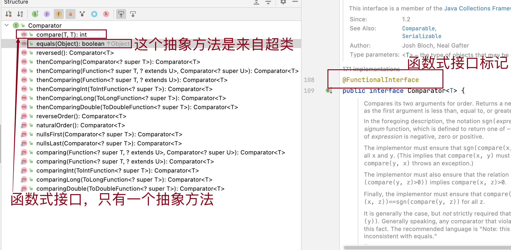
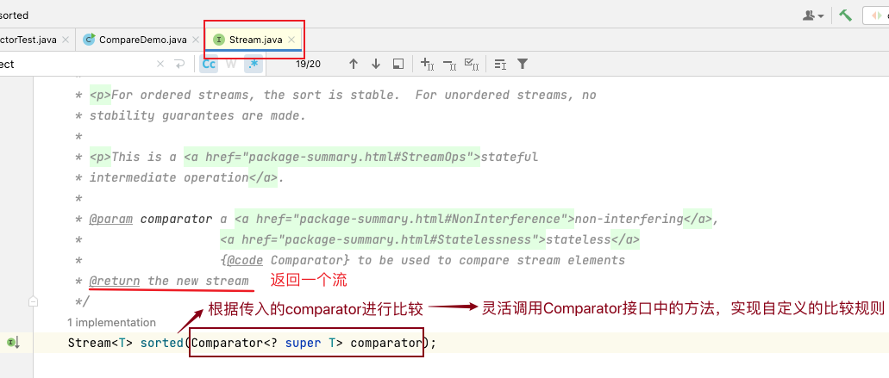
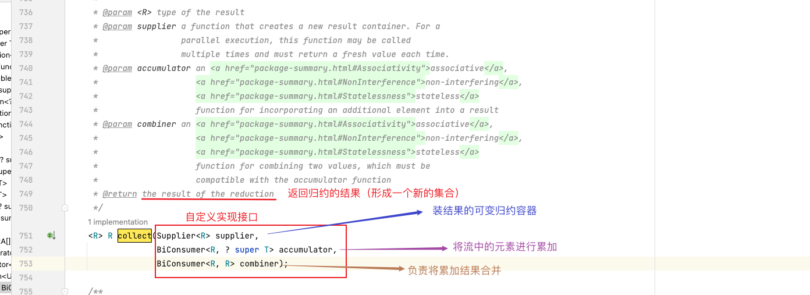
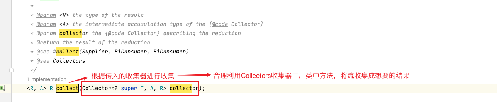

# 比较器和收集器


流基本操作分为中间操作和终止操作，中间操作包括`filter`，`map`，`limit`，`sorted`，`distinct`等，终止操作包...

<!--more-->

# 比较器和收集器

流基本操作分为中间操作和终止操作，中间操作包括`filter`，`map`，`limit`，`sorted`，`distinct`等，终止操作包括`forEach`，`count`，`collect`等。今天分享有关中间操作`Stream<T> sorted(Comparator<? super T> comparator);`和终止操作`<R, A> R collect(Collector<? super T, A, R> collector)`相关内容。

比较器`Comparator`接口新增了多种静态和默认方法，使排序操作变得更加简单，只需要通过一系列库方法调用，就能根据一个属性对集合进行排序。收集器`Collectors`提供将流转换回各类集合所需的静态方法，也可以在"下游"使用，利用它们对分组或分区操作进行后期处理。

## 1 比较器

### 1.1 比较的实现方式

Java实现对象排序的方式有两种：

- 自然排序：`java.lang.Comparable`接口
- 定制排序：`java.util.Comparator`接口

一、Comparable接口强行对实现它的每个类的对象进行整体排序，这种排序被称为类的自然排序。

实现`Comparable`接口必须实现重写`compareTo()`方法。`compareTo()`方法是类内部的比较器，一旦编写好了就确定了类中对象的先后次序。像String、包装类等实现了`Comparable`接口，重写了`compareTo(Obj)`方法，给出了比较两个对象大小的方式，比如进行从小到大的排序。


重写`compareTo(obj)`的规则：

- ​	如果当前对象this大于形参对象obj，则返回正整数；

- ​	如果当前对象this小于形参对象obj，则返回负整数；

- ​	如果当前对象this等于形参对象obj，则返回零；


对于自定义类来说，如果需要排序，就可以让自定义类实现`Comparable`接口，重写`compareTo(obj)`方法。在`compareTo(obj)`方法中指明如何排序。

```java
public class Goods implements Comparable{
    private String name;
    private double price;

    @Override
    public int compareTo(Object o) {
        if (o instanceof  Goods){
            Goods goods = (Goods) o;
//            方式一
            if (this.price > goods.price){
                return 1;
            }else if(this.price < goods.price){
                return -1;
            }else {
                return -this.name.compareTo(goods.name);
            }
//            方式二
//            return Double.compare(this.price,goods.price);
        }
        throw new RuntimeException("传入的数据类型不一致");
    }

    public Goods(String name, double price) {
        this.name = name;
        this.price = price;
    }

     public static void main(String[] args) {
        Goods goods1 = new Goods("java攻略", 74.6);
        Goods goods2 = new Goods("css秘密花园1", 154.6);
        Goods goods3 = new Goods("java从入门到精髓", 54.6);
        Goods goods4 = new Goods("算法", 24.6);
        Goods goods5 = new Goods("研究生英语阅读教程", 94.6);
        Goods goods6 = new Goods("新中特", 64.6);
        Object[] objects = {goods1,goods2,goods3,goods4,goods5,goods6};
        Arrays.sort(objects);
        for (Object s : objects) {
            System.out.println(s);
        }
    }

}
```

实现了`Comparable`接口的类，可以和自己比较，就意味着该类支持排序。  实现`Comparable`接口的对象列表（比如list集合）和数组可以通过 **`Collections.sort`** 或**`Arrays.sort`**进行自动排序。

二、实现`Comparator`接口，只是实现一种比较方式，是类外部的比较器。当元素的类型没有实现`java.lang.Comparable`接口而又不方便修改代码，或者实现了`java.lang.Comparable`接口的排序规则不是想要的比较操作，那么就可以考虑使用`Comparator`的对象来排序。`Comparator`是比较器接口，如果需要控制某个类的次序，但该类本身不支持排序(即没有实现`Comparable`接口)，那么就可以建立一个**“该类的比较器”**来进行排序，这个“比较器”只需要实现Comparator接口即可。



总结：简单情况来说如果是实现一类大量比较器操作建议实现`comparable`接口，而只是临时或只使用一次建议使用`comparator`接口。在流的中间操作使用**`Stream<T> sorted(Comparator<? super T> comparator)`**。

### 1.2 比较器功能方法

`compare(T o1, T o2)` 方法，比较o1和o2的大小；

```java
int compare(T o1, T o2) 
```

- 如果方法返回正整数，则表示o1大于o2；

- 如果返回负整数，则表示o1小于o2；

- 如果返回0，则表示o1等于o2；

  

#### 1.一个类实现Comparator接口并重写compare()

CompareDemoImplement

```java
package com.example.comp_coll.Comparator;

import java.io.Serializable;
import java.util.Comparator;
import java.util.List;

class AgeComparator implements Comparator<Student>, Serializable {
    private static final long serialVersionUID = 1L;
    @Override
    public int compare(Student s1, Student s2) {
        return s1.getAge() - s2.getAge();
    }
}
class NameComparator implements Comparator<Student>, Serializable {
    private static final long serialVersionUID = 1L;
    @Override
    public int compare(Student s1, Student s2) {
        return s1.getName().compareTo(s2.getName());
    }
}
public class CompareDemoImplement {
    public static void main(String[] args) {
        List<Student> list = Student.getStudentList();

        System.out.println("--- Sort Students by age ---");

        AgeComparator ageComparator = new AgeComparator();
        List<Student> collect1 = list.stream().sorted(ageComparator).collect(Collectors.toList());
        System.out.println(collect1);

        System.out.println("--- Sort Students by name ---");

        Comparator nameComparator = new NameComparator();
        Object collect2 = list.stream().sorted(nameComparator).collect(Collectors.toList());
        System.out.println(collect2);
    }
}
```

输出

```tex
--- Sort Students by age ---
[Aam <-> 18, Zhyam <-> 21, Eohan <-> 22]
--- Sort Students by name ---
[Aam <-> 18, Eohan <-> 22, Zhyam <-> 21]
```


#### 2. 使用lambda表达式定义compare

```java
Comparator<Student> ageComp = (s1, s2) -> s1.getAge() - s2.getAge();
Comparator<Student> nameComp = (s1, s2) -> s1.getName().compareTo(s2.getName()); 
```

示例CompareDemo

```java
public class CompareDemo {
    public static void main(String[] args) {
        List<Student> list = Student.getStudentList();
        System.out.println("--- Sort Students by name ---");
//        Comparator<Student> nameComp = new Comparator<Student>() {
//            @Override
//            public int compare(Student s1, Student s2) {
//                return s1.getName().compareTo(s2.getName());
//            }
//        };

//        lambda表达式
        Comparator<Student> nameComp = (s1, s2) -> s1.getName().compareTo(s2.getName());
//        stream.sorted排序
        List<Student> listAfterNameSorted = list.stream().sorted(nameComp).collect(Collectors.toList());
        System.out.println(listAfterNameSorted);
        list.forEach(s -> System.out.println("list.sort排序前："+s));
//        list.sort(nameComp);//具有破坏性，会破坏原始数据，不满足函数式编程的不可变性
//        list.forEach(s -> System.out.println("list.sort排序后："+s));

        Comparator<Student> ageComp = (s1, s2) -> s1.getAge() - s2.getAge();
        System.out.println("--- Sort Students by age ---");
        List<Student> listAfterAgeSorted = list.stream().sorted(ageComp).collect(Collectors.toList());
        System.out.println(listAfterAgeSorted);
        
    }
}
```

输出

```tex
--- Sort Students by name ---
[Aam <-> 18, Eohan <-> 22, Zhyam <-> 21]
list.sort排序前：Aam <-> 18
list.sort排序前：Zhyam <-> 21
list.sort排序前：Eohan <-> 22
list.sort排序后：Aam <-> 18
list.sort排序后：Eohan <-> 22
list.sort排序后：Zhyam <-> 21
--- Sort Students by age ---
[Aam <-> 18, Zhyam <-> 21, Eohan <-> 22]
```

注意：`Arrays.sort`方法返回`void`，这种排序是破坏性的，会修改所提供的集合。不符合Java 8函数式编程的不可变性(immutability)。


### 1.3 利用比较器实现排序

我们可以使用`Stream.sorted`、`Collections.sort`、`List.sort`和`Arrays.sort`方法来使用我们的比较器。

CompareDemoSorted

```java
package com.example.comp_coll.Comparator;

import java.util.Arrays;
import java.util.Collections;
import java.util.Comparator;
import java.util.List;
public class CompareDemoSorted {
    public static void main(String[] args) {
        List<Student> list = Student.getStudentList();
        Comparator<Student> ageComp = (s1, s2) -> s1.getAge() - s2.getAge();
        Comparator<Student> nameComp = (s1, s2) -> s1.getName().compareTo(s2.getName());

//        Stream.sorted返回一个由这个流的元素组成的流，根据提供的比较器进行排序。
        System.out.println("--- Stream.sorted Students by age ---");
        list.stream().sorted(ageComp).forEach(s -> System.out.println(s));

        System.out.println("--- Stream.sorted Students by name ---");
        list.stream().sorted(nameComp).forEach(s -> System.out.println(s));
      

//        Collections.sort根据给定的比较器实例对指定的列表进行排序。
        System.out.println("--- Collections.sort Students by age ---");
        Collections.sort(list, ageComp);
        list.forEach(s -> System.out.println(s));

        System.out.println("--- Collections.sort Students by name ---");
        Collections.sort(list, nameComp);
        list.forEach(s -> System.out.println(s));

//        List.sort根据给定的比较器实例对这个列表进行排序。
        System.out.println("--- List.sort Students by age ---");
        list.sort(ageComp);
        list.forEach(s -> System.out.println(s));

        System.out.println("--- List.sort Students by name ---");
        list.sort(nameComp);
        list.forEach(s -> System.out.println(s));

//        Arrays.sort根据指定比较器产生的顺序对指定的对象数组进行排序。
        Student st1 = new Student("Ram", 18);
        Student st2 = new Student("Shyam",22);
        Student st3 = new Student("Mohan",19);

        Student[] array = {st1, st2, st3};

        System.out.println("--- Arrays.sort Students by age ---");
        Arrays.sort(array, ageComp);
        for (Student s : array) {
            System.out.println(s);
        }

        System.out.println("--- Arrays.sort Students by name ---");
        Arrays.sort(array, nameComp);
        for (Student s : array) {
            System.out.println(s);
        }
    }
}

```

注意：`Collections.sort`、`List.sort`和`Arrays.sort`方法返回`void`，这种排序是破坏性的，会修改所提供的集合。不符合Java 8函数式编程的不可变性(immutability)。所以，Java 为`java.util.Comparator`接口新增了多种静态和默认方法，是排序变得更加的简单，只需要用过一系列库的调用，就可以对`POJO`集合进行排序。

### ==1.4 Comparator比较器的方法==

在java8中，比较器接口定义了一些静态和默认方法，将利用比较器对集合和Map进行排序。

#### 1.reversed

`reversed`是Java比较器功能接口的默认方法。`reversed`返回一个比较器，该比较器强制执行反向排序。声明如下：

```java
default Comparator<T> reversed() 
```

要使用`reversed`方法，我们需要实例化我们的比较器并调用该方法。

`reversed`将返回新的比较器实例，该实例将强加给该比较器反向排序。

```java
 @Test
    public void ComparatorReversedDemo(){
        List<Student> list = Student.getStudentList();//[Aam <-> 18, Zhyam <-> 21, Eohan <-> 22]
        System.out.println(list);
        Comparator<Student> ageComparator = (s1, s2) -> s1.getAge() - s2.getAge();
        List<Student> list1 = list.stream().sorted(ageComparator.reversed()).collect(Collectors.toList());
        System.out.println(list1);
        System.out.println("\n-----------");
        List<Student> list2 = list.stream().sorted(Comparator.comparing(Student::getAge).reversed()).collect(Collectors.toList());
        System.out.println(list2);
    }
```

#### 2.reverseOrder

`reverseOrder`是一个静态方法，返回比较器，对对象集合进行反向自然排序。`Comparator.reverseOrder`反转了自然排序。它在内部调用`Collections.reverseOrder()`并返回比较器实例。查找`Comparator.reverseOrder`的Java源代码。

```java
public static <T extends Comparable<? super T>> Comparator<T> reverseOrder() {
     return Collections.reverseOrder();
} 
```

示例：

```java
 @Test
    public void ComparatorReverseOrderDemo(){
        List<Student> stdList = Student.getStudentList();
        List<Student> collect = stdList.stream().sorted(Comparator.reverseOrder()).collect(Collectors.toList());
        System.out.println(collect);
    }
```

#### 3.naturalOrder

`naturalOrder`是比较器功能接口的静态方法。`Comparator.naturalOrder`方法返回一个比较器，该比较器以自然顺序比较可比较的对象。对于自然排序，一个类需要实现`Comparable`并定义`compareTo`方法。一个对象的集合按照自然排序的`compareTo`方法进行排序。像Integer、String和Date这样的Java类实现了`Comparable`接口，并覆盖了其`compareTo`方法，它们以词汇表(lexicographic-order)排序。

从Java源代码中找到naturalOrder方法声明。

```java
static <T extends Comparable<? super T>> Comparator<T> naturalOrder() 
```

示例：

```java
 @Test
    public void ComparatorNaturalOrderDemo(){
        List<Integer> numList = Arrays.asList(12, 10, 15, 8, 11);
        List<Integer> collect1 = numList.stream().sorted(Comparator.naturalOrder()).collect(Collectors.toList());
        System.out.println(collect1);
        System.out.println("-----------");
        List<Student> stdList = Student.getStudentList();
        List<Student> collect2 = stdList.stream().sorted(Comparator.naturalOrder()).collect(Collectors.toList());
        System.out.println(collect2);
    }
```

#### 4.nullsFirst

`nullsFirst`是比较器功能接口的静态方法。`Comparator.nullsFirst`方法返回一个对`null`友好的比较器，它认为`null`小于非`null`。

从`Java`源代码中找到它的声明。

```java
static <T> Comparator<T> nullsFirst(Comparator<? super T> comparator) 
```

找到由`nullsFirst`方法返回的比较器工作原理。

1. 空元素被认为是小于非空元素的。
2. 当两个元素都是空的时候，那么它们就被认为是相等的。
3. 当两个元素都是非空的时候，指定的比较器决定了顺序。
4. 如果指定的比较器是空的，那么返回的比较器认为所有非空的元素是相等的。

示例：

```java
//    nullsFirst方法返回一个对null友好的比较器，它认为null小于非null
    @Test
    public void NullsFirstDemo(){
        Student s1 = new Student("Xam", 18);
        Student s2 = new Student("Zhyam", 22);
        Student s3 = new Student("Yohan", 17);

        System.out.println("-------Case1: One null----------");

        List<Student> list = Arrays.asList(s1, s2, null, s3);
        List<Student> collect1 = list.stream().sorted(Comparator.nullsFirst(Comparator.comparing(Student::getName))).collect(Collectors.toList());
        System.out.println(collect1);//[null, Xam <-> 18, Yohan <-> 17, Zhyam <-> 22]

      
        System.out.println("--------Case2: More than one null---------");

        list = Arrays.asList(s1, null, s2, null, s3);
        List<Student> collect2 = list.stream().sorted(Comparator.nullsFirst(Comparator.comparing(Student::getName))).collect(Collectors.toList());
        System.out.println(collect2);//[null, null, Xam <-> 18, Yohan <-> 17, Zhyam <-> 22]


        System.out.println("--------Case3: Reverse specified Comparator to nullsFirst---------");

        list = Arrays.asList(s1, null, s2, null, s3);
        List<Student> collect3 = list.stream().sorted(Comparator.nullsFirst(Comparator.comparing(Student::getName).reversed())).collect(Collectors.toList());
        System.out.println(collect3);//[null, null, Zhyam <-> 22, Yohan <-> 17, Xam <-> 18]


        System.out.println("--------Case4: Reverse Comparator returned by nullsFirst---------");

        list = Arrays.asList(s1, null, s2, null, s3);
        List<Student> collect4 = list.stream().sorted(Comparator.nullsFirst(Comparator.comparing(Student::getName)).reversed()).collect(Collectors.toList());
        System.out.println(collect4);//[Zhyam <-> 22, Yohan <-> 17, Xam <-> 18, null, null]


        System.out.println("--------Case5: Specify natural order Comparator to nullsFirst---------");

        list = Arrays.asList(s1, null, s2, null, s3);
        List<Student> collect5 = list.stream().sorted(Comparator.nullsFirst(Comparator.naturalOrder())).collect(Collectors.toList());
        System.out.println(collect5);//[null, null, Xam <-> 18, Yohan <-> 17, Zhyam <-> 22]


        System.out.println("--------Case6: Specify null to nullsFirst---------");

        list = Arrays.asList(s1, null, s2, null, s3);
        List<Student> collect6 = list.stream().sorted(Comparator.nullsFirst(null)).collect(Collectors.toList());
        System.out.println(collect6);//[null, null, Xam <-> 18, Zhyam <-> 22, Yohan <-> 17]

    }
```

输出

```tex
-------Case1: One null----------
[null, Xam <-> 18, Yohan <-> 17, Zhyam <-> 22]
--------Case2: More than one null---------
[null, null, Xam <-> 18, Yohan <-> 17, Zhyam <-> 22]
--------Case3: Reverse specified Comparator to nullsFirst---------
[null, null, Zhyam <-> 22, Yohan <-> 17, Xam <-> 18]
--------Case4: Reverse Comparator returned by nullsFirst---------
[Zhyam <-> 22, Yohan <-> 17, Xam <-> 18, null, null]
--------Case5: Specify natural order Comparator to nullsFirst---------
[null, null, Xam <-> 18, Yohan <-> 17, Zhyam <-> 22]
--------Case6: Specify null to nullsFirst---------
[null, null, Xam <-> 18, Zhyam <-> 22, Yohan <-> 17]

```

#### 5.nullsLast

`nullsLast`是比较器功能接口的静态方法。`Comparator.nullsLast`方法返回一个对`null`友好的比较器，认为`null`大于非`null`。

从`Java`源代码中找到它的声明。

```java
static <T> Comparator<T> nullsLast(Comparator<? super T> comparator) 
```

找到由`nullsLast`方法返回的比较器工作原理。

1. 空元素被认为是大于非空元素的。
2. 当两个元素都是空的时候，那么它们就被认为是相等的。
3. 当两个元素都是非空的时候，指定的比较器决定了顺序。
4. 如果指定的比较器是空的，那么返回的比较器认为所有非空的元素是相等的。

示例：

```java
 //    nullsLast方法返回一个对null友好的比较器，认为null大于非null
    @Test
    public void NullsLastDemo(){
        Student s1 = new Student("Xam", 18);
        Student s2 = new Student("Zhyam", 22);
        Student s3 = new Student("Yohan", 17);

        System.out.println("-------Case1: One null----------");

        List<Student> list = Arrays.asList(s1, s2, null, s3);
        List<Student> sorted1 = list.stream().sorted(Comparator.nullsLast(Comparator.comparing(Student::getName))).collect(Collectors.toList());
        System.out.println(sorted1);//[Xam <-> 18, Yohan <-> 17, Zhyam <-> 22, null]


        System.out.println("--------Case2: More than one null---------");

        list = Arrays.asList(s1, null, s2, null, s3);
        List<Student> sorted2 = list.stream().sorted(Comparator.nullsLast(Comparator.comparing(Student::getName))).collect(Collectors.toList());
        System.out.println(sorted2);//[Xam <-> 18, Yohan <-> 17, Zhyam <-> 22, null, null]

        System.out.println("--------Case3: Reverse specified Comparator to nullsLast---------");

        list = Arrays.asList(s1, null, s2, null, s3);
        List<Student> sorted3 = list.stream().sorted(Comparator.nullsLast(Comparator.comparing(Student::getName).reversed())).collect(Collectors.toList());
        System.out.println(sorted3);//[Zhyam <-> 22, Yohan <-> 17, Xam <-> 18, null, null]


        System.out.println("--------Case4: Reverse Comparator returned by nullsLast---------");

        list = Arrays.asList(s1, null, s2, null, s3);
        List<Student> sorted4 = list.stream().sorted(Comparator.nullsLast(Comparator.comparing(Student::getName)).reversed()).collect(Collectors.toList());
        System.out.println(sorted4);//[null, null, Zhyam <-> 22, Yohan <-> 17, Xam <-> 18]


        System.out.println("--------Case5: Specify natural order Comparator to nullsLast---------");

        list = Arrays.asList(s1, null, s2, null, s3);
        List<Student> sorted5 = list.stream().sorted(Comparator.nullsLast(Comparator.naturalOrder())).collect(Collectors.toList());
        System.out.println(sorted5);//[Xam <-> 18, Yohan <-> 17, Zhyam <-> 22, null, null]

        System.out.println("--------Case6: Specify null to nullsLast---------");

        list = Arrays.asList(s1, null, s2, null, s3);
        List<Student> sorted6 = list.stream().sorted(Comparator.nullsLast(null)).collect(Collectors.toList());
        System.out.println(sorted6);//[Xam <-> 18, Zhyam <-> 22, Yohan <-> 17, null, null]
    }
```

#### 6.comparing

`Comparator.comparing`有两种形式。

(1)一个参数，`comparing`是比较器功能接口的静态方法。`Comparator.comparing`接受一个函数，该函数从给定的类型中提取一个可比较的排序键，并返回一个通过该排序键进行比较的比较器。

```java
static <T,U extends Comparable<? super U>> Comparator<T> comparing(Function<? super T,? extends U> keyExtractor) 
```


我们需要传递一个函数，它将从一个类型T中提取一个可比较的排序键，并返回一个通过该排序键进行比较的比较器。

示例：

```java
Comparator<Student> nameComparator = Comparator.comparing(Student::getAge);
```

(2)两个参数

```java
static <T,U> Comparator<T> comparing(Function<? super T,? extends U> keyExtractor, Comparator<? super U> keyComparator) 
```

我们需要传递一个函数和一个比较器。

该方法将从一个类型T中提取一个排序键，并返回一个比较器，使用指定的比较器对该排序键进行比较。

示例：

```java
Comparator<Student> nameComparator = Comparator.comparing(Student::getName, Comparator.reverseOrder());
```

这里我们将提供Comparator.comparing方法的例子。

```java
@Test
//    comparing接受一个函数，该函数从给定的类型中提取一个可比较的排序键，并返回一个通过该排序键进行比较的比较器。
    public void ComparingDemo(){
        List<Student> studentList = Student.getStudentList();


//它将从一个类型T中提取一个可比较的排序键，并返回一个通过该排序键进行比较的比较器。
        List<Student> collect1 = studentList.stream().sorted(Comparator.comparing(Student::getAge)).collect(Collectors.toList());
        System.out.println(collect1);


//        从一个类型T中提取一个排序键，并返回一个比较器，使用指定的比较器对该排序键进行比较。
        List<Student> collect = studentList.stream().sorted(Comparator.comparing(Student::getName, Comparator.reverseOrder())).collect(Collectors.toList());
        System.out.println(collect);

    }
```

对于int、long和double数据类型的排序键，比较器分别有comparingInt、comparingLong和comparingDouble方法。其他方法

| 方法名          | 说明                                                         |
| :-------------- | ------------------------------------------------------------ |
| comparingInt    | 它接受一个从类型`T`中提取一个`int`排序键的函数，并返回一个通过该排序键进行比较的比较器。 |
| comparingLong   | 它接受一个从类型`T`中提取`long`排序键的函数，并返回一个通过该排序键进行比较的比较器。 |
| comparingDouble | 它接受一个从类型`T`中提取`double`排序键的函数，并返回一个通过该排序键进行比较的比较器。 |

#### 7.thenComparing

`thenComparing`是比较器功能接口的默认方法。

`Comparator.thenComparing`返回一个词表顺序(lexicographic-order)的比较器，该比较器被一个比较器实例调用，使用一组排序键对项目进行排序。当这个比较器比较两个元素相等时，`thenComparing`方法决定了顺序。我们可以多次使用`Comparator.thenComparing`。当我们想通过排序键组来确定元素的顺序时，要用到它。

thenComparing有以下形式。

(1).

```java
default Comparator<T> thenComparing(Comparator<? super T> other) 
```

它返回一个词表顺序(`lexicographic-order`)比较器和另一个比较器。查找代码段。

```java
Comparator<StuBasicInfo> compByGrade = Comparator.comparing(StuBasicInfo::getGrade)
Comparator<StuBasicInfo> stuBasicInfoComparator = Comparator.comparing(StuBasicInfo::getLocation)
                .thenComparing(compByGrade); 
```

首先，比较器将按照学生地域名对学生集合进行排序，如果某些学生的地域相同，那么将按照他们的年级进行排序。

(2).

```java
default <U extends Comparable<? super U>> Comparator<T> thenComparing(Function<? super T,? extends U> keyExtractor) 
```

它返回一个词表顺序(`lexicographic-order`)比较器，其中包含一个提取可比较排序键的函数。

```java
Comparator<StuBasicInfo> stuBasicInfoComparator1 = Comparator.comparing(StuBasicInfo::getLocation).thenComparing(StuBasicInfo::getGrade).thenComparing(StuBasicInfo::getScore);
```

首先，学生的集合将按照他们地域名的自然顺序进行排序，如果一些学生根据他们的地域名排序是相同的，那么这些学生将按照他们各自的年级进行排序，如果年级也是相同的，那么他们将按照他们的分数进行排序。

(3).

```java
default <U> Comparator<T> thenComparing(Function<? super T,? extends U> keyExtractor, Comparator<? super U> keyComparator) 
```

它返回一个词表顺序(`lexicographic-order`)的比较器，该比较器带有一个函数，可以提取一个键与给定的比较器进行比较。

```java
        Comparator<StuBasicInfo> stuBasicInfoComparator2 = Comparator.comparing(StuBasicInfo::getLocation)
                .thenComparing(StuBasicInfo::getGrade)
                .thenComparing(StuBasicInfo::getScore, Comparator.reverseOrder());
```

首先，学生的集合将按照他们地域名的自然顺序进行排序，如果一些学生根据他们的地域名排序是相同的，那么这些学生将按照他们各自的年级进行排序，如果年级也是相同的，那么他们将按照他们的分数进行倒序排序。

对于int、long和double数据类型的排序键，比较器分别有`thenComparingInt`、`thenComparingLong`和`thenComparingDouble`默认方法。

| 方法名              | 方法说明                                                     |
| ------------------- | ------------------------------------------------------------ |
| thenComparingInt    | 它返回一个词表顺序(`lexicographic-order`)比较器，其中包含一个提取`int`排序键的函数。 |
| thenComparingLong   | 它返回一个词表顺序(`lexicographic-order`)比较器，其中包含一个提取`long`排序键的函数。 |
| thenComparingDouble | 它返回一个词表顺序(`lexicographic-order`)比较器，其中包含一个提取`double`排序键的函数。 |

如果想进行多重规则排序，使用comparator接口提供的默认和静态方法实现，`Comparing`和`thenComparing`方法都是传入Function作为参数，如果将`thenComparing`方法连接`comparing`方法，首先会比较第一个，如果相同则比较第二个变量，以此类推。

### 1.5 对映射排序

**问题：希望根据键或值对Map排序**

**方案：使用Map.Entry接口新增的静态方法**

Map接口定义的`entrySet`方法返回`Map.Entry`元素的Set。

`entrySet()`方法签名

```java
 Set<Map.Entry<K, V>> entrySet();
```

Map.Entry接口常用的方法，getKey和getValue二者分别返回与某个条目对应的键和值。`Map.Entry`公共静态内部接口新增的静态方法

| 方法                                         | 描述                                                         |
| -------------------------------------------- | ------------------------------------------------------------ |
| comparingByKey()                             | 返回一个比较器，它根据键的自然顺序比较 `Map.Entry`           |
| comparingByKey(Comparator <? super K> cmp)   | 返回一个比较器，它使用给定的Comparator并根据键比较`Map.Entry` |
| comparingByValue()                           | 返回一个比较器，它根据值的自然顺序比较`Map.Entry`            |
| comparingByValue(Comparator <? super K> cmp) | 返回一个比较器，它使用给定的Comparator 并根据值比较`Map.Entry` |


```java
 //    对Map进行映射排序
    @Test
    public  void MapComparingDemo(){
        List<StuBasicInfo> stuBasicInfos = CreatStu.CreatStudent();
        Map<String, Long> collect = stuBasicInfos.stream().collect(Collectors.groupingBy(StuBasicInfo::getGrade, Collectors.counting()));
        System.out.println(collect);
        System.out.println("--------按键排序---------");
        collect.entrySet().stream().sorted(Map.Entry.comparingByKey()).forEach( e -> System.out.printf(" %s （级） 有 %2d  （人） %n",e.getKey(),e.getValue()));
        System.out.println("--------按值排序---------");
        collect.entrySet().stream()  .sorted(Map.Entry.comparingByValue(Comparator.reverseOrder())).forEach( e -> System.out.printf(" %s （级） 有 %2d  （人） %n",e.getKey(),e.getValue()));

    }
```


返回的Map<String,Long>之后，程序将提取entrySet并产生一个流。stream.sorted方法使用提供的比较器生产经过排序的流。在上例中，comparingByKey方法返回一个根据键进行排序的比较器。如果希望以键的倒序顺序排序，可以使用comparingByKey方法的重载形式，它传入比较器作为参数`comparingByKey(Comparator.reverseOrder())`。

## 2 收集器

收集器的作用是对Stream中的元素进行收集而形成一个新的集合。 将流中的元素累积成一个结果，这个结果可以是数值，可以是集合，也可以是一个分组。

收集器作用于流的终止操作collect()。Collector作为Stream的collect方法的参数，Collector是一个接口，它是一个可变的汇聚操作，将输入元素累计到一个可变的结果容器中；它会在所有元素都处理完毕后，将累积的结果转换为一个最终的表示（这是一个可选操作）。Collectors本身提供了关于Collector的常见汇聚实现。

`collect`: 是stream流操作的最后一步终止操作，收集流最后的一个步骤，是一个方法，接受一个collector接口实现类

`Collector`：是一个接口，它是一个可变的汇聚操作，将输入元素累积到一个可变的结果容器中；它会在所有元素都处理完毕后，将结果转换为一个最终的表示；collect方法要接收一个实现了Collector接口的收集器，collect才能对流进行一个收集

`Collectors`:  本身提供了关于Collector的常见汇聚操作，Collectors的内部类CollectorImpl实现了Collector接口，是一个工具类，封装一些实现了预定义collector接口的收集器，可以直接使用。

### 2.1 Stream.collect()收集操作

java8一般通过称为流水线的中间操作来传递流元素，并在达到终止操作后结束。Stream接口定义的collect方法就是一种终止操作，用于将流转换为集合。收集操作就是遍历stream中的元素，并进行累加处理，即归约reduction

归约的定义：

*A reduction operation (also called a fold) takes a sequence of input elements and combines them into a single summary result by repeated application of a combining operation, such as finding the sum or maximum of a set of numbers, or accumulating elements into a list.* 


后面将提到的max(),min(),count(),reduce()都属于reduction operation

动态归约的定义：

*A mutable reduction operation accumulates input elements into a mutable result container, such as a `Collection` or `StringBuilder`, as it processes the elements in the stream.*


区别：动态归约将结果放进Collection， StringBuilder这样的动态容器中，所以称为动态归约。

归约官方文档：https://docs.oracle.com/en/java/javase/17/docs/api/java.base/java/util/stream/package-summary.html#MutableReduction

`Stream.collect`方法两种重载形式

```java
<R>   R collect(Supplier<R> supplier,
                BiConsumer<R,? super T> accumulator,
                BiConsumer<R,R> combiner)
<R,A> R collect(Collector<? super T,A,R> collector)
```

第一个方法签名：三个参数

- 供给者supplier：负责提供动态容器，例如Collector，StringBuilder

- 累加器accumulator：负责将流中的元素累积起来

- 合并者combiner：负责将两个容器的元素合并在一起

  <!--注：在串行流中，combiner根本没有执行，随便写点啥满足参数对象就行。-->

  举例：

  ```java
  @Test
      public void TestThreeColl(){
          Stream<String> stream = Stream.of("hhh", "llll");
  
          ArrayList<String> string1 = new ArrayList<>(); //创建收集容器
          stream.forEach(s -> string1.add(s)); //对流中元素进行重复add操作，将结果加到ArrayList中
  //        System.out.println(string1);
  //        // 等同于
          ArrayList<String> string2 = stream.collect(() -> new ArrayList<>(),//创建收集容器
                  (c, e) -> c.add(e.toString()),//对流中元素进行重复add操作，将结果加到ArrayList中
                  (c1, c2) -> c1.addAll(c2));//串形流进行归约操作将结果归约到一个结果容器中不需要进行子容器合并，并行流将结果归约到多个子结果容器中需要进行合并
  //        System.out.println(string2);
      }
  ```
  
  在collect操作中传递了三个参数有点麻烦，还不如直接传递一个对象！所以就出现了第二个方法签名，使用收集器Collector来替代三参数。

第二个方法签名：collect()传入Collector作为参数，收集器执行“动态可变规约操作”，将元素累加至结果容器，得到一个集合。`java.util.stream.Collector`属于接口， 要实现Collector还是很麻烦的，需要实现好几个接口（也可以使用该接口中提供的of静态方法，生成Collector），于是Java提供了更简单的Collectors工具类来方便我们构建Collector。


### 2.2 Collector收集器接口

如果Collectors工具类中的方法不能满足用户需求，用户可以手动实现Collector接口。

Collector接口

```java
//T：表示流中每个元素的类型。 A：表示中间结果容器的类型。 R：表示最终返回的结果类型。
public interface Collector<T, A, R> {

  Supplier<A> supplier()//生成容器
	
	BiConsumer<A,T>	accumulator()//是累加元素
	
	BinaryOperator<A> combiner()//是合并容器
	
	Function<A,R> finisher()///是输出的结果
	
	Set<Collector.Characteristics>	characteristics()//返回Set的Collector.Characteristics指示此收集器的特征。
	
	//返回一个新的Collector由给定的描述supplier， accumulator，combiner，和finisher功能。
	static <T,A,R> Collector<T,A,R> of(Supplier<A> supplier, 
										BiConsumer<A,T> accumulator, 
										BinaryOperator<A> combiner, 
										Function<A,R> finisher, 
										Collector.Characteristics... characteristics)
										
	
	//返回一个新的Collector由给定的描述supplier， accumulator和combiner功能。
	static <T,R> Collector<T,R,R>	of(Supplier<R> supplier, 
									   BiConsumer<R,T> accumulator, 
									   BinaryOperator<R> combiner, 
									   Collector.Characteristics... characteristics)
	
}

```

手动实现`java.util.stream.Collector`,可采用传入`Collector.of`的supplier、accumulator、combiner、finisher 函数提供lambda表达式或方法引用，以及其他所需的特性。

 收集器使用5个函数，它们的作用是将元素累加到可变容器，并有选择性地对结果进行转换，这5个函数是supplier、accumulator、combiner、finisher、characteristics。

supplier()：使用supplier创建累加器容器。

accumulator()：使用`BiConsumer<A,T>`为累加器添加一个新的数据元素

combiner()：使用`BinaryOperator<A>`合并两个累加器容器

finisher()：使用`Function<A,R>`将累加器转换成结果容器

characteristics()：从枚举值中选择的`Set<Collector.Characteristics>`。

characteristics函数：表示`Collector.Characteristics`枚举的一个不可变的元素Set。三个枚举常量为CONCURRENT、IDENTITY_FINISH、UNORDERED

| 枚举常量        | 含义                                                     |
| --------------- | -------------------------------------------------------- |
| CONCURRENT      | 表示结果容器支持多个线程在结果容器上并发的调用累加器函数 |
| IDENTITY_FINISH | 表示终止器函数返回其参数而不做任何修改                   |
| UNORDERED       | 表示集合操作无需保留元素的出现顺序                       |


几种Collector方法的用法（取自javadoc）

```java
R container = collector.supplier.get(); //创建累加收集器
for(T t : data ){
	collector.accumulator().accept(container, t); //将每个元素添加到累加器容器
}
return collector.finisher().apply(container); //通过finisher函数将累加器容器转换为结果容器
```

在上例中并未出现combiner函数，如果处理的是顺序流，则不需要该函数，算法将既定方式执行。如果处理的是并行流，流将被分为多个子流，每个子流都会生成各自的累加器容器。接下来，在连接过程中使用combiner函数将多个累加器合并为一个，然后应用finisher函数。

利用collect方法返回不可修改的SortedSet

```java
 //返回一个经过排序且不可修改的字符串集，它安字典排序
    public SortedSet<String> oddLengthStringSet(String... strings){
         Collector<String,?,SortedSet<String>> intoSet =  Collector.of(
                 TreeSet<String>::new,  //Supplier：创建新的TreeSet
                 SortedSet::add,   //BiConsumer: 将每个字符串添加到TreeSet
                 (left, right) -> {   // BinaryOperator： 将两个SortedSet实例合二为一
                    left.addAll(right);
                    return left;
                 },
                 Collections::unmodifiableSortedSet); //创建不可修改的TreeSet
        return Stream.of(strings)
                .filter(s -> s.length() % 2 !=0)
                .collect(intoSet);
    }
```


在经过两个自定义collector案例讲解，会发现自定义收集器难度有点高，所以在java标准库中，Collectors类提供了多种用于生成收集器的便利方法，用户几乎不需要创建自定义收集器。

### ==2.3 Collectors收集器工厂==

Collectors本身提供了关于Collector的常见汇聚实现，Collectors的内部类CollectorImpl实现了Collector接口，Collectors本身实际上是一个工厂。下面是常用方法的介绍和代码示例

#### 1.创建可变集合

- `Collectors.toList`

```java
   @Test
    public void ReduceToList() {
        List<String> list = Stream.of("Head", "First", "Java", "Sierra", "Bates")
                .filter(s -> s.length() < 6)
                .collect(Collectors.toList());
        System.out.println(list);
    }
```


- `Collectors.toSet`

```java
 @Test
    public void ReduceToSet(){
        Set<String> set = Stream.of("count","max","map","min","sum","avg","count")
                .map( s -> s.toUpperCase())
                .collect(Collectors.toSet());
        System.out.println(set);//会自动去重
    }
```


- `Collectors.toMap`

toMap()两参数方法签名

```java
//两参数方法签名
static <T,K,U> Collector<T,?,Map<K,U>> toMap(Function<? super T,? extends K> keyMapper, 
                                             Function<? super T,? extends U> valueMapper)

//1、当key重复时，会抛出异常：java.lang.IllegalStateException: Duplicate key 
//2、当value为null时，会抛出异常：java.lang.NullPointerException
```

实例：

```java
@Test
    public void ReduceToMap1(){
        List<School> integerList = new ArrayList<>();
        integerList.add(new School("a",3));
        integerList.add(new School("b",3));
        integerList.add(new School("c",3));
        integerList.add(new School("d",2));
        integerList.add(new School("e",2));
//        两参数，key重复时会报错，value为null时会报错
        Map map =integerList.stream().collect(Collectors.toMap(School::getSname,School::getNumbers));
        System.out.println(map);//{a=3, b=3, c=3, d=2, e=2}
    }
```

Function接口identity方法

 返回一个输出跟输入一样的Lambda表达式对象 

`Function.identity`方法签名

```java
static <T> Function<T,T> identity()
//在java标准库中的实现
static <T> Function<T,T> identity(){
    return t -> t;
}
```

```java
   @Test
    public void ReduceToMap2(){
        List<School> integerList = new ArrayList<>();
        integerList.add(new School("a",3));
        integerList.add(new School("b",3));
        integerList.add(new School("c",3));
        integerList.add(new School("d",2));
        integerList.add(new School("e",2));
    //**Function接口identity方法** 返回一个输出跟输入一样的Lambda表达式对象
        Map map =integerList.stream().collect(Collectors.toMap(School::getSname, Function.identity()));//{a=School{sname=a, numbers='3'}, b=School{sname=b, numbers='3'}, c=School{sname=c, numbers='3'}, d=School{sname=d, numbers='2'}, e=School{sname=e, numbers='2'}}
        System.out.println(map);
    }
```


toMap()三参数方法签名：

```java
//第三个参数用在key值冲突的情况下：如果新元素产生的key在Map中已经出现过了，第三个参数就会定义解决的办法。
static <T,K,U> Collector<T,?,Map<K,U>> toMap(  Function<? super T,? extends K> keyMapper, 
											   Function<? super T,? extends U> valueMapper, 
											   BinaryOperator<U> mergeFunction)

```

示例：

```java
@Test
    public void ReduceToMap3(){
        List<School> integerList = new ArrayList<>();
        integerList.add(new School("a",3));
        integerList.add(new School("b",3));
        integerList.add(new School("c",3));
        integerList.add(new School("d",2));
        integerList.add(new School("e",2));
        integerList.add(new School("e",2));

        Map map =integerList.stream().collect(Collectors.toMap(School::getSname,School::getNumbers,(a,b) -> a + b));
        System.out.println(map);
    }
```

`toList`、`toSet`和`toMap`都是使用的默认数据类型，即List使用`ArrayList`，Set是`HashSet`。


- `Collectors.toCollection()`

  如果要使用特定的数据类型，需要使用`Collectors.toCollection`方法，参数为Supplier。下面以将结果归约为LinkedList为例

```java
@Test
    public void ReduceToCollection(){
        List<String> list = Stream.of("count","max","map","min","sum","avg")
                .filter(a -> a.length() < 4)
                .map( s -> s.toUpperCase())
                .collect(Collectors.toCollection(LinkedList::new));
        System.out.println(list);
       System.out.println(list.getClass());
    }
```


拓展：Stream接口还定义了一个用于创建对象数组的方法toArray，它有两种重载形式：

```java
			Object[] toArray();
	<A>      A[] toArray(IntFunction<A[]> generator);
```

第一种形式返回一个包含流元素的数组，但未指定类型。第二种形式传入一个函数并生成所需要类型的新数组，数组的长度与流相同，很容易与数组构造函数引用一起使用。

```java
//   Stream.toArray()
    @Test
    public void TestArray(){
        String[] strings = Stream.of("the waffler", "reverse psychologist", "pms avenger")
                .toArray(String[]::new);
        for (int i = 0; i < strings.length; i++) {
            System.out.println(strings[i]);
        }
    }
```

返回数组具有指定的类型，其长度与流中的元素数量匹配。


#### 2.创建不可变集合

java.utils.Collections是集合工具类，用来对集合进行操作。Collections 是一个操作 Set、List 和 Map 等集合的工具类。Collections 中提供了一系列静态的方法对集合元素进行排序、查询和修改等操作，还提供了对集合对象设置不可变、对集合对象实现同步控制等方法。

Collections工具类定义了`unmodifiableList`,`unmodifiableSet`,`unmodifiableMap`方法用来创建不可变的列表、集合或映射

方法签名：

```java
static <T> List<T> unmodifiableList(List<? extends T> list)
static <T> Set<T> unmodifiableSet(set<? extends T> s)
static <K,V> Map<T> unmodifiableMap(Map<? extends K, ? extends V> m)
```

上述三种方法的参数分别是现有的列表、集合、映射。创建的结果列表、集合、映射中包含的元素和参数与原来的参数相同，重要的区别就是创建的结果是不可变的，也就是不能进行增删改查操作，所有可以修改集合的方法（如add或remove）都会跑出UnsupportedOperationException。

> ` Collections.unmodifiableLis`t实现的不是真正的不可变集合，当原始集合修改后，不可变集合也发生变化。不可变集合不可以修改集合数据，当强制修改时会报错 

java8的写法

```java
//创建不可变集合
    @Test
    public void TestUnmodifiable(){
        List<String> umdflist = Collections.unmodifiableList(Stream.of("a", "b", "c").collect(Collectors.toList()));
        Set<String> umdfset = Collections.unmodifiableSet(Stream.of("1", "2", "3").collect(Collectors.toSet()));
//        System.out.println(umdflist.add("hr"));//抛出java.lang.UnsupportedOperationException异常
    }
```


java9采用工厂方法`List.of`、`Set.of`、`Map.of`创建不可变集合（阅读书10.3节内容，P200页）

`List.of`

```java
public void exTest1(){
    List<String> intList = List.of(1,2,3);
    intList.add(99);    
}
```

结构上是不可变的。即无法执行添加、删除或者是替换元素。调用任何更改器方法都会抛出`UnsupportedOperationException`。但如果包含的属于本身可变，list的内容是可以发生改变的。

不允许创建包括null元素的List，会抛出`NullPOinterException`。

#### 3.分区与分组

Collectors.partitioningBy 方法将元素拆分为满足Predicate与不满足Predicate的两类。Collectoes.groupingBy方法生成一个由类别构成的Map，其中值为每个类别中的元素。

`partitioningBy`的方法签名：

```java
static <T> Collector<T,?,Map<Boolean,List<T>>> partitioningBy(Predicate<? super T> predicate)
static <T,D,A> Collector<T,?,Map<Boolean,D>> partitioningBy(Predicate<? super T> predicate,Collector<? super <T,A,D> downstream)
```

> `partitioningBy`：第一种方法签名只传入单个Predicate作为参数，将元素分为满足和不满足条件的两类，即map里只有两个键值对，键为Boolean值true和false，值为满足条件的Predicate的值列表。
>
> `partitioningBy`的重载方式传入Collector作为第二个参数，构成下游收集器。也就是对分组或者分区后返回的列表进行后期处理。

```java
@Test
    public void TestPartitioningBy(){
        List<String> list = Arrays.asList("count","min","max",  "IntStream","summarizing","mapping","string");
      
        Map<Boolean, List<String>> collect1 = list.stream()
                .collect(Collectors.partitioningBy(s -> s.length() > 7));
        System.out.println(collect1);//{false=[count, min, max, mapping, string], true=[IntStream, summarizing]}

        Map<Boolean, Set<String>> collect2 = list.stream()
                .collect(Collectors.partitioningBy(s -> s.length() > 7,Collectors.toSet()));
        System.out.println(collect2);//{false=[mapping, min, string, max, count], true=[summarizing, IntStream]}
    }
```

`groupingBy`：和`SQL`的group by 作用相似，把数据按照某个条件进行分组。方法返回一个Map，键为分组，值为各个分组中的元素列表。

> 虽然`groupingBy`和`SQL`的group by作用相似，如果数据是来自数据库，还是必须在数据库中实现分组，该方法只适合处理内存中的数据。

`groupingBy`方法签名：

```java
//classifier分组依据函数
static <T,K> Collector<T,?,Map<K,List<T>>> groupingBy(Function<? super T,? extends K> classifier)
  
//downstream将小组内对象进行处理
static <T,K,A,D> Collector<T,?,Map<K,D>>	groupingBy(Function<? super T,? extends K> classifier, Collector<? super T,A,D> downstream)

//mapFactory中间操作，指定归约结果容器类型
static <T,K,D,A,M extends Map<K,D>> Collector<T,?,M>  groupingBy(Function<? super T,? extends K> classifier, Supplier<M> mapFactory,  Collector<? super T,A,D> downstream)

```

Function参数传入的各个元素，并提取需要分组的元素。

```java
@Test
    public void TestgroupingBy(){

        List<School> integerList = new ArrayList<>();
        integerList.add(new School("a",3));
        integerList.add(new School("b",3));
        integerList.add(new School("a",3));
        integerList.add(new School("d",2));
        integerList.add(new School("e",2));
        integerList.add(new School("e",2));

//     一个参数
        Map<String, List<School>> map1 = integerList.stream().collect(Collectors.groupingBy(School::getSname));
        System.out.println(map1);

//        两个参数
        Map<String, Long> map2 = integerList.stream()
                .collect(Collectors.groupingBy(School::getSname, Collectors.summingLong(School::getNumbers)));
        System.out.println(map2);
//        三个参数
        TreeMap<String, Long> map3 = integerList.stream().collect(Collectors.groupingBy(School::getSname, TreeMap::new, Collectors.summingLong(School::getNumbers)));
        System.out.println(map3);
        System.out.println(map3.getClass());

    }
```

#### 4.下游收集器

对分组或者分区后操作可能并不能满足我们的需求，而是需要对`groupingBy`或者`partitioningBy`操作返回的集合进行后期处理，这时候就需要用到下游收集器。

**Stream接口定义的方法与Collectors类定义的方法**

| Stream                   | Collectors        |
| ------------------------ | ----------------- |
| count                    | counting          |
| map                      | mapping           |
| min                      | minBy             |
| max                      | maxBy             |
| IntStream.sum            | summingInt        |
| DoubleStream.sum         | summingDouble     |
| LongStream.sum           | summingLong       |
| IntStream.summarizing    | summarizingInt    |
| DoubleStream.summarizing | summarizingDouble |
| LongStream.summarizing   | summarizingLong   |

下游收集器用于对上游操作产生的对象集合进行后期处理

##### maxBy()，minBy()：

查找最大最小值，希望确定流中的最大值和最小值，即可以使用BinaryOperator接口定义的maxBy和minBy方法，也可以使用 stream接口定义的max和min方法，还可以使用collectors类定义的maxBy和minBy方法。

- Stream.max()，Stream.min()方法的应用

  ```java
  Optional<T> max(Comparator<? super T> comparator);
  Optional<T> min(Comparator<? super T> comparator);
  ```

  

```java
//    Stream.max()，Stream.min()方法的应用
    @Test
    public void TestSMaxMin(){
        //最高分数
        OptionalDouble smax = CreatStu.CreatStudent().stream().mapToDouble(StuBasicInfo::getScore).max();
        System.out.println(smax);

//        最低分数
        OptionalDouble smin = CreatStu.CreatStudent().stream().mapToDouble(StuBasicInfo::getScore).min();
        System.out.println(smin);
    }

```

- Collectors.maxBy(),Collectors.minBy()方法

  ```java
   public static <T> Collector<T, ?, Optional<T>>
      maxBy(Comparator<? super T> comparator) {
          return reducing(BinaryOperator.maxBy(comparator));
      }
   public static <T> Collector<T, ?, Optional<T>>
      minBy(Comparator<? super T> comparator) {
          return reducing(BinaryOperator.minBy(comparator));
      }
  ```

  

```java
    //    Collectors类定义的maxBy(),minBy()方法
    @Test
    public void TestCMaxMin(){
        //最高分数
        Optional<StuBasicInfo> cmax = CreatStu.CreatStudent().stream().collect(Collectors.maxBy(Comparator.comparing(StuBasicInfo::getScore)));
        System.out.println(cmax);

//        最低分数
        Optional<StuBasicInfo> cmin = CreatStu.CreatStudent().stream().collect(Collectors.minBy(Comparator.comparing(StuBasicInfo::getScore)));
        System.out.println(cmin);
    }
```

- BinaryOperator.maxBy()，BinaryOperator.minBy()方法的应用

  BinaryOperator<T>是一个函数式接口，是给两个相同类型的量，返回一个跟这两个量相同类型的一个结果，伪表达式(T, T) -> T。
  
  ```java
   public static <T> BinaryOperator<T> maxBy(Comparator<? super T> comparator) {
          Objects.requireNonNull(comparator);
          return (a, b) -> comparator.compare(a, b) >= 0 ? a : b;
      }
  
   public static <T> BinaryOperator<T> minBy(Comparator<? super T> comparator) {
          Objects.requireNonNull(comparator);
          return (a, b) -> comparator.compare(a, b) <= 0 ? a : b;
      }
  ```
  
  

```java
 @Test
    public void TestBMaxMin(){
        //最高分数
        Optional<StuBasicInfo> bmax = CreatStu.CreatStudent().stream().reduce(BinaryOperator.maxBy(Comparator.comparing(StuBasicInfo::getScore)));
        System.out.println(bmax);


//        最低分数
        Optional<StuBasicInfo> bmin = CreatStu.CreatStudent().stream().reduce(BinaryOperator.minBy(Comparator.comparing(StuBasicInfo::getScore)));
        System.out.println(bmin);

    }
```


##### averagingDouble()

计算平均值

```java
static <T> Collector<T,?,Double> averagingDouble(ToDoubleFunction<? super T> mapper)

static <T> Collector<T,?,Double> averagingInt(ToIntFunction<? super T> mapper)

static <T> Collector<T,?,Double> averagingLong(ToLongFunction<? super T> mapper)

```

示例：

```java
//    计算平均值
    @Test
    public void TestAvg(){
        Double avg = CreatStu.CreatStudent().stream().collect(Collectors.averagingDouble(StuBasicInfo::getScore));
        System.out.println(avg);
    }
```


##### summingDouble()

对流中数据求和

```java
static <T> Collector<T,?,Double> summingDouble(ToDoubleFunction<? super T> mapper)	
static <T> Collector<T,?,Integer> summingInt(ToIntFunction<? super T> mapper)	
static <T> Collector<T,?,Long>	summingLong(ToLongFunction<? super T> mapper)
```

```java
    //    求和
    @Test
    public void TestSum(){
//        求分数总和
        Double sum = CreatStu.CreatStudent().stream().collect(Collectors.summingDouble(StuBasicInfo::getScore));
        System.out.println(sum);        
    }
```


##### summarizingDouble()

统计分析流中数据，方法签名如下：

```java
static <T> Collector<T,?,DoubleSummaryStatistics> summarizingDouble(ToDoubleFunction<? super T> mapper)

static <T> Collector<T,?,IntSummaryStatistics>	 summarizingInt(ToIntFunction<? super T> mapper) 

static <T> Collector<T,?,LongSummaryStatistics> summarizingLong(ToLongFunction<? super T> mapper)

```

DoubleSummaryStatistics，IntSummaryStatistics，LongSummaryStatistics 用于收集统计数据（如计数，最小值，最大值，总和和平均值）的状态对象。
此实现不是线程安全的。但是，Collectors.toXXXStatistics()在并行流上使用是安全的 ，因为并行实现Stream.collect() 提供了必要的分区，隔离和合并结果，以实现安全有效的并行执行。

方法如下：

```java
void accept(int value)//添加一个值
void combine(IntSummaryStatistics other)//将另一个的状态合并IntSummaryStatistics到这个状态中。
double getAverage()//算术平均值，如果没有记录值，则返回零。
long getCount()//返回记录的值的计数。
int getMax()//返回记录的最大值，或者Integer.MIN_VALUE没有记录值。
int getMin()//返回记录的最小值，或者Integer.MAX_VALUE没有记录值。
long getSum()//返回记录的值的总和，如果没有记录值，则返回零。
String toString()//返回对象的字符串表示形式。
```

示例：

```java
//    统计数据
    @Test
    public void TestSummarizing(){
        DoubleSummaryStatistics collect = CreatStu.CreatStudent().stream().collect(Collectors.summarizingDouble(StuBasicInfo::getScore));
//        collect.accept(100.0);//接受一个数据
        System.out.println(collect.getMax());//最大值 99.0
        System.out.println(collect.getMin());//最小值 34.0
        System.out.println(collect.getSum());//求和 1101.9
        System.out.println(collect.getAverage());//求平均 73.46000000000001
        System.out.println(collect.getCount());//计数 15

    }
```


##### mapping()

```java
//通过在累积之前将映射函数应用于每个输入Collector元素，使类型的接受元素适应一个接受类型的U元素T。
static <T,U,A,R> Collector<T,?,R>	mapping(Function<? super T,? extends U> mapper, Collector<? super U,A,R> downstream)

```

示例：

```java
//收集器
    @Test
    public void TestMapping(){
        Set<String> mapping = CreatStu.CreatStudent().stream().collect(Collectors.mapping(StuBasicInfo::getLocation, Collectors.toSet()));
        System.out.println(mapping);//[yunnan, sichuan, beijing, chongqing]
    }
```

##### joining()

将元素以某种规则连接起来。该方法有三种重载形式

```java
//按遇见顺序将输入元素连接成String
public static Collector<CharSequence, ?, String> joining() {}
//按遇见顺序连接由指定分隔符分割的输入元素，delimiter分隔符
public static Collector<CharSequence, ?, String> joining(CharSequence delimiter) {}  
//delimiter分隔符，prefix前缀，suffix后缀
public static Collector<CharSequence, ?, String> joining(CharSequence delimiter,
                                                             CharSequence prefix,
                                                             CharSequence suffix) {}

```

```java
//    joining
    @Test
    public void TeatJoining(){
        String collect1 = Stream.of("Long", "How", "Will", "I", "You", "?").collect(Collectors.joining());
        String collect2 = Stream.of("Long", "How", "Will", "I", "You", "?").collect(Collectors.joining(","));
        String collect3 = Stream.of("Long", "How", "Will", "I", "You", "?").collect(Collectors.joining(",","[","]"));
        System.out.println(collect1);//LongHowWillIYou?
        System.out.println(collect2);//Long,How,Will,I,You,?
        System.out.println(collect3);//[Long,How,Will,I,You,?]
    }
```


##### reducing()

Collectors.reducing()方法类比stream.reduce()操作。

方法签名：

```java
//
public static <T> Collector<T, ?, Optional<T>> reducing(BinaryOperator<T> op) {}
//identity 作基准值
public static <T> Collector<T, ?, T> reducing(T identity, BinaryOperator<T> op) {}
//mapper 映射结果处理
public static <T, U> Collector<T, ?, U> reducing(U identity,
                                Function<? super T, ? extends U> mapper,
                                BinaryOperator<U> op) {}
```

示例：

```java
//    reducing
    @Test
    public void TestReducing(){
        //按照年级分组，分组后查找出各年级内分数最高的学生 reducing一个参数
        Map<String, Optional<StuBasicInfo>> collect = CreatStu.CreatStudent().stream().collect(Collectors.groupingBy(StuBasicInfo::getGrade, Collectors.reducing(BinaryOperator.maxBy(Comparator.comparing(StuBasicInfo::getScore)))));
        System.out.println(collect);

        //对上面map进行按照键排序输出
//        List<Map.Entry<String, Optional<StuBasicInfo>>> collect1 = collect.entrySet().stream().sorted(Map.Entry.comparingByKey()).collect(Collectors.toList());
//        System.out.println(collect1);

//        StuBasicInfo identity = new StuBasicInfo("sichuan","小梅",0,"2020",80.0);

        StuBasicInfo identity = new StuBasicInfo();
        identity.setScore(80.0);
//      reducing两个参数，可以统计处每个年级得分不低于80.0分而且分数最高的那个人，当然如果该年级没有人高于80.0分则返回基准值identity。这时候就确定一定会返回一个 StuBasicInfo 了，最起码会是基准值identity 不再是 Optional
        Map<String, StuBasicInfo> collect2 = CreatStu.CreatStudent().stream().collect(Collectors.groupingBy(StuBasicInfo::getGrade, Collectors.reducing(identity, BinaryOperator.maxBy(Comparator.comparing(StuBasicInfo::getScore)))));
        System.out.println(collect2);

//        reducing三参数 定义一个 Function<? super T, ? extends U> mapper 对归约的结果做一个映射处理
//      先定义一个mapper
        Function<StuBasicInfo, StuBasicInfo> mapper = ps ->{
            Double score = ps.getScore();
            Double result = score + 10.0;
            ps.setScore(result);
            return ps;
        };
        Map<String, StuBasicInfo> collect3 = CreatStu.CreatStudent().stream().collect(Collectors.groupingBy(StuBasicInfo::getGrade, Collectors.reducing(identity, mapper, BinaryOperator.maxBy(Comparator.comparing(StuBasicInfo::getScore)))));
        System.out.println(collect3);
    }
```


## 3 总结：

1. 中间操作Stream.sorted()

   

2. 终止操作Stream.collect()

   

   

3. Comparable

4. Comparator

5. Collector

6. Collectors

7. Collections

