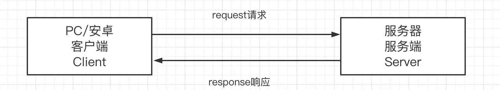
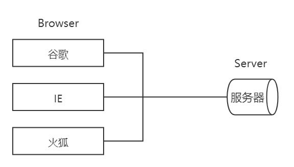
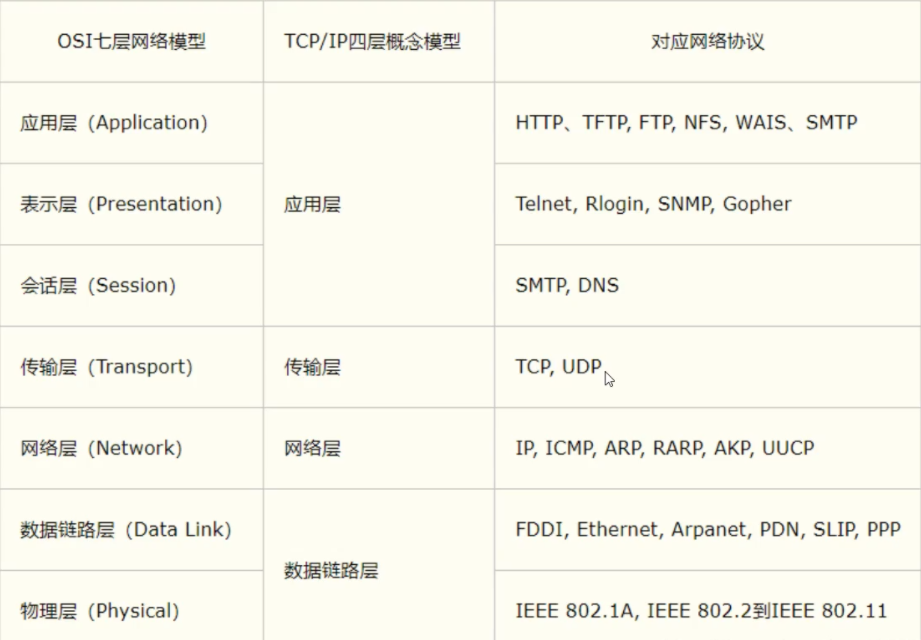
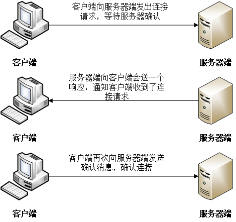
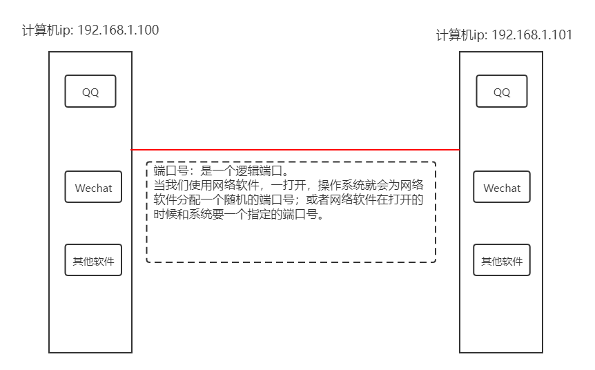
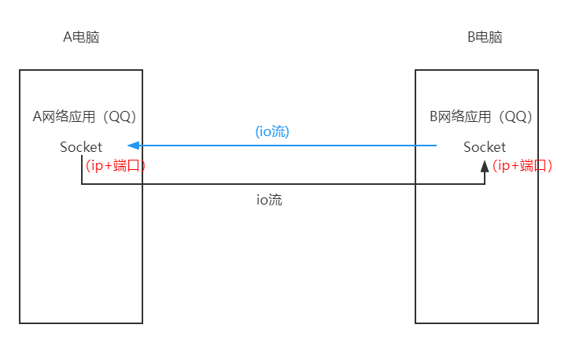
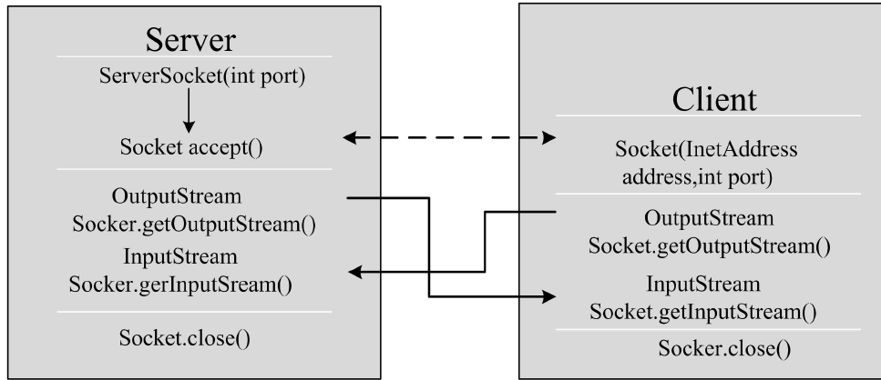

# 网络编程


Spring WebFlux 是一个异步非阻塞式 IO 模型.

<!--more-->

# 一 网络编程概述

## 1.1 软件结构

- C/S结构：全称为Client/Server结构，是指客户端和服务器结构。常见程序有QQ等软件。

  

- B/S结构：Browser/Server结构，是指浏览器和服务器结构。常见的浏览器有谷歌、火狐等。

  

  两种结构各有优势，但是无论哪种架构，都离不开网络的支持。**网络编程**，就是在一定的协议下，实现两台计算机的通信的程序。

## 1.2 网络通信协议

- **网络通信协议**：通过计算机网络可以使多台计算机实现连接，位于同一个网络中的计算机在进行连接和通信时需要遵守一定的规则，这就好比在道路上行驶的汽车一定要遵守交通规则一样。这些连接和通信的规则被称为网络通信协议，它对数据的传输格式、传输速率、传输步骤等做了统一规定，通信双方必须同时遵守才能完成数据交换。(比如，我用QQ给另外一个人发送消息，我们双方都得遵守网络通信协议，消息才能发送出去)

- **TCP/IP协议**：传输控制协议/因特网互联协议（Transmission Control Protocol/Internet Protocol）。它定义了计算机如何连入因特网，以及数据如何在它们之间传输的标准。它的内部包含一系列的用于处理数据通信的协议，并采用了4层的分层模型。

  

  上图中，TCP/IP协议中的四层分别是应用层、传输层、网络层和数据链路层，每层分别负责不同的通信功能。

  链路层：链路层是用于定义物理传输通道，通常是对某些网络连接设备的驱动协议，例如针对光纤、网线提供的驱动。

  网络层：网络层是整个TCP/IP协议的核心，它主要用于将传输的数据进行分组，将分组的数据发送到目标计算机或者网络。

  传输层：主要使网络程序进行通信，在进行网络通信时，我们可以使用两种协议，一种是TCP协议，一种是UDP协议。

  应用层：主要负责应用程序的协议，例如HTTP协议、FTP协议等。

## 1.3 协议分类

- **UDP**：用户数据报协议（User Datagram Protocol）。数据报是网络传输的基本单位。UDP是无连接通信协议，即在数据传输时，数据的发送端和接受端不建立逻辑连接。简单来说，主机1向主机2发送数据时，不会确认主机2是否存在，就会发送数据；同样主机2在收到数据时，也不会向主机1反馈是否收到数据。

  由于使用UDP协议消耗资源小，通信效率高，所以通常都会用于音频、视频数据传输。

  但是在使用UDP协议传送数据时，由于UDP的面向无连接性，不能保证数据的完整性，因此在传输重要数据时不建议使用UDP协议。

  特点：每个数据报的大小限制在64kb以内，超出这个范围就不能发送了。

- **TCP**：传输控制协议（Transmission Control Protocol）。TCP协议是**面向连接**的通信协议，即在数据传输之前，在发送端和接收端建立逻辑连接，然后再传输数据，它提供了两台计算机之间可靠的无差错的数据传输。

  在TCP连接中必须明确客户端与服务器端，由客户端向服务器端发出连接请求，每次连接的创建都需要经过“三次握手”。

  - 三次握手：TCP协议中，在发送数据的准备阶段，客户端与服务器之间的三次交互，以保证连接的可靠。

    - 第一次握手，客户端向服务器端发出连接请求，等待服务器确认。

    - 第二次握手，服务器端向客户端回送一个响应，通知客户端收到的连接请求。

    - 第三次握手，客户端再次向服务端发送确认消息，确认连接。整个交互过程如下图所示：

      

      

## 1.4 网络编程三要素

**（一）协议**

​	协议：计算机网络通信必须遵守的规则，上面已经介绍过了。

**（二）IP地址**

**（三）端口号**


# 二 IP地址

## 2.1 概念

**IP地址**：指互联网协议地址（Internet Protocol Address），俗称IP。IP地址用来给一个网络中的计算机设备做唯一的编号。


## 2.2 分类

|      |                   IPV4                   |                   IPV6                   |
| :--: | :--------------------------------------: | :--------------------------------------: |
| 地址长度 |           IPV4协议具有32位（4字节）地址长度           |          IPv6协议具有128位（16字节）地址长度          |
|  格式  | IPv4 地址的文本格式为  **a.b.c.d** 的形式，例如**192.168.2.2** 。其中a、b、c、d都是0~255范围内的十进制整数 | IPv6 地址的文本格式为 xxxx:xxxx:xxxx:xxxx:xxxx:xxxx:xxxx:xxxx，例如 **2001:0bb2:aaaa:0015:0000:0000:1aaa:1312**，其中每个 x 都是十六进制数 |
|  数量  |            共有43亿，30亿在北美，4亿在亚洲            |                                          |


## 2.3 类型

- A类IP地址的范围：**1.0.0.1---127.255.255.254** 

  （1）10.X.X.X 是私有地址（私有地址就是在互联网上不使用，而被用在局域网中的地址）

  （2）127.X.X.X 是保留地址，用作循环测试用的。

- B类：**128.0.0.1---191.255.255.254**

  172.16.0.0---172.31.255.255是私有地址

- C类：**192.0.0.1---223.255.255.254**

  192.168.X.X 是私有地址

- D类：224.0.0.1---239.255.255.254

- E类：240.0.0.1---247.255.255.254

**在A类地址中，10.0.0.0 到 10.255.255.255 是私有地址（私有地址就是在互联网上不使用，而被用在局域网络中的地址）**

**在B类地址中，172.16.0.0 到 172.31.255.255 是私有地址。**

**在C类地址中，192.168.0.0 到 192.168.255.255 是私有地址。**

**常用命令：**

- 查看本机IP地址：

  ```
  ipconfig
  ```
  


## 2.4 InetAddress类

### 2.4.1 InetAddress概述

​	它是Java中IP地址的类，该类对象代表一个ip对象。

### 2.4.2 常用方法

1. 获取 InetAddress 对象

   ```java
   // 根据主机名或者IP地址的字符串得到IP对象
   public static InetAddress getByName(String host)
   ```

2. 获得IP对象的IP字符串

   ```java
   public String getHostAddress()
   ```

3. 获得IP对象的主机名称

   ```java
   public String getHostName()
   ```

演示：

```java
package com.xpc.ip;

import java.net.InetAddress;
import java.net.UnknownHostException;

/**
 * @ClassName TestInetAddress
 * @Description TODO
 * @Author XiaoPengCheng
 * @Date 2021-10-12 19:52
 * @Version 1.0
 */
public class TestInetAddress {

    public static void main(String[] args) throws UnknownHostException {
        // 创建IP对象
//        InetAddress inetAddress = InetAddress.getByName("10.13.254.254");
        InetAddress inetAddress = InetAddress.getByName("ComputerOfXiao");
        // 通过IP对象获得主机名称、IP地址
        System.out.println(inetAddress.getHostAddress());
        System.out.println(inetAddress.getHostName());

    }

}

```


# 三 端口




- 不同的进程有不同的端口号，端口号是用来区分一台机器上不同的应用程序的。
- 端口号是由两个字节组成，被规定  
- TCP，UDP：65535*2，例：tcp:80，udp:80（TCP和UDP传输协议监听同一个端口后，接收数据互不影响，不冲突。因为数据接收时时根据五元组**{传输协议，源IP，目的IP，源端口，目的端口}**判断接收者的。

**（一）分类**

1. **公有端口：**0~1023
   - HTTP：80
   - HTTPS：443
   - FTP：21
   - SSH：22
   - Telnet：23
2. **程序注册端口**（分配给用户或者程序）：1024~49151
   - Tomcat：8080
   - MySQL：3306
   - Oracle：1521
3. **动态、私有端口**：49152~65535

**（二）DOS命令查看端口**

- 查看所有端口：

  ```txt
  netstat -ano
  ```

- 查看指定端口：

  ```
  netstat -ano|findstr "端口号"
  ```

- 杀死进程（根据进程号）：

  ```
  taskkill /pid 14396 -t -f
  ```

## URL

#### 1）简介 

 URL（Uniform Resource Locator）中文名为统一资源定位符，咱们的网页地址也是一种URL。表示为互联网上的资源，如网页或者 FTP 地址。我们可以使用URL很方便的定位到一个资源，URL 可以分为如下几个部分。

```text
protocol://host:port/path?query#fragment
```

protocol(协议)可以是 HTTP、HTTPS、FTP 和 File，port 为端口号，path为文件路径及文件名。

当然本地文件也可以使用URL来表示：

```java
file:///D:/a.txt
```

#### 2）URL 类方法

| 序号 | 方法描述                                                     |                                                              |
| :--- | :----------------------------------------------------------- | ------------------------------------------------------------ |
| 1    | public URL(String protocol, String host, int port, String file) throws MalformedURLException | 通过给定的参数(协议、主机名、端口号、文件名)创建URL。        |
| 2    | public URL(String protocol, String host, String file) throws MalformedURLException | 使用指定的协议、主机名、文件名创建URL，端口使用协议的默认端口。 |
| 3    | public URL(String url) throws MalformedURLException          | 通过给定的URL字符串创建URL                                   |
| 4    | public URL(URL context, String url) throws MalformedURLException | 使用基地址和相对URL创建                                      |

URL类中包含了很多方法用于访问URL的各个部分，具体方法及描述如下：

| 序号 | 方法                                                     | 描述                                    |
| :--- | :------------------------------------------------------- | --------------------------------------- |
| 1    | public String getPath()                                  | 返回URL路径部分。                       |
| 4    | public int getPort()                                     | 返回URL端口部分                         |
| 5    | public int getDefaultPort()                              | 返回协议的默认端口号。                  |
| 6    | public String getProtocol()                              | 返回URL的协议                           |
| 7    | public String getHost()                                  | 返回URL的主机                           |
| 8    | public String getFile()                                  | 返回URL文件名部分                       |
| 10   | public URLConnection openConnection() throws IOException | 打开一个URL连接，并运行客户端访问资源。 |

访问文件

```java
public static void main(String[] args) throws IOException {
    URL resource = new URL("file:///D:/a.txt");
    URLConnection urlConnection = resource.openConnection();
    InputStream inputStream = urlConnection.getInputStream();

    byte[] buf = new byte[1024];
    int len;
    while ((len = inputStream.read(buf)) != -1){
        System.out.println(new String(buf,0,len));
    }
}
```

文件下载

```java
public static void main(String[] args) throws IOException {
    URL url = new URL("https://down.qq.com/qqweb/PCQQ/PCQQ_EXE/PCQQ2021.exe");
    URLConnection urlConnection = url.openConnection();
    InputStream inputStream = urlConnection.getInputStream();
    OutputStream outputStream = new FileOutputStream("D:/QQ.exe");
    byte[] bytes = new byte[1024];
    int len;
    while ((len = inputStream.read(bytes)) != -1){
        outputStream.write(bytes,0,len);
    }
}
```


# 四 Socket

## 4.1 概述

​	网络上具有唯一标识的**IP地址**和**端口号**组合在一起才能**构成唯一能识别的标识符** ，这个标识符就是套接字。所谓套接字(**Socket**)，就是对网络中不同主机上的进程之间进行双向通信的端点的抽象。 一个套接字就是网络上进程通信的一端。

## 4.2 Socket机制




# 五 TCP网络编程和UDP网络编程

## 5.1 TCP网络编程

### 5.1.1 概述

TCP通信能实现两台计算机之间的数据交互，通信的两端要严格区分客户端（Client）与服务端（Server）。

**（1）两端通信时步骤：**

1. 服务端程序，**需要事先启动**，等待客户端的连接。
2. 客户端主动连接服务器端，连接成功才能通信。

**（2）在Java中，提供了两个类用于实现TCP通信程序：**

1. 客户端：**java.net.Socket**类表示。创建Socket对象，向服务端发送连接请求，服务端响应请求，两者建立连接开始通信。
2. 服务端：**java.net.ServerSocket**类表示。创建ServerSocket对象，相当于开启一个服务，并等待客户端的连接。

### 5.1.2 Socket类

**（1）构造方法摘要**

​	**public Socket(String host, int port)**：创建套接字对象并将其连接到指定主机上的指定端口号。

**（2）常用方法摘要**

- **public InputStream getInputStream()**： 返回此套接字的输入流。


- **public OutputStream getOutputStream()**：返回此套接字的输出流。


- **public void close()**：关闭此套接字。

### 5.1.3 ServerSocket类

**（1）构造方法摘要**

​	**public ServerSocket(int port)**：使用该构造方法在创建ServerSocket对象时，就可以将其绑定到一个指定的端口号上，参数port就是端口号。

**（2）常用方法摘要**

​	**public Socket accept()**：侦听并接受连接，返回一个新的Socket对象，用于和客户端实现通信。该方法会一直阻塞直到建立连接。

### 5.1.4 通信模型



### 5.1.5 案例演示

客户端：

```java
package com.xpc.tcp;

import java.io.ByteArrayOutputStream;
import java.io.IOException;
import java.io.InputStream;
import java.io.OutputStream;
import java.net.Socket;

/**
 * @ClassName TCPClientDemo1
 * @Description TODO
 * @Author XiaoPengCheng
 * @Date 2021-10-14 17:01
 * @Version 1.0
 */
// 客户端
public class TCPClientDemo1 {

    public static void main(String[] args) {

        OutputStream os = null;
        Socket socket = null;

//        InputStream is = null;
//        ByteArrayOutputStream baos = null;

        try {
            // 1. 创建一个socket连接
            socket = new Socket("127.0.0.1", 9999);
            // 2. 获取一个输出流，用于写出要发出的数据
            os = socket.getOutputStream();
            // 3. 写出数据
            os.write("你好，我是客户端！".getBytes());

//            // ==================== 解析回复================
//            socket.shutdownOutput();
//            is = socket.getInputStream();
//            baos = new ByteArrayOutputStream();
//            byte[] buffer = new byte[1024];
//            int len;
//            while ((len=is.read(buffer))!=-1){
//                baos.write(buffer, 0, len);
//            }
//            System.out.println("收到了来自服务器的消息：" + baos.toString());

        } catch (Exception e) {
            e.printStackTrace();
        } finally {
            // 4. 关闭资源
//            if(baos!=null){
//                try {
//                    baos.close();
//                } catch (IOException e) {
//                    e.printStackTrace();
//                }
//            }
//            if(is!=null){
//                try {
//                    is.close();
//                } catch (IOException e) {
//                    e.printStackTrace();
//                }
//            }
            if(os!=null){
                try {
                    os.close();
                } catch (IOException e) {
                    e.printStackTrace();
                }
            }
            if(socket!=null){
                try {
                    socket.close();
                } catch (IOException e) {
                    e.printStackTrace();
                }
            }
        }

    }

}

```

服务端：

```java
package com.xpc.tcp;

import java.io.ByteArrayOutputStream;
import java.io.IOException;
import java.io.InputStream;
import java.io.OutputStream;
import java.net.ServerSocket;
import java.net.Socket;

/**
 * @ClassName TCPServerDemo1
 * @Description TODO
 * @Author XiaoPengCheng
 * @Date 2021-10-14 17:02
 * @Version 1.0
 */
// 服务端
public class TCPServerDemo1 {

    public static void main(String[] args) {

        ByteArrayOutputStream baos = null;
        InputStream is = null;
        Socket socket = null;
        ServerSocket serverSocket = null;

//        OutputStream os = null;

        try {
            // 1. 创建服务端的ServerSocket，指明自己的端口号
            serverSocket = new ServerSocket(9999);
            // 2. 等待客户端连接过来
            socket= serverSocket.accept();
            // 3. 获取socket的输入流，用来读取客户端的消息
            is = socket.getInputStream();
            // 4. 使用字节数组输出流，读取输入流中的数据
            baos = new ByteArrayOutputStream();
            byte[] buffer = new byte[1024];
            int len;
            while ((len=is.read(buffer))!=-1){
                baos.write(buffer, 0, len);
            }
            System.out.println("收到了来自于客户端"+socket.getInetAddress().getHostName()
                    +"的消息："+baos.toString());

//            // ===================================回复=================================
//            os = socket.getOutputStream();
//            os.write("你好，我是服务端。".getBytes());

        } catch (Exception e) {
            e.printStackTrace();
        } finally {
            // 关闭资源
//            if (os != null) {
//                try {
//                    os.close();
//                } catch (IOException e) {
//                    e.printStackTrace();
//                }
//            }
            if (baos != null) {
                try {
                    baos.close();
                } catch (IOException e) {
                    e.printStackTrace();
                }
            }
            if (is != null) {
                try {
                    is.close();
                } catch (IOException e) {
                    e.printStackTrace();
                }
            }
            if (socket != null) {
                try {
                    socket.close();
                } catch (IOException e) {
                    e.printStackTrace();
                }
            }
            if (serverSocket != null) {
                try {
                    serverSocket.close();
                } catch (IOException e) {
                    e.printStackTrace();
                }
            }
        }

    }

}

```

## 5.2 UDP网络编程

从技术意义上来讲，只有TCP才会分Server和Client。**对于UDP来说，严格意义上，并没有所谓的Server和Client。**

**java.net**包给我们提供了两个类**DatagramSocket**（此类表示用于发送和接收数据报的套接字）和**DatagramPacket**（该类表示数据报的数据包）

### 5.2.1 DatagramSocket

**（1）构造方法摘要**

- **public DatagramSocket()**：构造数据报套接字并将其绑定到本地主机上的任何可用端口。
- **public DatagramSocket(int port)**：构造数据报套接字并将其绑定到本地主机上的指定端口。
- **public DatagramSocket(int port, InetAddress laddr)**：创建一个数据报套接字，绑定到指定的地址。

### 5.2.2 DatagramPacket

**（1）构造方法摘要**

- **public DatagramPacket(byte[] buf, int offset, int length)**：构造一个DatagramPacket用于接收指定长度的数据报包到缓冲区中。

- **public DatagramPacket(byte[] buf, int offset, int length, InetAddress address, int port)**：构造用于发送指定长度的数据报包到指定主机的指定端口号上。

**（2）常用方法摘要**

- **byte[] getData()**：返回数据报包中的数据。
- **InetAddress getAddress()**：返回该数据报发送或接收数据报的计算机的IP地址。
- **int getLength()**：返回要发送的数据的长度或接收到的数据的长度。

### 5.2.3 案例演示

发送端：

```java
package com.xpc.udp;

import java.net.DatagramPacket;
import java.net.DatagramSocket;
import java.net.InetAddress;

/**
 * @ClassName UDPSender
 * @Description TODO
 * @Author XiaoPengCheng
 * @Date 2021-10-15 19:37
 * @Version 1.0
 */
public class UDPSender {

    public static void main(String[] args) {

        DatagramSocket socket = null;

        try {
            // 1. 创建一个Socket
            socket = new DatagramSocket();

            // 2. 创建一个包（要发送给谁）
            String msg = "你好啊！";

            InetAddress localhost = InetAddress.getByName("localhost");
            DatagramPacket packet = new DatagramPacket(msg.getBytes(), 0, msg.getBytes().length, localhost, 9090);

            // 3. 发送包
            socket.send(packet);

        } catch (Exception e) {
            e.printStackTrace();
        } finally {
            if (socket != null)
                socket.close();
        }

    }

}

```

接收端：

```java
package com.xpc.udp;


import java.net.DatagramPacket;
import java.net.DatagramSocket;

/**
 * @ClassName UDPReceiver
 * @Description TODO
 * @Author XiaoPengCheng
 * @Date 2021-10-15 19:59
 * @Version 1.0
 */
public class UDPReceiver {

    public static void main(String[] args) {

        DatagramSocket socket = null;

        try {
            // 1. 创建一个socket，开放端口
            socket = new DatagramSocket(9090);

            // 2. 创建一个包接收数据
            byte[] buffer = new byte[1024];
            DatagramPacket packet = new DatagramPacket(buffer, 0, buffer.length);

            // 3. 接收数据
            socket.receive(packet);
            // 将数据包转换为字符串输出
            String msg = new String(packet.getData(), 0, packet.getLength());
            System.out.println(packet.getAddress().getHostAddress() + ": " + msg);

        } catch (Exception e) {
            e.printStackTrace();
        } finally {
            if (socket != null)
                socket.close();
        }

    }

}

```

# 六 小结

**（一）基于Socket的TCP编程**

1. 服务器程序的工作过程包含以下四个基本的步骤：
   - 调用 ServerSocket(int port) ：创建一个服务器端套接字，并绑定到指定端口上。用于监听客户端的请求。
   - 调用 accept()：监听连接请求，如果客户端请求连接，则接受连接，返回通信套接字对象。
   - 调用 该Socket类对象的 getOutputStream() 和getInputStream ()：获取输出流和输入流，开始网络数据的发送和接收。
   - 关闭ServerSocket和Socket对象。
2. 客户端程序的工作过程包含以下步骤：
   - 创建Socket：根据指定服务端的IP地址和端口号构造Socket对象。
   - 获取Socket的输入/输出流：使用getInputStream()方法获得输入流，使用getOutputStream()方法获得输出流，进行数据传输。
   - 对 Socket 进行读/写操作
   - 关闭 Socket

**（二）基于Socket的UDP编程**

1. 发送端程序的工作过程包含以下步骤：
   - 创建DatagramSocket 实例
   - 创建DatagramPacket实例：将数据放在DatagramPacket对象中，并指定接收方的IP地址和端口号。
   - 发送数据：通过DatagramSocket实例的send()发送数据。
   - 关闭socket
2. 接收端程序的工作过程包含以下步骤：
   - 构造DatagramSocket实例，指定本地端口。 
   - 创建DatagramPacket实例：用来接收数据。
   - 接收数据：通过DatagramSocket实例的receive()接收。
   - 关闭socket


